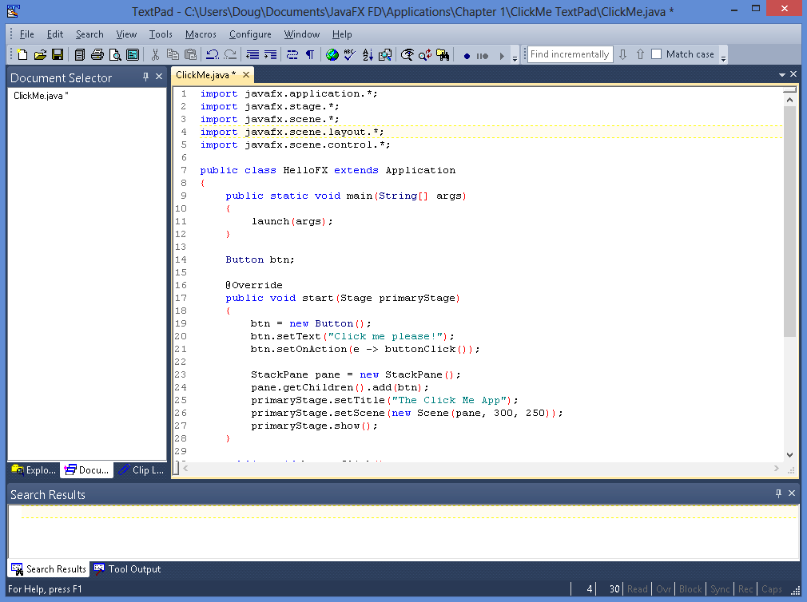
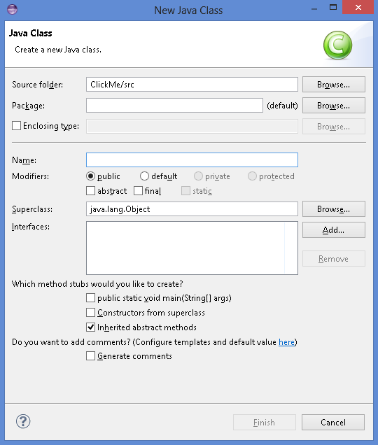

# 第 1 章 你好， JavaFX！

> **在本章节**
>
> - 快速了解什么是 JavaFX，可以使用它做什么
> - 查看一个基本的 JavaFX 程序
> - 下载、安装和配置 Java 8 以便构建你自己的 JavaFX 程序
> - 使用记事本和命令提示符这种较困难的方式构建 JavaFX 程序
> - 使用 TextPad 简化 JavaFX 编程
> - 使用 IDE（例如 Eclipse 或 NetBeans）进行 JavaFX 编程

欢迎来到奇妙的 JavaFX 编程世界！

本章对 JavaFX 编程进行了简单的介绍。在接下来的几页中，你将了解 JavaFX 是什么，来自哪里又去向何方。你会看到借助 JavaFX 实现的经典的 Hello World! 示例。你还将了解如何设置计算机，使用几种流行的 JavaFX 开发工具来开发 JavaFX 程序。

顺带一提，我假设你已经对 Java 编程有所了解。不需要你精通，但应该掌握基础知识，比如创建使用了一些变量和语句（例如 `if` 和 `for`）的程序，创建自己的类或者使用 Java API（应用程序编程接口）中包含的各种类。我不会花时间在本书中解释这些基础知识，如果深入研究 JavaFX 的细节之前需要 Java 的入门知识，建议你阅读我的杰作《 Java All-in-One For Dummies (Wiley Publishing, Inc.)》。

本章的目的是让你准备好开始学习如何编写 JavaFX 程序。因此，在本章中你将看到一个简单的 JavaFX 程序示例。在 JavaFX 之旅的早期阶段，你或许不能完全理解这个程序。但不要气馁，在第 2 章中，我会对它逐行分析，以便你了解它的作用所在。在这一章中，我主要从高层关注 JavaFX 是什么，你可以用它做什么，以及如何为 JavaFX 编程设置你的计算机。

本书中的所有代码都可以从 www.dummies.com/extras/javafx 下载。


## JavaFX 是什么？

简而言之，JavaFX 是一系列 Java 包的集合，它允许你为 Java 应用程序添加精美的图形用户界面。借助 JavaFX，你可以创建传统 Windows 风格的用户界面，其中包括熟悉的控件，如标签、按钮、文本框、复选框、下拉列表等。你还可以为这些用户界面添加一些特殊效果，例如光源，透视图和动画。这就是 JavaFX 中的 FX 由来。

JavaFX 出现之前，在 Java 中创建图形用户界面的主要方法是通过 Swing API。JavaFX 在许多方面与 Swing 有相似之处，所以如果你曾经使用过 Swing 为 Java 程序创建用户界面，这对学习 JavaFX 来说会是一个良好的开端。

JavaFX 作为附加包出现已经有一段时间了，但是从 Java 8 开始，它成为了 Java 平台官方标准的一部分。因此，在安装了 Java 8 开发工具包（*JDK 8*）之后，你就可以开始使用喜欢的开发工具开发 JavaFX 应用程序了。在本章的后面，你将知道如何下载和安装 JDK 8，以及如何使用三款流行的 Java 开发工具：TextPad、Eclipse 和 NetBeans 来创建一个简单的 JavaFX 程序。

因为 JavaFX 现在是 Java 标准的一部分，所以可以在任何包含 Java 8 运行时环境（JRE）的设备上运行 JavaFX 程序。这些设备包括计算机、平板、智能手机和其他支持 JDK8 的设备。

Oracle 已经宣布 JavaFX 最终将取代Swing。尽管 Java 8 仍然支持 Swing，并且短期内还不会改变，但 Oracle 把主要精力放在 JavaFX 的新特性上。最终，Swing 将被淘汰。


## 仔细研究 JavaFX 的可能性

JavaFX 的基本优势之一是它能够让你轻松地使用所有大家都知道并且喜爱的经典用户界面元素了来创建复杂的图形用户界面。因此，JavaFX 提供了各种各样的控件 —— 实际上有几十种，囊括了经典的按钮、标签、文本框、复选框、下拉列表和菜单，以及一些独特的控件，如选项面板和折叠面板。图 1-1 显示了一个典型的 JavaFX 用户界面，它使用几种控件创建了一个用于数据输入的表单。

> 图 1-1：一个典型的JavaFX程序。


坦白讲，图 1-1 显示的数据输入表单不是很引人注目。实际上，使用 Swing 可以很容易地创建这样的数据输入表单，而且花费的工作量差不多。在开始使用一些更高级的 JavaFX 特性之前，相对于 Swing 的真正优势并不明显。

站在初学者的角度观察图 1-1 中所示的数据输入表单的整体外观，可以看出按钮、标签、文本字段、单选按钮和复选框的外观都有些过时，对话框也与 20 年前在 Windows 95 电脑上用 Visual Basic 创建的对话框看不出什么差别。

JavaFX 开始大放异彩的地方在于它能够使用级联样式表（*CSS*）轻松地改善用户界面的外观。CSS 通过将所有的格式化信息放在一个称为样式表的单独文件中，使得定制用户界面控件外观的许多方面变得容易。样式表是一个简单的文本文件，它提供一组规则来格式化用户界面的各种元素。你可以使用 CSS 控制数百个格式化属性。例如，更改文本属性（如字体、大小、颜色和粗细），添加背景图片、渐变填充、边框和特殊效果（如阴影、模糊和光源）。

图 1-2 显示了图 1-1 中所示形式的一种变体，这次使用了 CSS 进行格式化，为表单添加了背景图片，增强了文本格式，并修改了按钮的外观。

> 图 1-2：JavaFX 允许你使用 CSS 指定用户界面元素的格式。


除了 CSS，JavaFX 还提供了许多其他功能。其中最重要的有：

> **✓ 视觉效果：** 你可以为用户界面元素添加各种视觉效果，包括阴影，反射，模糊，照明和透视。
>
> **✓ 动画：** 你可以指定随时间逐渐过渡的动画效果。
>
> **✓ 图表：** 你可以使用 `javafx.scene.chart` 包的许多类来创建条形图，饼图和其他类型的图表。
>
> **✓ 3-D 对象：** 你可以绘制三维对象，例如立方体，圆柱体，球体以及更复杂的形状。
>
> **✓ 触摸界面：** JavaFX 可以轻松应对触屏设备，例如智能手机和平板电脑。
>
> **✓ 属性绑定：** JavaFX 允许你创建可以绑定到用户界面控件的特殊数据类型 *properties*（属性）。例如，你可以创建一个属性来表示所购买商品的价格，然后把它与一个标签进行绑定。当价格的值发生变化时，标签上显示的值就会自动更新。

在本书后续章节，你会了解到以上所有及更多的特性。但是现在，我们先来看看一个简单的 JavaFX 程序，这样可以让你对 JavaFX 程序有个大致的了解。


## 看看一个简单的 JavaFX 程序

图 1-3 显示了一个非常简单的 JavaFX 程序的用户界面，它只包含一个按钮。最初，按钮上显示的文字是 `Click me please!`。当按钮被点击后，文本变成了 `You clicked me!`。如果再次点击，文本会变回 `Click me please!` 。此后，每次单击按钮时，文本在 `Click me please!` 和 `You clicked me!` 之前交替变换。

> 图 1-3：Click Me 程序。


为了让你了解 JavaFX 编程是什么样的，清单 1-1 完整展示了这个程序。这里我不会解释程序工作的细节 —— 我会在第 2 章对它进行详细研究。现在，我只想让你对 JavaFX 编程有个总体认知。

**清单1-1：Click Me 程序**

```java
import javafx.application.*; 
import javafx.stage.*; 
import javafx.scene.*; 
import javafx.scene.layout.*; 
import javafx.scene.control.*;

public class ClickMe extends Application {

  public static void main(String[] args) { 
    launch(args); 
  }

  Button btn;

  @Override 
  public void start(Stage primaryStage) {
    // 创建按钮
    btn = new Button(); 
    btn.setText("Click me please!"); 
    btn.setOnAction(e -> buttonClick());

    // 将按钮添加到布局面板中
    BorderPane pane = new BorderPane(); 
    pane.setCenter(btn); 
    
    // 将布局面板添加到场景中
    Scene scene = new Scene(pane, 300, 250);

    // 完成并展示舞台
    primaryStage.setScene(scene); 
    primaryStage.setTitle("The Click Me App"); 
    primaryStage.show();
  }

  public void buttonClick() {
    if (btn.getText() == "Click me please!") {
      btn.setText("You clicked me!"); 
    } else {
      btn.setText("Click me please!"); 
    }
  }
}
```

以下段落简要说明了 Click Me 程序的关键点：

> ✓ 与其他 Java 程序一样，JavaFX 程序以大量的 `import` 语句开始，这些语句引用了该程序将要使用的各种包。
>
>   在本例中，导入了 5 个包。大多数 JavaFX 程序都需要这 5 个包，以及提供更多高级功能的附加包。
>
> ✓ 所有的 JavaFX 程序都要继承一个核心类 `Application`，它提供了程序的基本功能。继承 `Application` 类时必须重写 `start` 方法，JavaFX 会在应用程序启动时调用此方法。
>
> ✓ 与其他 Java 程序一样，JavaFX 程序必须有一个 `main` 方法。在 JavaFX 程序中，`main` 方法调用 `Application` 类的 `launch` 方法来启动应用程序并调用 `start` 方法。
>
> ✓ JavaFX 程序的用户界面元素按照容器层次结构进行排列。最顶层的是 `stage`（舞台），它代表一个窗口。在舞台内的是 `scene`（场景），其中包含用户界面控件。控件本身（例如按钮、标签、下拉列表等）通常包含在一个或多个布局面板（*layout panes*）中，这些面板管理着控件的位置布局。
>
>   如果你研究过 `start` 方法中的代码，会发现这些元素是自下而上构建的：
>
> - 创建一个按钮。
>- 将按钮添加到布局面板（具体来说是一个 `StackPane`，这是几种可用的布局面板之一）。
> - 将布局面板添加到场景中，然后把场景添加到舞台中。
>- 调用舞台的 `show` 方法显示应用程序的 GUI（图形用户界面）。 
> 
>✓ 每当用户单击按钮时，都会调用 `buttonClick` 方法。此方法检查按钮当前显示的文本，并进行相应更改。因此，每次用户单击该按钮时，按钮的文本都会从 `Click me please!` 变为 `You clicked me!` ，反之亦然。

如果你发现这个程序的某些地方（或者全部）让你感到困惑，请不要担心。我写这一章的目的是让你看一眼这个简单的 JavaFX 程序，而不是让你对这个程序如何工作的细节感到不知所措。正如前面提到的，我将在第 2 章逐行回顾这个程序的细节。

在本章的剩余部分，你将了解如何下载、安装和配置 Java 开发工具包，以及如何使用流行的 Java 开发工具来编译和测试 Click Me 程序。


## 下载和安装 JavaFX

实际上，上面的标题耍了点花招。在 Java 8 之前，JavaFX 是一个独立于 Java 的实体。因此，要使用 JavaFX，你必须下载并安装一个单独的 JavaFX 软件包。但是从 Java 8 开始，JavaFX 便成为了 Java 的一部分。所以，如果已经下载并安装了 Java 8，那么你就已经拥有了 JavaFX。

在下面的章节中，我将说明如何下载、安装和配置 Java 8 开发工具包（JDK 8），以便编写和测试 JavaFX 程序。如果你已经安装了 JDK 8，可以跳过本章节。

### 下载 JDK 8

在浏览器输入 http://java.oracle.com/technetwork/java 进入下载页面，根据你的操作系统选择相应的链接下载 JDK 8。

进入 Java 下载页面，你会发现下载 JDK 或 JRE 的链接。请选择 JDK 下载链接。JRE 只提供了 Java 运行时环境，不是完整的 Java 开发工具包。

JDK 提供两个版本供用户下载：

> ✓ 联机版本需要网络连接才能安装 JDK。
>
>   离线版本需要先下载 JDK 安装包文件到你的电脑，然后再安装。

建议你使用离线版本，不仅安装速度更快，而且在下次需要重新安装 JDK 时也不需要再次下载。

### 安装 JDK 8

下载 JDK 文件后，可通过运行下载的可执行文件进行安装。这个过程根据操作系统而略有不同，但基本上，只需在下载 JDK 安装程序文件后运行它，如下：

> **✓ 在 Windows 系统上，** 打开你保存安装程序的文件夹，双击安装程序图标。
>
> **✓ 在 Linux 或 Solaris 系统上，** 使用控制台命令进入文件下载目录，然后运行程序。
>
> **✓ 在 Mac 上，** 打开“下载”窗口，双击下载的 JDK.dmg 文件。此时将出现一个 Finder 窗口，这其中包含一个开箱图标，双击这个图标即可启动安装程序。

启动安装程序后，它将提示你输入正确安装 JDK 所需的信息，例如要安装的功能以及你想将 JDK 安装在哪个文件夹中。你可以安全地为每个选项选择默认设置。

### 设置 Path

安装 JDK 之后，需要对操作系统进行配置，以便能够找到 JDK 命令行工具。为此，必须设置 Path 环境变量 —— 操作系统用来查找可执行程序的文件夹列表。要在 Windows 上执行此操作，需遵循以下步骤。你必须以管理员身份登录才能进行此过程中描述的更改。

1. **打开控制面板。**

   - 在 Windows 7 或更早版本的系统上，打开“开始”菜单，选择“控制面板”。
   - 在 Windows 8 或更高版本的系统上，单击“开始”按钮或按 Windows 键，输入“控制面板”，按下回车。

2. **双击系统图标。**

   出现“系统属性”页面。

3. **选择高级系统设置，点击“环境变量”按钮。**

   系统弹出“环境变量”对话框，如图 1-4 所示。
   
   > 图 1-4： “环境变量”对话框。
   
   

4. **在系统变量列表中，滚动到 Path 变量，选择它，然后单击“编辑”按钮。**

   将会弹出一个小对话框，让你编辑 Path 变量的值。

5. **在 Path 值的开头添加 JDK bin 文件夹的名称。**

   使用分号将 bin 文件夹与 path 中可能已存在的其他信息分开。

   **注意：** bin 文件夹的名称在你的系统上可能会有所不同，例如以下示例：

   ```
   c:\Program Files\Java\jdk1.8.0\bin;other directories...
   ```

6. **单击“确定”三次，退出。**
   第一个确定使您返回到“环境变量”对话框；第二个“确定”使您返回“系统属性”页面；第三个“确定”关闭“系统属性”页面。

对于 Linux 或 Solaris 操作系统，此过程取决于你使用的 shell。要了解更多信息，请参考正在使用的 shell 的文档。注意，以上步骤在 Mac 系统上不是必需的。


## 使用记事本开发 Click Me 程序

安装 JDK 8 之后，就可以使用 JavaFX 了。严格地讲，除了 JDK 8 之外，开发 Java 程序所需的其他工具只有文本编辑器和命令行。使用文本编辑器创建  Java 源文件，以扩展名 `.java` 保存。然后，在命令提示符下，使用 Java 命令行工具编译并运行该程序。

Windows 附带的免费文本编辑器——记事本，足以创建简单的 Java 源文件。但记事本是一个通用的文本编辑器，它并不了解 Java 源代码的任何特性。因此，它在缩进、匹配左右大括号或提醒你注意语法错误等细节方面无法提供任何帮助。

同样，记事本也没办法编译、运行或者调试 Java 程序。但好处是它免费而且易于使用，你也不需要再安装其他软件。

以下是使用记事本和 Java 命令行工具创建 Click Me 程序的步骤：

1. **打开记事本。**

   要在 Windows 7 或 8 中做到这一点，你需要：

   ​	a.单击“开始”按钮（或按键盘上的 <kbd>Windows</kbd> 键）。

   ​	b.输入“记事本”，然后按下回车。

   这时候记事本便会显示，并给你提供一个空的文本编辑窗口。

2. **在编辑窗口中输入清单1-1中所示的 Click Me 程序。**

   确保输入的文本与清单中显示的完全一致。完成之后，记得仔细检查，确保输入无误。

   图 1-5 展示了正确输入 Click Me 程序后的显示结果。 （图中显示的记事本窗口不够大，不足以显示整个源文件，你可以通过滚动窗口看到整个文件。）

   > 图 1-5：记事本中的 Click Me 程序。

   

3. **使用 `ClickMe.java` 作为为名称，选择“文件”➪“保存”。**

   可以保存在任何你想存放的文件夹里，但是文件名必须为 `ClickMe.java`。

   Java 源文件的名称必须与类的名称完全匹配，包括大小写形式。所以，如果将文件另存为 `clickme.java` 而不是 `ClickMe.java`，Click Me 程序将无法运行。

4. **打开命令提示窗口。**

   在 Windows 7 或 8 中，打开窗口需要：

   ​	a.单击“开始”按钮（或按键盘上的 <kbd>Windows</kbd> 键）。

   ​	b.输入“cmd”，然后按下回车。

5. **使用 `cd` 命令切换到步骤 3 中保存源文件的文件夹。**

   例如，如果你将文件保存在 `C:\Java` 中，请输入以下命令：

   ```
   cd C:\Java
   ```

6. **使用 `javac` 命令编译程序。**

   输入以下命令：

   ```
   javac ClickMe.java
   ```

   如果 你输入的程序完全正确，`javac` 命令不会显示任何消息。如果程序有错误，编译器会显示错误消息。这时候需要在记事本中打开源文件，修改错误后保存文件，然后重复这个步骤，直到没有错误显示为止。

7. **使用 `java` 命令运行程序。**

   输入如下命令：
  
   ```bash
   java ClickMe
   ```
  
   会出现如图 1-6 所示的窗口。

   > 图 1-6： Click Me 程序运行中
	
   

8. **点击 `Click Me Please!`  按钮。**

   点击后，按钮上显示的文字将变为 ` You clicked me!`。

9. **单击关闭按钮关闭 Click Me 程序。**

   恭喜！你已经成功创建了第一个 JavaFX 程序！


## 使用 TextPad 开发 Click Me 程序

TextPad 是一个便宜的文本编辑器（$33），你可以将其与 Java 开发工具包（JDK）进行集成，以简化 Java 程序编码、编译和运行的任务。因为缺少集成调试，代码生成器和用于创建图形用户界面的拖放工具等功能，所以它不是真正的集成开发环境（IDE）。

因为简单和快速，TextPad  成为了开发 Java 程序的流行工具。它是学习 Java 的理想选择，因为它易于使用，让你可以专注于学习 Java，而不是学习如何使用复杂的开发环境。

你可以从 www.textpad.com 网站下载太阳神软件解决方案（Helios Software Solutions）提供的 TextPad 免费评估版。你可以免费使用评估版，但是如果决定保留该程序，则必须付费。（Helios接受在线信用卡付款）

如果电脑上已经安装了Java JDK，在安装 TextPad 时，它会进行自动配置以支持编译和运行 Java 程序。如果在安装 TextPad 之后才安装 JDK，为了使 TextPad 支持 Java，需要打开首选项对话框（通过选择 Configure➪Preferences），在对话框左侧目录中选择“工具”，然后选择 Add➪Java SDK Commands。

将 TextPad 配置为编译和运行 Java 程序后，可以按照以下步骤创建 Click Me 程序：

1. **启动 TextPad。**

   TextPad 会自动打开一个名为 Document1 的空白源文档。

2. **选择 File➪Save，输入 `ClickMe.java`，点击 Save。**

   文件会以 `ClickMe.java` 为名称进行保存。在输入文本前，以扩展名 `.java` 保存文件可以使 TextPad 进入 Java 编辑模式，这能让你更容易地输入和编辑 Click Me 程序的 Java 源代码。

3. **将清单 1-1 中 Click Me 程序对应文本输入到 Document1 窗口中。**

   TextPad 的基本文本编辑功能几乎与你使用过的其他文本编辑器一致，所以你在输入和编辑 Click Me 程序的文本时应该不会遇到什么麻烦。

   在编辑文本时，你可能会注意到 TextPad 上一些有用的 Java 编辑特性。例如，TextPad 在输入左括号时会自动缩进你的代码，然后在输入右括号时恢复到前一个缩进。TextPad 还使用不同的颜色来表示关键字、变量和其他 Java 编程元素。

   图 1-7 展示了 Click Me 程序在 TextPad 中是如何显示的。

   > 图 1-7：TextPad 中的 Click Me 程序。

   

4. **选择 Tools➪Compile Java 以编译程序。**

   如果你愿意，还可以使用键盘快捷键 <kbd>Ctrl + 1</kbd>。无论哪种方式，都会自动保存对源文件的更改，并调用 `javac` 命令来编译程序。如果编译成功，Tool Results 面板会显示 `Tool completed successfully` 消息。

   如果在输入 Click Me 程序时出了错，Tool Results 面板会显示编译器生成的错误消息。双击每个错误消息的第一行，TextPad 会将你带到发生错误的位置，以便更正错误。

5. **选择 Tools➪Run Java Application 以运行程序。**

   首先会打开一个命令行提示符窗口，然后会打开 Click Me 程序窗口（参考图 1-6）。

6. **点击 `Click Me Please!`  按钮。**

   点击后，按钮上显示的文字将变为 ` You clicked me!`。

7. **单击关闭按钮关闭 Click Me 程序。**

   Click Me 程序窗口已被关闭，但是命令行提示符窗口仍然可见，上面会显示“按任意键继续”的消息。

8. **按任意键关闭命令行提示符窗口。**
   就这么简单！


## 使用 IDE 创建 Click Me 程序

IDE（集成开发环境）是一种功能强大的工具，它结合了复杂的文本编辑功能以及用于各种编程语言进行编译、执行和调试程序的能力。 IDE 可以跟踪组成一个 Java 编程项目的多个源文件，甚至源文件的多个版本。

在 Java 编程中，最受欢迎的两个 IDE 是 Eclipse 和 NetBeans。两者都是免费的，功能也相当，所以选择哪一款凭你喜好。可以从 www.eclipse.org 网站下载 Eclipse，或者从 https://netbeans.org 网站下载 NetBeans。

在本章的剩余部分，我将向你展示如何在 Eclipse 中创建 Click Me 程序。虽然在 NetBeans 中创建 Click Me 程序的步骤不同，但概念是相同的。

要开始使用 Eclipse，请访问 www.eclipse.org ，单击 Download Eclipse 按钮，下载当前适用于 Java 开发人员版本的 Eclipse IDE。与大多数程序不同，Eclipse 没有复杂的安装程序。你只需下载 Zip 文件，解压缩，然后直接从解压到的文件夹中运行 Eclipse 可执行文件（`eclipse.exe`）。

如果你使用的是 Windows，为了更方便地启动 Eclipse，可能需要为它添加一个桌面快捷方式。为此，请打开包含 `eclipse.exe` 文件的文件夹，右键单击该文件并将其拖到桌面上，释放鼠标按钮，然后从出现的菜单中选择“创建快捷方式”。这样，你就可以通过双击桌面快捷方式来启动 Eclipse 了。

以下是在 Eclipse 中创建 Click Me 程序的步骤：

1. **通过运行 `Eclipse.exe` 或双击其桌面快捷方式启动 Eclipse。**

   Eclipse 启动，如图 1-8 所示。

   > 图 1-8：Eclipse 等待你的命令。
   
   

2. **选择 File➪New➪Java Project。**

   出现 New Java Project 对话框，如图 1-9 所示。

   > 图 1-9：创建一个新的 Java 项目。

   

3. **在 Project Name 文本框中输入 `ClickMe`，然后点击 Finish。**

   Eclipse 建立项目并将其添加到屏幕左侧的 Package Explorer 窗格中，如图 1-10 所示。(最初，项目是折叠的，只显示项目的顶部一行。在此图中，我展开项目，显示出了名为 `src` 和 `JRE System Library` 的子文件夹。)

   > 图 1-10：ClickMe 项目显示在 Package Explorer 窗格中。


4. **选择 File➪New➪Class。**

   弹出 New Java Class 对话框，如图 1-11 所示。
   
   > 图 1-11：向 ClickMe 项目添加一个类文件。

   

5. **在 Name 文本框中输入 ClickMe，然后单击 Finish。**

   Eclipse 会将一个名为 `ClickMe.java` 的文件添加到 `src` 文件夹，并在编辑窗口中打开该文件，如图 1-12 所示。注意，Eclipse 还添加了一小段代码，以帮助你开始使用该类。

   > 图 1-12：Eclipse 显示新创建的 ClickMe.java 文件。
   
   
   
6. **删除 `ClickMe.java` 文件中的代码，然后将清单 1-1 中的文本输入到编辑窗口中。**

   图 1-13 显示了正确输入程序文本后 ClickMe.java 文件的外观。
  
   > 图1-13：在 Eclipse 中完成的 Click Me 程序。

   

7. **选择 Run➪Run 以运行程序。**
  
   将打开 Click Me 程序窗口，如之前的图 1-6 所示。
  
8. **点击 `Click Me Please!`  按钮。**

   点击后，按钮上显示的文字将变为 `You clicked me!`。

9. **单击关闭按钮关闭 Click Me 程序。**

   恭喜！你使用 Eclipse 成功创建并运行了 Click Me 程序。

既然你已经知道可以使用记事本和命令行工具、简单 Java文本编辑器 TextPad 或更复杂的 IDE（如 Eclipse）来开发简单的 Click Me 程序，那么就可以开始探索 JavaFX 程序工作的细节了。所以，在第二章中，我将对这个简单程序的每一行进行详细说明。勇往直前！

