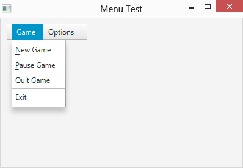
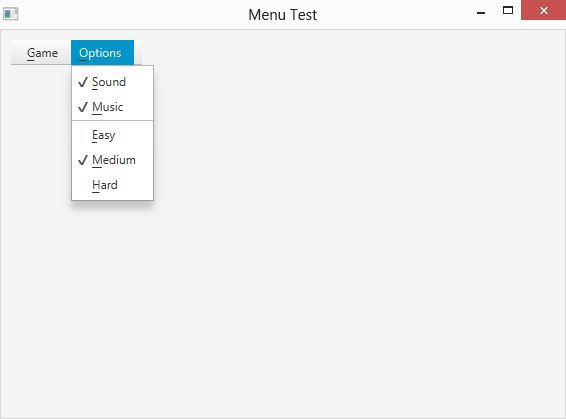
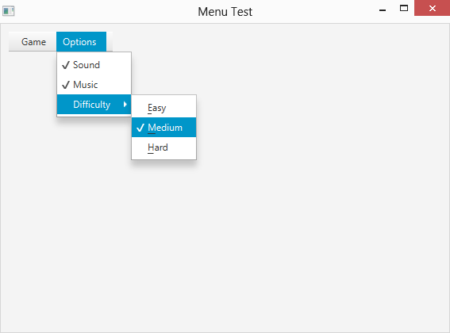
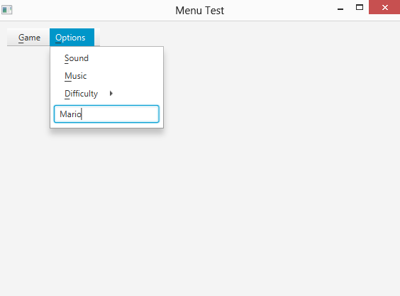

# 第 10 章  创建菜单

> **本章内容**
>
> + 创建基本和动态菜单
> + 使用分隔符和动作监听器
> + 使用复选框和单选按钮构建菜单
> + 创建子菜单和自定义菜单项

在本章中，您将了解如何使用菜单来装饰您的程序。您在应用程序中使用菜单，因此您可能已经熟悉菜单是什么以及它们是如何工作的。我不会在本章中回顾这些基础知识。相反，我直接进入了如何创建菜单并将其添加到场景中的细节。

## 介绍用于创建菜单的类

以下段落描述了您在创建菜单时最常使用的类：

> **✓ MenuBar:** 此类是出现在场景顶部菜单栏中的菜单的顶级容器。
>
> **✓ Menu：** 菜单栏中的每个菜单都由一个 Menu 对象表示。如图 10-1 所示，菜单栏有两个 Menu 对象：一个用于 Game 菜单，另一个用于 Options 菜单。 Menu 对象包含在用户单击菜单时显示的 MenuItem 对象的集合。
>
> **✓ MenuItem：** 菜单项由 MenuItem 类或其子类之一表示。图 10-1 所示的 Game 菜单有四个 MenuItem 对象：New Game、Pause Game、Quit Game 和 Exit。它还包括一个 SeparatorMenuItem 对象； SeparatorMenuItem 是 MenuItem 类的子类。
>
> 有趣的是，Menu 类实际上是 MenuItem 的子类。这意味着菜单的项目集合可以包含其他子菜单。当用户单击子菜单时，将显示子菜单的菜单项集合。
>
> **✓ CheckMenuItem:** 这种特殊类型的菜单项有一个与之关联的复选框。尽管它们没有在图 10-1 中显示，但 Options 菜单中有两个 CheckMenuItem 对象。此类扩展了 MenuItem。
>
> **✓ RadioMenuItem:** 这种特殊类型的菜单项有一个与之关联的单选按钮。 RadioMenuItem 类扩展了 MenuItem。
>
> **✓ CustomMenuItem:** 自定义菜单项可以有任何与之关联的 JavaFX 节点对象。使用自定义菜单项，您可以向菜单添加控件，例如文本字段或列表框。
>
> **✓ SeparatorMenuItem:** 分隔菜单项只是在菜单中显示分隔线。您可以使用此类通过菜单创建视觉分组。

> 图 10-1：带有菜单栏的场景。



## 创建基本菜单栏

创建菜单的基础非常简单。首先，通过调用 MenuBar 构造函数创建一个菜单栏：

```java
MenuBar menuBar = new MenuBar();
```

然后创建一个或多个菜单并将其添加到菜单栏。菜单栏完成后，将其添加到布局窗格中，就像添加任何其他节点一样：

```java
pane.getChildren().add(menuBar);
```

供您参考，表 10-1 列出了 MenuBar 类最有用的构造函数和方法。

**表 10-1 MenuBar 类**

| 构造函数 | 描述         |
| ----------- | ------------------- |
| MenuBar()   | 创建一个菜单栏。 |

| 方法                    | 描述                                                  |
| ------------------------- | ------------------------------------------------------------ |
| ObservableList getMenus() | 返回此菜单栏中包含的菜单列表。您可以使用 ObservableList 接口的任何方法在菜单栏中添加或删除菜单。 |

## 创建菜单

要创建每个菜单，请使用 Menu 和 MenuItem 类，我将在本章接下来的两个表中讨论它们的构造函数和方法。首先调用 Menu 构造函数并为菜单命名：

```java
Menu menuGame = new Menu("_Game");
```

这里，文本字符串中的下划线标记了助记快捷键，用户可以使用它来获取菜单，而无需触摸鼠标。在这种情况下，字母 G 是助记符。

助记符允许用户在按住 Alt 键的同时按下助记符来打开菜单。当用户按下 Alt 键时，所有可见的助记符都会加下划线，以便用户确定哪些字符是助记符。

表 10-2 列出了 Menu 类最重要的构造函数和方法，供您参考。
**表 10-2 菜单类**

| 构造函数       | 描述                             |
| ----------------- | --------------------------------------- |
| Menu(String name) | 创建具有指定名称的菜单 |

| 方法                    | 描述                                                  |
| ------------------------- | ------------------------------------------------------------ |
| ObservableList getItems() | 返回表示此菜单中的菜单项的 ObservableList 集合。然后，您可以使用 ObservableList 接口的任何方法来添加或删除菜单项。 |
| String getText()          | 获取菜单的文本。                                       |
| void setText(String text) | 设置菜单的文本。                                        |

## 创建菜单项

创建菜单后，下一步是创建菜单项并将它们添加到菜单中。要创建菜单项，只需调用 MenuItem 构造函数，将要显示的文本作为参数传递：

```java
MenuItem menuItemNewGame = new MenuItem("_New Game");
```

再一次，下划线标识菜单项的助记快捷方式。因此，用户可以通过按 Alt+N 来选择此菜单项。

要将事件处理程序添加到菜单，请使用 setOnAction 方法。例如：

```java
menuItemNewGame.setOnAction(e -> StartNewGame());
```

在这里，当用户选择 New Game 菜单项时，将调用 StartNewGame 方法。

这是一个创建图 10-1 中所示的四个菜单项的简短序列，为每个项分配一个动作事件处理程序：

```java
MenuItem menuItemNewGame = new MenuItem("_New Game"); 
menuItemNewGame.setOnAction(e -> StartNewGame());

MenuItem menuItemPauseGame = new MenuItem("_Pause Game"); 
menuItemNewGame.setOnAction(e -> PauseGame()); 

MenuItem menuItemQuitGame = new MenuItem("_Quit Game"); 
menuItemNewGame.setOnAction(e -> QuitGame());

MenuItem menuItemExit = new MenuItem("E_xit");
menuItemExit.setOnAction(e -> ExitProgram());
```

创建菜单项后，您可以将它们添加到菜单中，如下所示：

```java
menuGame.getChildren().add(menuItemNewGame); menuGame.getChildren().add(menuItemPauseGame);
menuGame.getChildren().add(menuItemQuitGame); 
menuGame.getChildren().add(menuItemExit);
```

或者，您可以使用 addAll 方法一次添加所有菜单项：

```java
menuGame.getChildren()
  .addAll(menuItemNewGame,menuItemPauseGame, menuItemQuitGame, menuItemExit);
```

表 10-3 列出了 MenuItem 类的一些构造函数和方法，以便您以后快速查找它们。

**表 10-3 MenuItem 类**

| 构造函数           | 描述                                  |
| --------------------- | -------------------------------------------- |
| MenuItem(String name) | 创建具有指定名称的菜单项。 |

| 方法                                          | 描述                                                  |
| ----------------------------------------------- | ------------------------------------------------------------ |
| String getText()                                | 获取菜单项的文本                                   |
| void setText(String text)                       | 设置菜单项的文本。                                  |
| boolean isDisable()                             | 如果菜单项被禁用，则返回 true。                  |
| void setDisable()                               | 禁用菜单项。                                     |
| void setDisable(boolean value)                  | 如果值为 true，则禁用菜单项。否则，启用菜单项。 |
| setOnAction(EventHandler \<ActionEvent\> value) | 设置当用户选择此菜单项时调用的操作事件处理程序。 |

## 使用分割线

菜单分隔符是一个菜单项，其唯一目的是在菜单中创建视觉分隔，以便项目按逻辑分组。图 10-1 中显示的菜单包含一个分隔符，它将启动、暂停或结束游戏的三个菜单项与退出程序的项分开。

要创建分隔符，请使用 SeparatorMenuItem 类。通常，您在用于将分隔符添加到菜单的同一语句中创建分隔符，如下所示：

```java
menuGame.getItems().add(new SeparatorMenuItem());
```

这是一个在 Quit Game 菜单项和 Exit 菜单项之间添加分隔符的示例：

```java
menuGame.getChildren().add(menuItemNewGame); menuGame.getChildren().add(menuItemPauseGame);
menuGame.getChildren().add(menuItemQuitGame); 
menuGame.getChildren().add(new SeparatorMenuItem()); menuGame.getChildren().add(menuItemExit);
```

## 使用操作监听器

菜单项在用户选择时会生成操作事件。与任何其他操作事件一样，您可以通过创建在生成操作事件时调用的操作事件处理程序来处理菜单的操作事件。最简单的方法是创建一个在操作事件发生时调用的方法，然后使用 Lambda 表达式和菜单项的 setOnAction 方法来调用您创建的方法。

这是一个简单的方法，您可能会将其与退出菜单项相关联。该方法通过调用初级阶段的close方法简单地退出程序：

```java
private void menuItemExit_OnClick() {
  stage.close();
}
```

注意：要使此方法起作用，stage 必须是已在程序的 start 方法中分配给主要阶段的类字段。

要使用此侦听器，请通过 Lambda 表达式将其传递给 Exit 菜单项的 setOnAction 方法，如下所示：

```java
menuItemExit.setOnAction(e -> exitMenuAction());
```

如果您愿意，您可以完全取消单独的方法并直接在 setOnAction 方法中调用 stage.close()，如下所示：

```java
exitItem.addActionListener(e -> stage.close());
```

但是，我更喜欢创建单独的方法来处理每个菜单项。这种做法使添加代码变得更容易（例如，确保用户在退出之前保存了她的工作）。

处理菜单动作事件的常用方法是使用单一方法来处理菜单中所有菜单项的事件。为此，您必须在调用 setOnAction 方法时通过 Lambda 表达式将 ActionEvent 对象传递给事件处理程序方法，如下例所示：

```java
menuItemExit.setOnAction(e -> menuAction(e));
```

然后 menuAction 方法可以使用嵌套的 if 语句来确定用户选择了哪个菜单项，如下例所示：

```java
public void menuAction(ActionEvent e) {
  if (e.getSource() == newItem) 
    newGame(); 
  else if (e.getSource() == pauseItem)
    pauseGame(); 
  else if (e.getSource() == quitItem)
    quitGame(); 
  // and so on
}
```

这是一个示例动作侦听器，您可能想在弄清楚如何使用菜单时使用它。每当用户选择菜单命令时，此操作侦听器只会在控制台上显示每个菜单项的文本。这样，您可以确定您正确设置了菜单和操作侦听器：

```java
public void menuAction(ActionEvent e){ 
  MenuItem item = (MenuItem)e.getSource();
  System.out.println(item.getText());
}
```

## 创建可更改的菜单

在许多应用程序中，菜单项会随着您使用程序而改变。在某些情况下，某些项目可能会被禁用，并且菜单项的文本可能会根据使用命令的上下文而改变。

例如，您可能希望 Game 菜单中的 Pause Game 菜单项在用户暂停游戏时更改为 Resume Game。然后，如果用户恢复游戏，此菜单项将恢复为暂停游戏。您可以通过多种方式做到这一点。最简单的方法是只查看菜单项中的文本。如果文本是_Pause Game，则改为_Resume Game；如果文本为_Resume Game，则将其更改为_Pause Game。这是完成这项工作的代码片段：

```java
if (menuItemPauseGame.getText().equals("_Pause Game")) {
  menuItemPauseGame.setText("_Resume Game"); 
} else {
  menuItemPauseGame.setText("_Pause Game");
}
```

当然，在实际程序中，这段代码也会暂停和恢复游戏。

根据程序中发生的情况启用或禁用菜单项也很常见。假设您不想让用户在游戏暂停时退出游戏。在这种情况下，当用户选择 Pause Game 时禁用 Quit Game 菜单项，如果用户选择 Resume Game 则再次启用它，如下所示：

```java
if (menuItemPauseGame.getText().equals("_Pause Game")) {
  menuItemPauseGame.setText("_Resume Game");
  menuItemQuitGame.setDisable(true); }
else {
  menuItemPauseGame.setText("_Pause Game"); 
  menuItemQuitGame.setDisable(false);
}
```

## 使用多选和单选菜单项

复选菜单项是类似于复选框的菜单项，用户可以单击以复选或取消复选。检查菜单对于允许用户选择程序选项的菜单项的理想选择。

单选菜单项类似于检查菜单项，只是它可以与其他单选菜单项组合在一起，很像单选按钮。与单选按钮一样，一次只能选择一组单选菜单项中的一项。因此，当用户单击单选菜单项时，同一组中的任何其他单选项都会自动取消选中。

图 10-2 显示了一个选项菜单，其中包含两个检查菜单项和三个单选项。分隔符用于将检查项与单选项分开。

> 图 10-2：带有检查菜单项和单选菜单项的菜单。



要创建检查菜单项，请使用 CheckMenuItem 类，其构造函数和方法在表 10-4 中列出。这个类继承了MenuItem类，所以它的大部分方法都是一样的。

**表 10-4 CheckMenuItem 类**

| 构造函数                | 描述                                        |
| -------------------------- | -------------------------------------------------- |
| CheckMenuItem(String name) | 创建具有指定名称的检查菜单项 |

| 方法                                          | 描述                                                  |
| ----------------------------------------------- | ------------------------------------------------------------ |
| boolean isSelected()                            | 如果项目被选中，则返回 true。 |
| void setSelected(boolean value)                 | 指定 true 以选中该项目，或指定 false 以取消选中该项目。 |
| String getText()                                | 获取菜单项的文本。 |
| void setText(String text)                       | 设置菜单项的文本。 |
| boolean isDisable()                             | 如果菜单项被禁用，则返回 true。 |
| void setDisable()                               | 禁用菜单项。 |
| void setDisable(boolean value)                  | 如果值为 true，则禁用菜单项。否则，启用菜单项。 |
| setOnAction(EventHandler \<ActionEvent\> value) | 设置当用户选择此菜单项时调用的操作事件处理程序。 |

最初，检查菜单项没有被选中。如果要检查项目的默认设置，请调用 setSelected 方法，如下所示：

```java
menuItemMusic.setSelected(true);
```

要测试检查菜单项的状态，请使用 isSelected 方法，如下例所示：

```java
if (menuItemMusic.isSelected() == true) 
  System.out.println("Your mamma can't dance.");
else
  System.out.println("Your daddy can't rock and roll.");
```

此处控制台上会显示两条不同的消息，具体取决于 musicItem 菜单项的复选框的设置。

要创建单选菜单项，请使用表 10-5 中所示的 RadioMenuItem 类。

**表 10-5 RadioMenuItem 类**

| 构造函数                | 描述                                        |
| -------------------------- | -------------------------------------------------- |
| RadioMenuItem(String name) | 创建具有指定名称的单选菜单项。 |

| 方法                                          | 描述                                                  |
| ----------------------------------------------- | ------------------------------------------------------------ |
| void setToggleGroup(ToggleGroup group)          | 将此单选菜单项分配给切换组。 |
| ToggleGroup getToggleGroup()                    | 检索此单选菜单项所属的切换组。 |
| boolean isSelected()                            | 如果项目被选中，则返回 true。 |
| void setSelected(boolean value)                 | 指定 true 以选中该项目，或指定 false 以取消选中该项目。 |
| String getText()                                | 获取菜单项的文本。 |
| void setText(String text)                       | 设置菜单项的文本。 |
| boolean isDisable()                             | 如果菜单项被禁用，则返回 true。 |
| void setDisable()                               | 禁用菜单项。 |
| void setDisable(boolean value)                  | 如果值为 true，则禁用菜单项。否则，启用菜单项。 |
| setOnAction(EventHandler \<ActionEvent\> value) | 设置当用户选择此菜单项时调用的操作事件处理程序。 |

如您所见，该类与 CheckMenuItem 类几乎相同。唯一显着的区别是添加了 setToggleGroup 方法，它允许您将单选菜单项添加到切换组。这是一段代码，它创建了三个单选菜单项，然后创建了一个切换组并将三个单选菜单项添加到组中：

```java
RadioMenuItem menuItemEasy = new RadioMenuItem("_Easy"); 
RadioMenuItem menuItemMedium = new RadioMenuItem("_Medium");
RadioMenuItem menuItemHard = new RadioMenuItem("_Hard");

ToggleGroup groupDifficulty = new ToggleGroup();

menuItemEasy.setToggleGroup(groupDifficulty);
menuItemMedium.setToggleGroup(groupDifficulty); menuItemHard.setToggleGroup(groupDifficulty);
```

## 创建子菜单

子菜单是菜单中的菜单。子菜单是可能的，因为 Menu 类本身是 MenuItem 类的子类，这意味着菜单中的任何项目本身都可以是另一个菜单。当用户单击子菜单时，子菜单会打开以显示其菜单项。可以在子菜单中创建子菜单，可以根据需要创建任意多个级别。但是很少有菜单嵌套超过两三层。

以下示例创建了一个选项菜单版本，将三个难度选项隔离到一个名为难度的单独子菜单中：

```java
// Create the check menu items 
CheckMenuItem menuItemSound = new CheckMenuItem("_Sound"); 
CheckMenuItem menuItemMusic = new CheckMenuItem("_Music");

// Create the radio menu items 
RadioMenuItem menuItemEasy = new RadioMenuItem("_Easy"); 
RadioMenuItem menuItemMedium = new RadioMenuItem("_Medium"); 
RadioMenuItem menuItemHard = new RadioMenuItem("_Hard"); 
ToggleGroup difficultyGroup = new ToggleGroup();
menuItemEasy.setToggleGroup(difficultyGroup); menuItemMedium.setToggleGroup(difficultyGroup); menuItemHard.setToggleGroup(difficultyGroup);

// Create the Difficulty submenu 
Menu menuDifficulty = new Menu("_Difficulty"); menuDifficulty.getItems().add(menuItemEasy); menuDifficulty.getItems().add(menuItemMedium); menuDifficulty.getItems().add(menuItemHard);

// Create the Options menu 
Menu menuOptions = new Menu("_Options"); 
menuOptions.getItems().add(menuItemSound); 
menuOptions.getItems().add(menuItemMusic); 
menuOptions.getItems().add(menuDifficulty);
```

图 10-3 显示了这个菜单的运行情况。

> 图 10-3：带有子菜单的菜单。



## 创建自定义菜单项

自定义菜单项是可以包含任何 JavaFX 节点的菜单项。这使您可以轻松地将任何 JavaFX 节点转换为菜单项。例如，您可以通过将文本字段、选项框或组合框添加到自定义菜单项，然后将自定义菜单项添加到菜单来将其转换为菜单项。图 10-4 显示了一个包含文本字段的自定义菜单项的示例。

> 图 10-4：包含文本字段的自定义菜单项。



要创建自定义菜单项，请使用 CustomMenuItem 类。表 10-6 显示了该类的详细信息。

**表 10-6 CustomMenuItem 类**

| 构造函数                                 | 描述                                                  |
| ------------------------------------------- | ------------------------------------------------------------ |
| CustomMenuItem()                            | 创建一个空的自定义菜单项。 |
| CustomMenuItem(Node content)                | 创建一个以指定节点为内容的自定义菜单项。 |
| CustomMenuItem(Node content, boolean value) | 创建一个自定义菜单项，其中指定节点作为其内容和指定的 hideOnClick 设置。 |

| 方法                                          | 描述                                                  |
| ----------------------------------------------- | ------------------------------------------------------------ |
| Node getContent()                               | 获取菜单项的内容。 |
| void setContent(Node content)                   | 设置菜单项的内容。 |
| void setHideOnClick(boolean value)              | 设置 HideOnClick 属性。对于大多数自定义菜单项，此属性应设置为 false。 |
| boolean isHideOnClick()                         | 指示 HideOnClick 设置。 |
| boolean isDisable()                             | 如果菜单项被禁用，则返回 true。 |
| void setDisable()                               | 禁用菜单项。 |
| void setDisable(boolean value)                  | 如果值为 true，则禁用菜单项。否则，启用菜单项。 |
| setOnAction(EventHandler \<ActionEvent\> value) | 设置当用户选择此菜单项时调用的操作事件处理程序。 |

如您所见，您可以在构造函数中或通过 setContent 方法指定要添加为自定义菜单项内容的节点。

自定义菜单项的一个常见问题是当用户单击它们时它们往往会消失。这是因为菜单项的默认行为是在单击后立即消失。对于大多数自定义菜单项，这是不可取的。例如，如果自定义菜单项包含一个文本字段，但当用户单击它时该文本字段消失，则用户无法在该文本字段中输入任何内容。

为避免这种情况，您可以调用 setHideOnClick 方法并使用 false 值作为其参数。这抑制了单击时隐藏的行为，允许用户单击自定义菜单项来选择它。然后，用户可以在字段中输入数据。注意：您还可以通过类构造函数设置点击时隐藏行为。

以下示例显示如何创建文本字段自定义菜单项并将其添加到菜单：

```java
TextField txtName = new TextField(); 
txtName.setPromptText("Player Name"); 
CustomMenuItem menuItemName = new CustomMenuItem(txtName); 
menuItemName.setHideOnClick(false);
menuOptions.getItems().add(menuItemName);
```

