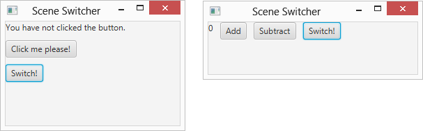
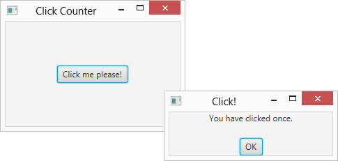
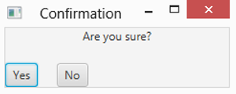

# 第 4 章 设置窗口和场景布局

> **In This Chapter**
>
> - Looking at some useful methods of the Stage and Scene classes
> -  Alternating scenes within a single stage
> - Displaying additional stages as message and confirmation boxes
> - Discovering the proper way to exit a JavaFX program

*O for a Muse of fire, that would ascend*
*The brightest heaven of Invention,*

*A kingdom for a stage, princes to act,*
*And monarchs to behold the swelling scene!*

So begins William Shakespeare’s play Henry V, and so also begins this chapter, in which I explore the various ways to manipulate the appearance of a JavaFX application by manipulating its stage and its swelling scenes.

Specifically, you read important details about the Stage class and the Scene class so that you can control such things as whether the window is resizable and if so, whether it has a maximum or a minimum size. You also read how to coerce your programs into displaying additional stages beyond the primary stage, such as an alert or confirmation dialog box. And finally, you read the proper way to end a JavaFX program by handling the events generated when the user closes the stage.

## Examining the Stage Class

A stage, which is represented by the Stage class, is the topmost container in which a JavaFX user interface appears. In Windows, on a Mac, or in Linux, a stage is usually a window. On other types of devices, such as a smartphone or tablet, the stage may be the full screen or a tiled region of the screen.

When a JavaFX application is launched, a stage known as the primary stage is automatically created. A reference to this stage is passed to the application’s start method via the primaryStage parameter:

```java
@Override public void start(Stage primaryStage) 
{
  // primaryStage refers to the
  // application's primary stage. 
}
```

You can then use the primary stage to create the application’s user interface by adding a scene, which contains one or more controls or other user-interface nodes.

In many cases, you will need to access the primary stage outside of the scope of the start method. You can easily make this possible by defining a class field and using it to reference the primary stage. You see an example of how to do that later in this chapter, in the section “Switching Scenes.”

The primary stage initially takes on the default characteristics of a normal windowed application, which depends on the operating system within which the program will run. You can, if you choose, change these defaults to suit the needs of your application. At the minimum, you should always set the window title. You may also want to change details, such as whether the stage is resizable and various aspects of the stage’s appearance.

The Stage class comes equipped with many methods that let you manipulate the appearance and behavior of a stage. Table 4-1 lists the ones you’re most likely to use.

**Table 4-1 Commonly Used Methods of the Stage Class**

| Method                                 | Description                                                  |
| -------------------------------------- | ------------------------------------------------------------ |
| void close()                           | Closes the stage.                                            |
| void initModality(Modality modality)   | Sets the modality of the stage. This method must be called before the show method is called. The modality can be one of the following: Modality.NONE Modality.APPLICATION_MODAL Modality.WINDOW_MODAL |
| void initStyle(StageStyle style)       | Sets the style for the stage. This method must be called before the show method is called. The style can be one of the following: StageStyle.DECORATED StageStyle.UNDECORATED StageStyle.TRANSPARENT StageStyle.UNIFIED StageStyle.UTILITY |
| void getMaxHeight(double maxheight)    | Gets the maximum height for the stage.                       |
| void getMaxWidth(double maxwidth)      | Gets the maximum width for the stage.                        |
| void getMinHeight(double maxheight)    | Gets the minimum height for the stage.                       |
| void getMinWidth(double maxwidth)      | Gets the minimum width for the stage.                        |
| void setFullScreen(boolean fullscreen) | Sets the fullscreen status of the stage.                     |
| void setIconified(boolean iconified)   | Sets the iconified status of the stage.                      |
| void setMaximized(boolean maximized)   | Sets the maximized status of the stage.                      |
| void setMaxHeight(double maxheight)    | Sets the maximum height for the stage.                       |
| void setMaxWidth(double maxwidth)      | Sets the maximum width for the stage.                        |
| void setMinHeight(double maxheight)    | Sets the minimum height for the stage.                       |
| void setMinWidth(double maxwidth)      | Sets the minimum width for the stage.                        |
| void setResizable(boolean resizable)   | Sets the fullscreen status of the stage.                     |
| void setScene(Scene scene)             | Sets the scene to be displayed on the stage.                 |
| void setTitle(String title)            | Sets the title to be displayed in the stage’s title bar, if a title bar is visible. |
| void show()                            | Makes the stage visible.                                     |
| void showAndWait()                     | Makes the stage visible and then waits until the stage is closed before continuing. |
| void toFront()                         | Forces the stage to the foreground.                          |
| void toBack()                          | Forces the stage to the background.                          |

The following paragraphs point out some of the ins and outs of using the Stage class methods listed in Table 4-1:

> **✓ For many (if not most) applications, the only three methods from Table 4-1 you need to use are setScene, setTitle, and show.**
>
> - Every stage must have a scene.
> - Every stage should have a title.
> - There’s not much point in creating a stage if you don’t intend on showing it to the user.
>
> The other methods in the table let you change the appearance or behavior of the stage, but the defaults are acceptable in most cases.
>
> **✓ If you want to prevent the user from resizing the stage, use the setResizable method like this:**
>
> ```java
> primaryStage.setResizable(false);
> ```
>
> Then, the user can’t change the size of the window. (By default, the stage is resizable. Thus, you don’t need to call the setResizable method unless you want to make the stage non-resizable.)
>
> **✓ If the stage is resizable, you can set the minimum and maximum size for the window.** For example:
>
> ```java
> primaryStage.setResizable(true); 
> primaryStage.setMinWidth(200); 
> primaryStage.setMinHeight(200); 
> primaryStage.setMaxWidth(600); 
> primaryStage.setMaxHeight(600);
> ```
>
> In this example, the user can resize the window, but the smallest allowable size is 200-x-200 pixels and the largest allowable size is 600-x-600 pixels.
>
> **✓ If you want to display the stage in a maximized window, call setMaximized:**
>
> ```java
> primaryStage.setMaximized(true);
> ```
>
> A maximized window still has the usual decorations (a title bar, window borders, and Minimize, Restore, and Close buttons). If you want the stage to completely take over the screen with no such decorations, use the setFullScreen method instead:
>
> ```java
> primaryStage.setFullScreen(true);
> ```
>
> When your stage enters fullscreen mode, JavaFX displays a message advising the user on how to exit fullscreen mode.
>
> **✓ If, for some reason, you want to start your program minimized to an icon, use the setIconified method:**
>
> ```java
> primaryStage.setIconified(true);
> ```
>
> **✓ For more information about the close method,** see the section “Exit, Stage Right” later in this chapter.
>
> **✓ The initModality and initStyle methods are interesting because they can be called only before you call the show method.** The initModality method allows you to create a modal dialog box — that is, a window that must be closed before the user can continue using other functions within the program. And the initStyle method lets you create windows that do not have the usual decorations such as a title bar or Minimize, Restore, and Close buttons. You typically use these methods when you need to create additional stages for your application beyond the primary stage. You can read more about how that works later in this chapter, in the section “Creating a Dialog Box.”

## Examining the Scene Class

Like the Stage class, the Scene class is fundamental to JavaFX programs. In every JavaFX program, you use at least one instance of the Scene class to hold the user-interface controls that your users will interact with as they use your program.

Table 4-2 lists the more commonly used constructors and methods of the Scene class.

**Table 4-2 Commonly Used Constructors and Methods of the Scene class**

| Constructor                                     | Description                                                  |
| ----------------------------------------------- | ------------------------------------------------------------ |
| Scene(Parent root)                              | Creates a new scene with the specified root node.            |
| Scene(Parent root, double width, double height) | Creates a new scene with the specified root node, width, and height. |

| Method                    | Description                                |
| ------------------------- | ------------------------------------------ |
| double getHeight()        | Gets the height of the scene.              |
| double getWidth()         | Gets the width of the scene.               |
| double getX()             | Gets the horizontal position of the scene. |
| double getY()             | Gets the vertical position of the screen.  |
| void setRoot(Parent root) | Sets the root node.                        |

The following paragraphs explain some of the more interesting details of the constructors and methods of the Scene class:

> ✓ All the Scene class constructors require that you specify the root node.
>
> You can change the root node later by calling the setRoot method, but it’s not possible to create a scene without a root node.
>
> ✓ You might be wondering why the root node is an instance of the
>
> Parent class rather than an instance of the Node class. The Parent class is actually a subclass of the Node class, which represents a node that can have child nodes. There are several other subclasses of Node, which represent nodes that can’t have children; those nodes can’t be used as the root node for a scene.
>
> ✓ You can set the scene’s initial size when you create it by specifying the Width and Height parameters.
>
> If you don’t set the size, the scene will determine its own size based on its content.
>
> ✓ You can retrieve the size of the scene via the getHeight and getWidth methods.
>
> There are no corresponding set methods that let you set the height or width.
>
> ✓ In general, the size of the scene determines the size of the stage, provided that that scene is not smaller than the minimum size specified for the stage or larger than the maximum size.
>
> ✓ If the user resizes the stage, the size of the scene is resized accordingly.

## Switching Scenes

The primary stage of a JavaFX program (or any other stage, for that matter) can have only one scene displayed within it at any given time. However, that doesn’t mean that your program can’t create several scenes and then swap them as needed. For example, suppose you’re developing a word-processing program and you want to let the user switch between an editing view and a page preview view. You could do that by creating two distinct scenes, one for each view. Then, to switch the user between views, you simply call the stage’s setScene method to switch the scene.

In Chapter 2, you read about a ClickCounter program whose scene displays a label and a button and then updates the label to indicate how many times the user has clicked the button. Then, in Chapter 3, you saw several variations of an AddSubtract program whose scene displayed a label and two buttons: One button added one to a counter when clicked, the other subtracted one from the counter.

Listing 4-1 shows a program named SceneSwitcher that combines the scenes from the ClickCounter and AddSubtract programs into a single program. Figure 4-1 shows this program in action:

> ✓ When the SceneSwitcher program is first run, it displays the ClickCounter scene as shown on the left side of the figure.
>
> ✓ When the user clicks the Switch Scene button, the scene switches to the AddSubtract scene, as shown in the right side of the figure.

> Figure 4-1: The SceneSwitcher program.



**Listing 4-1: The SceneSwitcher Program**

```java
import javafx.application.*; 
import javafx.stage.*; 
import javafx.scene.*; 
import javafx.scene.layout.*; 
import javafx.scene.control.*; 
import javafx.event.*;

public class SceneSwitcher extends Application 
{
  public static void main(String[] args) 
  { 
    launch(args); 
  }

  // class fields for Click-Counter scene                                        // →15
  int iClickCount = 0; 
  Label lblClicks; 
  Button btnClickMe; 
  Button btnSwitchToScene2; 
  Scene scene1;

  // class fields for Add-Subtract scene                                         // →22
  int iCounter = 0; 
  Label lblCounter; 
  Button btnAdd; 
  Button btnSubtract; 
  Button btnSwitchToScene1; 
  Scene scene2;

  // class field for stage 
  Stage stage;                                                                   // →31

  @Override public void start(Stage primaryStage) 
  { 
    stage = primaryStage;                                                        // →35

    // Build the Click-Counter scene                                             // →37

    lblClicks = new Label(); 
    lblClicks.setText("You have not clicked the button.");
    btnClickMe = new Button(); 
    btnClickMe.setText("Click me please!"); 
    btnClickMe.setOnAction( 
      e -> btnClickMe_Click());

    btnSwitchToScene2 = new Button(); 
    btnSwitchToScene2.setText("Switch!"); 
    btnSwitchToScene2.setOnAction(
      e -> btnSwitchToScene2_Click());

    VBox pane1 = new VBox(10); 
    pane1.getChildren().addAll(lblClicks, btnClickMe, 
                               btnSwitchToScene2);

    scene1 = new Scene(pane1, 250, 150);


    // Build the Add-Subtract scene                                              // →59

    lblCounter = new Label(); 
    lblCounter.setText(Integer.toString(iCounter));

    btnAdd = new Button(); 
    btnAdd.setText("Add"); 
    btnAdd.setOnAction(
      e -> btnAdd_Click() );

    btnSubtract = new Button(); 
    btnSubtract.setText("Subtract"); b
      tnSubtract.setOnAction( 
      e -> btnSubtract_Click() );

    btnSwitchToScene2 = new Button(); 
    btnSwitchToScene2.setText("Switch!"); 
    btnSwitchToScene2.setOnAction( 
      e -> btnSwitchToScene1_Click() );

    HBox pane2 = new HBox(10); 
    pane2.getChildren().addAll(lblCounter, btnAdd, 
                               btnSubtract, btnSwitchToScene2);

    scene2 = new Scene(pane2, 300, 75);

    // Set the stage with scene 1 and show the stage                             // →84
    primaryStage.setScene(scene1); 
    primaryStage.setTitle("Scene Switcher"); 
    primaryStage.show();
  }


  // Event handlers for scene 1                                                  // →91
  
  public void btnClickMe_Click() 
  {
    iClickCount++; 
    if (iClickCount == 1) 
    {
      lblClicks.setText("You have clicked once."); 
    } 
    else 
    {
      lblClicks.setText("You have clicked "
                        + iClickCount + " times." ); 
    }
  } 

  private void btnSwitchToScene2_Click() 
  { 
    stage.setScene(scene2); 
  }

  // Event handlers for scene 2                                                  // →112

  private void btnAdd_Click()
  {
    iCounter++;

    lblCounter.setText(Integer.toString(iCounter)); 
  } 

  private void btnSubtract_Click() 
  {
    iCounter--;
    lblCounter.setText(Integer.toString(iCounter)); 
  } 

  private void btnSwitchToScene1_Click() 
  {
    stage.setScene(scene1); 
  }
}
```

The following paragraphs point out some key sections of the program:

➝ 15：This section of the program defines class fields that will be used by the scene for the Click-Counter portion of the program. These fields include iClickCount, used to count the number of times the user has clicked the Click Me! Button; the label used to display the count of how many times the Click Me! button has been clicked; the Click Me! button itself; and the button used to switch to the Add-Subtract scene. Also included is a Scene field named scene1 that will be used to reference the Click Counter scene.

➝ 22：These lines define class variables used by the Add-Subtract portion of the program, including the counter (iCounter), the label used to display the counter, the two buttons used to increment and decrement the counter, the button used to switch back to the ClickCounter scene, and a Scene field named scene2 that will be used to reference the Add-Subtract scene.

➝ 31：A class field named stage is used to hold a reference to the primary stage so that it can be accessed throughout the program.

➝ 35：This line sets stage class field to reference the primary stage.

➝ 37：This section of the program builds the Click-Counter scene. First, it creates the label and buttons displayed by the scene. Then it creates a VBox layout pane (which lays out its controls in a vertical stack) and adds the label and buttons to the pane. Finally, it creates the scene using the VBox pane as its root.

➝ 59：This section of the program builds the Add-Subtract scene by creating the label and the buttons displayed by the scene, arranging them in an HBox layout pane, and creating the scene using the HBox pane as its root.

➝ 84：These lines set the Click-Counter scene as the root scene for the primary stage, sets the stage title, and then shows the stage.

➝ 91：This section of the program provides the event handlers for the buttons in the Click-Counter scene. The event handler for the Click Me! button increments the click counter, then sets the label to display an appropriate message. The handler for btnSwitchToScene2 simply switches the scene of the primary stage to scene2, which instantly switches the display to the Add-Subtract scene as shown in the right side of Figure 4-1.

➝ 112：This section of the program provides the event handlers for the buttons in the Add-Subtract scene. The event handler for the Add and Subtract buttons increment or decrement the counter and update the text displayed by the label. The handler for btnSwitchToScene1 switches the scene back to scene1, which switches the display back to the Click-Counter scene shown in the left right side of Figure 4-1.

##Creating a Dialog Box

Every JavaFX program has at least one stage — the primary stage. In addition to the primary stage, most JavaFX programs at some point find the need to create additional stages to

> ✓ Display informational or warning messages (commonly called alert boxes or a message boxes)
>
> ✓ Ask for confirmation from the user before performing a task 
>
> ✓ Show complex dialog boxes that ask the user to enter data or select options

Many GUI programming packages or languages contain provisions for creating such dialog boxes. For example, Swing includes a built-in class called JOptionPane that makes it easy to create a simple alert box. With the JOptionPane class, you can create a simple alert box, such as the one shown in Figure 4-2, with a single call to the static showMessageDialog method, like this:

```java
JOptionPane.showMessageDialog(null, "Thanks for stopping by", "Say Thanks", JOptionPane.INFORMATION_MESSAGE);
```

> Figure 4-2: The ClickCounter program in action.



Unfortunately (and a little inexplicably), JavaFX provides no such facility. To display a similar message box in JavaFX, you must write code to create a new stage, create a new scene, create a label or other type of text control to display the message, create an OK button, create a layout pane, add the controls to the layout pane, add the pane to the scene, add the scene to the stage, set the stage’s modality to WINDOW_MODAL, and then display the stage. You end up needing well over a dozen lines of code to do this.

That’s a lot of work to display a simple message box. Fortunately, it doesn’t take a lot of effort to create a simple class that you can use to display common message, alert, or confirmation boxes. You can use the class throughout your project, or you can place the class in a package so you can import it into any JavaFX project.

Listing 4-2 shows a simple class named MessageBox that has one method, show, which you can call to display a dialog box that displays a message. To display a message box, simply call the show method, like this:

```java
MessageBox.show("Hello!", "Greetings!");
```

The show method accepts two parameters — the message to be displayed and the title displayed in the dialog box.

**Listing 4-2: The MessageBox Class**

```java
import javafx.application.*; 
import javafx.stage.*; 
import javafx.scene.*; 
import javafx.scene.layout.*; 
import javafx.scene.control.*; 
import javafx.geometry.*;

public class MessageBox                                                           // →8
{
  public static void show(String message, String title)                           // →10
  { 
    Stage stage = new Stage();                                                    // →12
    stage.initModality(Modality.APPLICATION_MODAL);                               // →13
    stage.setTitle(title);                                                        // →14
    stage.setMinWidth(250);                                                       // →15    

    Label lbl = new Label();                                                      // →17
    lbl.setText(message);

    Button btnOK = new Button();                                                  // →20
    btnOK.setText("OK"); 
    btnOK.setOnAction(e -> stage.close());                                        // →22

    VBox pane = new VBox(20);                                                     // →24
    pane.getChildren().addAll(lbl, btnOK); 
    pane.setAlignment(Pos.CENTER);                                                // →26

    Scene scene = new Scene(pane);                                                // →28
    stage.setScene(scene); 
    stage.showAndWait();                                                          // →30
  }
}
```

The following paragraphs highlight the key points of this program:

➝ 8：The MessageBox class creates and shows a simple dialog box that displays a message.

➝ 10：The show method accepts two parameters — the message to be displayed and the title for the dialog box.

➝ 12：The show method creates a new stage by calling the Stage class constructor.

➝ 13：The initModality method is called to specify that the stage will be displayed in application modal mode, which means that when displayed, the stage will block all events from reaching any other stages in the application. Thus, the user must close the message box before using any part of the rest of the application’s user interface.

➝ 14：The message box title is set to the title parameter passed to the show method.

➝ 15：The message box’s minimum width is set to 250 pixels. The actual width of the message box will be increased automatically if necessary based on the length of the message to be displayed.

➝ 17：A label control is created and its text set to the value of the message parameter.

➝ 20：A button is created; its text is set to the string OK.

➝ 22：An event handler is created by using a Lambda expression to call the close method of the stage object. Thus, when the user clicks OK, the stage is closed. This, in turn, causes the message box to disappear.

➝ 24：A VBox layout pane is created, and the label and button are added to it.

➝ 26：The setAlignment method of the VBox class is called to specify that the label and button should be centered within the VBox layout pane. (You can read more about this method and other methods of the VBox class in Chapter 5.)

➝ 28：A scene object is created using the layout pane as its root node. Then, in the next line, the setScene method of the primary stage is called to establish the scene to be displayed on the stage.

➝ 30：The showAndWait method is called to display the message box. This method doesn’t return until the stage has been closed, which ensures that the message box is modal — no other part of the program will receive events until the user has closed the message box.

To demonstrate how you might use the MessageBox class, the program shown in Listing 4-3 is a variation of the ClickCounter program that was originally discussed in Chapter 2. The original version of this program displayed a label and a button, using the label to display a count of how many times the user has clicked the button. This version of the program dispenses with the label and instead uses the MessageBox class to display a message indicating how many times the user has clicked the button.

**Listing 4-3: The ClickCounter Program**

```java
import javafx.application.*; 
import javafx.stage.*; 
import javafx.scene.*; 
import javafx.scene.layout.*; 
import javafx.scene.control.*;

public class ClickCounter extends Application 
{
  public static void main(String[] args) 
  { 
    launch(args); 
  }

  int iClickCount = 0;
  @Override public void start(Stage primaryStage) 
  {
    // Create the button 
    btn = new Button(); 
    btn.setText("Click me please!"); 
    btn.setOnAction(e -> buttonClick());

    // Add the button to a layout pane 
    BorderPane pane = new BorderPane(); 
    pane.setCenter(btn);

    // Add the layout pane to a scene 
    Scene scene = new Scene(pane, 250, 150);

    // Add the scene to the stage, set the title 
    // and show the stage 
    primaryStage.setScene(scene); 
    primaryStage.setTitle("Click Counter"); 
    primaryStage.show();
  }

  public void buttonClick() 
  {
    iClickCount++; if (iClickCount == 1) 
    {
      MessageBox.show("You have clicked once.", "Click!"); 
    } 
    else
    {
      MessageBox.show("You have clicked "
                      + iClickCount + " times." , "Click!"); }
  }
}
```

This program is nearly identical to the version that was presented in Chapter 2 (in Listing 2-2). In fact, here are the only two differences:

> ✓ No label is defined in this program because a message box, not a label, is used to display the number of times the button has been clicked.
>
> ✓ In the buttonClick method of the Chapter 2 version, the label’s setText method was called to display the number of times the button has been clicked. In this version, MessageBox.show is used instead.

Figure 4-2 shows the new version of the ClickCounter program in action. Here, you can see the message box displayed when the user clicks the button the first time. (In this example, I moved the message box to the side a little so that you can see the primary stage beneath it. When you actually run the program, the message box is centered over the primary stage.)

## Creating a Confirmation Box

A confirmation box is a dialog box that asks the user for confirmation before proceeding with some action. For example, if the user of a word processing program closes the program without first saving changes to the current document, the program typically asks the user whether he really wants to quit without saving changes. A confirmation box displays a text message, which is often as simple as “Are you sure?” along with two buttons, typically labeled Yes and No or OK and Cancel.

Creating a confirmation box is a little more complicated than creating a message box because the confirmation box must let the main program know which button the user clicked. The most common way to do that is to call a method that displays the confirmation box and returns a result value that indicates the user’s selection.

In this section, I look at a simple class called ConfirmationBox that has a static method named show. This method displays a message and two buttons and returns a Boolean value true if the user clicks the first button and false if the user clicks the second button.

The show method accepts four parameters:

> ✓ The message to be displayed 
>
> ✓ The title for the confirmation box
>
> ✓ The text to be displayed on the first button 
>
> ✓ The text to be displayed on the second button

Here’s an example of how you might use this class to display a confirmation box:

```java
boolean confirm = ConfirmationBox.show( "Are you sure?", "Confirmation", "Yes", "No");
```

Figure 4-3 shows the confirmation box displayed by the preceding statement. If the user clicks the Yes button, the show method returns true; otherwise, the show method returns false.

Listing 4-4 shows the source for the ConfirmationBox class.

> Figure 4-3: A confirmation box displayed by the ConfirmationBox class.



**Listing 4-4: The ConfirmationBox Class**

```java
import javafx.application.*; 
import javafx.stage.*; 
import javafx.scene.*; 
import javafx.scene.layout.*; 
import javafx.scene.control.*; 
import javafx.scene.text.*; 
import javafx.event.*; 
import javafx.geometry.*;

public class ConfirmationBox                                                      // →10
{

  static Stage stage;                                                             // →13
  static boolean btnYesClicked;                                                   // →14

  public static boolean show(String message, String title,                        // →16
                             String textYes, String textNo) 
  {
    btnYesClicked = false;

    stage = new Stage(); 
    stage.initModality(Modality.APPLICATION_MODAL);                               // →21
    stage.setTitle(title); 
    stage.setMinWidth(250);

    Label lbl = new Label();                                                      // →26
    lbl.setText(message);

    Button btnYes = new Button();                                                 // →28
    btnYes.setText(textYes); 
    btnYes.setOnAction(e -> btnYes_Clicked() );

    Button btnNo = new Button();                                                  // →32
    btnNo.setText(textNo); 
    btnNo.setOnAction(e -> btnNo_Clicked() );

    HBox paneBtn = new HBox(20);                                                  // →36
    paneBtn.getChildren().addAll(btnYes, btnNo);

    VBox pane = new VBox(20);                                                     // →39
    pane.getChildren().addAll(lbl, paneBtn); 
    pane.setAlignment(Pos.CENTER);

    Scene scene = new Scene(pane);                                                // →43
    stage.setScene(scene); 
    stage.showAndWait(); 
    return btnYesClicked;                                                         // →46
  }

  private static void btnYes_Clicked()                                            // →49
  {
    stage.close();
    btnYesClicked = true; 
  }

  private static void btnNo_Clicked()                                             // →55
  {
    stage.close();
    btnYesClicked = false; 
  }
}
```

The following paragraphs explain some of the key points of this class:

➝ 10：The ConfirmationBox class represents a dialog box that asks the user for a Yes/No confirmation.

➝ 13：The stage is defined using a class field so that it will be available to the event handlers for the buttons, which are implemented in separate methods that will be called via Lambda expressions.

➝ 14：A boolean class field named btnYesClicked indicates whether the user clicks the Yes or No button.

➝ 16：The show method returns a boolean value and accepts four parameters: the message to display, the dialog box title, the text to display on the first button (the Yes button), and the text to display on the second button (the No button).

➝ 21：The stage is created using APPLICATION_MODAL modality so that no events are processed elsewhere in the program until the user closes the confirmation box. The title is assigned the value passed via the title parameter.

➝ 26：A label is created and assigned the value passed via the message parameter.

➝ 28：The Yes button is created and assigned the text value passed via the textYes property. The setOnAction method uses a Lambda expression to call a method named btnYes_Clicked when the user clicks this button.

➝ 32：The No button is created and assigned the text value passed via the textNo property. The setOnAction method uses a Lambda expression to call a method named btnNo_Clicked when the user clicks this button.

➝ 36：The buttons are added to an HBox layout pane so they will appear side by side in the confirmation box.

➝ 39：The label and the HBox are added to a VBox layout pane so the label will appear centered above the buttons in the confirmation box.

➝ 43：The scene is created using the VBox pane as its root node. Then, the scene is added to the stage and the stage is displayed.

➝ 46：When the user closes the confirmation box, the show method returns the value of btnYesClicked to indicate which button the user clicked.

➝ 49：The btnYes_Clicked method is called if the user clicks the Yes button. In this method, the stage is closed and the btnYesClicked class field is set to true.

➝ 55：The btnNo_Clicked method is called if the user clicks the No button. Here, the stage is closed and the btnYesClicked class field is set to false.

## Exit, Stage Right

Because I started this chapter by quoting Shakespeare, I thought it’d be nice to end it by quoting Snagglepuss, the famous pink mountain lion from the old Hanna-Barbera cartoons. He’d often leave the scene by saying, “Exit, stage left” or “Exit, stage right.”

Heavens to Mergatroyd!

There’s a right way and a wrong way to exit the stage, even. And so far, none of the programs presented in this book have done it the right way. The only mechanism the programs you’ve seen so far have provided to quit the program is for the user to click the standard window close button, typically represented by an X in the upper-right corner of the window’s title bar. That is almost always the wrong way to exit a program.

In most cases, the correct way to exit a program involves the following details:

> ✓ Adding a button, menu command, or other way for the user to signal that she wishes to close the program.
>
> Many programs include a button labeled Exit or Close, and programs that use a menu usually have an Exit command.
>
> ✓ Optionally displaying a confirmation box that verifies whether the
>
> user really wants to close the program. You can do that by using the ConfirmationBox class shown in the preceding section or by using a similar class.
>
> Depending on the program, you might want to display this dialog box only if the user has made changes to a document, database, or other file that have not yet been saved.
>
> ✓ If the user really does want to close the program, the program should perform any necessary clean-up work, such as
>
> - Saving changes to documents, databases, or other files.
> - Properly closing databases and other resources.
>
> ✓ After you’ve done any necessary clean-up work, you can close the application by calling the primary stage’s close method.
>
> ✓ The verification and clean-up steps should be taken whether the user attempts to close the program by using a button or menu command you’ve provided in your user interface or by clicking the built-in window close button.

In the following sections, you read about how to add a Close button to your application, how to prevent the window close button from unceremoniously terminating your application, and how to put these two elements together in a complete program.

###Creating a Close button

To add a button or other user-interface element that allows the user to close the button, all you have to do is provide an action event handler that calls the stage’s close method.

For example, suppose you create a Close button using the following code:

```java
Button btnClose = new Button(); 
btnClose.setText("Close"); 
btnClose.setOnAction(e -> primaryStage.close());
```

In this case, the action event handler simply calls primaryStage.close() to close the application.

If you want to do more than simply call the close method in the action event handler, you may want to isolate the event handler in a separate method, as in this example:

```java
btnClose.setOnAction(e -> btnClose_Clicked());
```

Because the btnClose_Clicked method will need to access the primary stage to close it, you need to define a class field of type Stage and use it to reference the primary stage. Then, your btnClose_Clicked method can easily perform additional tasks. For example:

```java
private void btnClose_Click() 
{
  boolean reallyQuit = false; 
  reallyQuit = ConfirmationBox.show( 
    "Are you sure you want to quit?", 
    "Confirmation", 
    "Yes", "No"); 
  if (reallyQuit) 
  { 
    // Perform cleanup tasks here 
    // such as saving files or freeing resources 
    stage.close(); 
  }
}
```

In this example, a confirmation box is displayed to make sure the user really wants to exit the program.

> **Shakespeare’s Best Stage Direction**
>
> So far in this chapter, I’ve quoted William Shakespeare once and Snagglepuss once. Both quotes are appropriate for the topic of this chapter: The Shakespeare quotation from Henry V refers to stages and scenes, and the Snagglepuss quotation refers to the proper way to exit the stage. Even so, quoting Snagglepuss as often as Shakespeare seems a little out of balance. Thus, I think it’s best to throw in another Shakespeare quote to save what little respect I may still have from my college English professors.
>
> Shakespeare’s plays are liberally sprinkled with stage directions. Most of them are very brief, such as Enter Tybalt or Exit Romeo found in Romeo and Juliet. A few are a bit more detailed, such as Enter several of both houses, who join the fray, also from Romeo and Juliet. And
>
> sometimes they’re a bit ambiguous, such as Enter a messenger with two heads and a hand from Titus Andronicus.
>
> But in my opinion, the most interesting of all Shakespeare’s stage directions is found in The Winter’s Tale, when Antigonus is thwarted from rescuing Perdita following a shipwreck: Exit, pursued by a bear.
>
> When you exit the stage because you’re pursued by a bear, you don’t get to collect your things or accomplish any of the other important tasks you had set out to do, such as saving the princess or saving the important changes the user made to a document. Instead, you just turn and run, which is pretty much what happens when the user clicks the window close button unless you properly handle the CloseRequest event.

### Handling the CloseRequest event

Providing a Close button is an excellent way to allow your users to cleanly exit from your program. However, the user can bypass your exit processing by simply closing the window — that is, by clicking the window close button, usually represented as an X in the upper-right corner of the window border. Unless you provide otherwise, clicking this button unceremoniously terminates the application, bypassing all your nice code that confirms whether the user wants to save his work, closes any open resources, and otherwise provides for a graceful exit.

Fortunately, you can easily avoid such ungraceful exits. Whenever the user attempts to close the window within which a JavaFX stage is displayed, JavaFX generates a CloseRequest event, which is sent to the stage. You can provide an event handler for this event by calling the setOnCloseRequest method of the Stage class. Then, the event handler is called whenever the user tries to close the window.

You might be tempted to create a single method that can serve as the event handler for both the Action event of your Close button and the CloseRequest event, like this:

```java
btnClose.setText("Close"); 
btnClose.setOnAction(e -> btnClose_Click()); 
primaryStage.setOnCloseRequest(e -> btnClose_Click());
```

Here, the intent is to handle the CloseRequest event exactly as if the user had clicked the btnClose button.

That’s a good idea, but it doesn’t work if the btnClose_Click event displays a confirmation box and closes the stage only if the user confirms that she really wants to quit the program. That’s because when the event handler for the CloseRequest event ends, JavaFX automatically closes the stage if the event handler doesn’t explicitly close the stage.

To prevent that from happening, you call the consume method of the CloseRequest event object. Consuming the event causes it to be stopped in its tracks within the event handler, thus preventing JavaFX from automatically closing the stage when the event handler ends.

In the Lambda expression passed to the setOnCloseRequest method, the CloseRequest event object is represented by the argument e. Thus, you can consume the CloseRequest event by calling e.consume().

An easy way to provide a method that handles both the Action event for a Close button and the CloseRequest event for a stage is to craft the Lambda expression for the setOnCloseRequest method so that it consumes the event before calling the method that will handle the event:

```java
btnClose.setText("Close"); 
btnClose.setOnAction(e -> btnClose_Click());
primaryStage.setOnCloseRequest(
  e -> { 
    e.consume();
    btnClose_Click(); 
  });
```

Here, the event handler for the CloseRequest event first consumes the event and then calls btnClose_Click. The btnClose_Click method, in turn, displays a confirmation box and closes the stage if the user confirms that this is indeed what he wishes to do.

### Putting it all together

Now that you know how to add a Close button to a scene and how to handle the CloseRequest event, I look at a program that puts together these two elements to demonstrate the correct way to exit a JavaFX program.

This section presents a variation of the ClickCounter program that includes a Close button in addition to the Click Me! button. When the user clicks the Click Me! button, a message box displays to indicate how many times the button has been clicked. But when the user attempts to exit the program, whether by clicking the Close button or by simply closing the window, the ConfirmationBox class that was shown in Listing 4-4 is used to ask the user whether she really wants to exit the program. Then, the stage is closed only if the user clicks the Yes button in the confirmation box.

The source code for this program is shown in Listing 4-5.

**Listing 4-5: The ClickCounter Exit program**

```java
import javafx.application.*; 
import javafx.stage.*; 
import javafx.scene.*; 
import javafx.scene.layout.*; 
import javafx.scene.control.*; 
import javafx.geometry.*;

public class ClickCounterExit extends Application 
{
  public static void main(String[] args) 
  { 
    launch(args); 
  }

  Stage stage;
  int iClickCount = 0;

  @Override public void start(Stage primaryStage) 
  { 
    stage = primaryStage;

    // Create the Click Me button 
    Button btnClickMe = new Button(); 
    btnClickMe.setText("Click me please!"); 
    btnClickMe.setOnAction(e -> btnClickMe_Click());

    // Create the Close button                                                    // →27
    Button btnClose = new Button(); 
    btnClose.setText("Close"); 
    btnClose.setOnAction(e -> btnClose_Click() );

    // Add the buttons to a layout pane 
    VBox pane = new VBox(10); 
    pane.getChildren().addAll(btnClickMe, btnClose); 
    pane.setAlignment(Pos.CENTER );

    // Add the layout pane to a scene 
    Scene scene = new Scene(pane, 250, 150);

    // Finish and show the stage 
    primaryStage.setScene(scene); 
    primaryStage.setTitle("Click Counter"); 
    primaryStage.setOnCloseRequest( e ->                                          // →43
                                   {
                                     e.consume();
                                     btnClose_Click();
                                   } );
    primaryStage.show();
  }

  public void btnClickMe_Click() 
  {
    iClickCount++; 
    if (iClickCount == 1) 
    {
      MessageBox.show("You have clicked once.", "Click!");
    } 
    else 
    {
      MessageBox.show("You have clicked " + iClickCount + " times." , "Click!");
    }
  }

  public void btnClose_Click()                                                    // →65
  {
    boolean confirm = false; 
    confirm = ConfirmationBox.show(
      "Are you sure you want to quit?", "Confirmation",
      "Yes", "No"); 
    if (confirm) 
    {
      // Place any code needed to save files or
      // close resources here.
      stage.close();
    }
  }
}
```

The following paragraphs describe the sections of this program that are responsible for making sure the program exits cleanly:

➝ 27：These lines create the Close button. The Lambda expression in the call to setOnAction causes the method named btnClose_ Click to be called if the user clicks the button.

➝ 43：This statement creates an event handler for the CloseRequest event, which is raised if the user attempts to close the window by clicking the window close button. The event handler first consumes the CloseRequest event and then calls the btnClose_ Click method. Thus, from the user’s perspective, clicking the window close button is the same as clicking the Close button.

➝ 65：The btnClose_Click method displays a confirmation box to ask the user whether he really wants to quit. If so, the stage is closed. I added comments to show where you’d insert any code needed to save files or do any other cleanup work that might be required in a more realistic program.