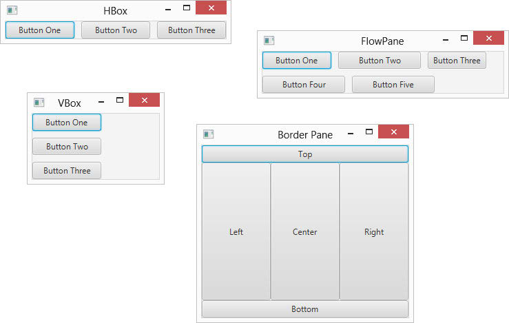
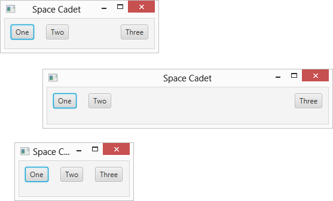
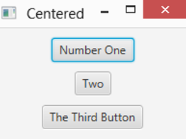
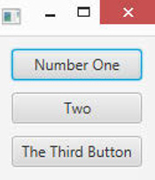
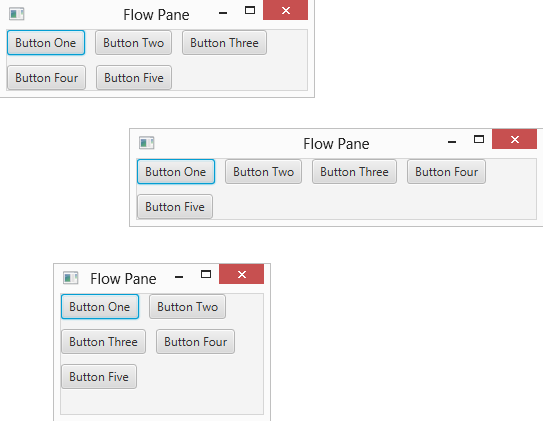
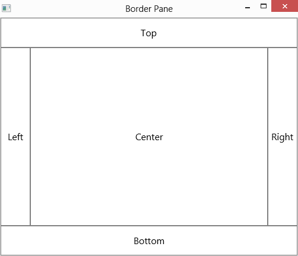

# 第 5 章 使用布局面板布置场景

> **在这一章当中**
>
> - 使用四种流行的布局窗格类：HBox、VBox、FlowPane 和 BorderPane
> - 调整布局窗格及其包含的节点的大小
> - 摆弄用于在布局窗格中分隔节点的各种选项

控制场景中组件的布局通常是使用 JavaFX 最困难的方面之一。事实上，有时它可能会让人非常恼火。通常，这些组件似乎几乎都有自己的想法。他们变得固执，拒绝让步。当您希望它们并排时，它们会相互排列。您对标签或文本字段稍作更改，整个场景似乎会重新排列。有时，您想将拳头穿过显示器。

我建议不要把你的拳头穿过你的显示器。你会弄得一团糟，割伤你的手，还得花钱买一台新显示器——当你让你的电脑重新工作时，组件仍然不会按照你想要的方式排列。

问题不在于组件。它与布局窗格有关，它确定每个组件在其框架或面板中的显示位置。布局窗格是特殊的类，其唯一目的是控制出现在场景中的节点的排列。 JavaFX 提供了几种不同类型的布局窗格；每种类型都使用不同的方法来控制节点的排列。成功布置场景的诀窍是使用正确组合的布局窗格来实现您想要的布置。

## 使用布局窗格

了解布局窗格是创建有吸引力且可用的 JavaFX 框架的关键。

### 介绍四个 JavaFX 布局窗格

JavaFX 提供了许多不同的布局窗格供您使用。我在本章中解释了以下四个：

> ✓ HBox：此布局窗格水平排列节点，一个接一个。您可以使用它来创建整齐排列的控件。
>
> ✓ VBox：此布局窗格垂直排列节点，一个在另一个之上。
>
> 您可以使用它来创建整齐排列在列中的控件。
>
> ✓ FlowPane：此布局窗格将节点彼此相邻排列，直到空间不足；然后，它换行以继续布局节点。您可以配置 FlowPane 以在行中水平排列节点或在列中垂直排列节点。
>
> ✓ BorderPane：此布局窗格将窗格分为五个区域：顶部、左侧、中心、右侧和底部。添加节点时，可以指定要放置节点的区域。

为了让您大致了解这四个布局窗格中的每一个可以实现的结果，图 5-1 显示了四个示例窗口，每个窗口都使用一个布局窗格。

第 11 章讨论了其他类型的布局窗格。

> 图 5-1：四种常用的布局窗格。



### 创建布局窗格

使用布局窗格的基本过程很简单。以下是创建布局节点的一般过程：

1. 创建要添加到窗格的控件或其他节点。

   例如，如果布局窗格将包含两个按钮，您应该使用类似于以下的代码创建这两个按钮：

   ```java
   Button btnOK = new Button(); 
   btnOK.setText("OK"); 
   btnOK.setOnAction(e -> btnOK_Click()); 
   Button btnCancel = new Button(); btnCancel.setText("Cancel"); 
   btnCancel.setOnAction(e -> btnCancel_Click());
   ```

2. 通过调用其构造函数创建一个布局窗格。

   例如：

   ```java
   HBox pane = new HBox();
   ```

3. 微调布局窗格所需的任何设置。

   每种类型的布局窗格都有一个独特的参数分类，用于控制节点在窗格中的布局方式的详细信息。例如，HBox 窗格允许您设置将用于分隔窗格中每个节点的像素数。您可以按如下方式设置此值：

   ```java
   HBox.setSpacing(10);
   ```

4. 添加将出现在布局窗格中的每个节点。

   每种类型的布局窗格都提供了一种将节点添加到窗格的方法。对于 HBox 窗格，您必须首先调用 getChildren 方法来获取已添加到窗格中的所有节点的列表。然后，调用 addAll 方法将一个或多个节点添加到窗格中。例如：

   ```java
   pane.getChildren().addAll(btnOK, btnCancel);
   ```

5. 创建场景，将布局窗格指定为场景的根节点。

   例如：

   ```java
   Scene scene = new Scene(pane, 300, 400);
   ```

   在此示例中，窗格被添加为场景的根节点。

### 组合布局窗格

您可以组合多个布局窗格来创建比单个布局窗格所能提供的更复杂的布局。例如，假设您要创建一个布局，该布局在底部有一排水平按钮，右侧有一列垂直按钮。为此，您可以为底部的按钮创建一个 HBox，为右侧的按钮创建一个 VBox。然后，您可以创建一个 BorderPane 并将 HBox 添加到底部区域并将 VBox 添加到右侧区域。

这样的组合是可能的，因为所有布局窗格都继承了基类 javafx.scene.layout.Pane，而后者又继承了类 javafx.scene.node。换句话说，所有窗格也是节点。添加到布局窗格的每个节点都可以是另一个布局窗格。您可以根据需要将布局窗格嵌套在布局窗格中的深度，以实现应用程序所需的精确布局。

## 使用 HBox 布局

HBox 类提供了所有 JavaFX 布局管理器中最简单的一种：它将一个或多个节点排列成水平行。表 5-1 展示了 HBox 类最常用的构造函数和方法。

**表 5-1 HBox 构造函数和方法**

| 构造函数                              | 描述                                                  |
| ---------------------------------------- | ------------------------------------------------------------ |
| HBox()                                   | 创建一个空的 HBox。                                       |
| HBox(double spacing)                     | 创建一个具有指定间距的空 HBox。            |
| HBox(Node. . . children)                 | 创建具有指定子节点的 HBox。此构造函数允许您创建一个 HBox 并同时向其添加子节点。 |
| HBox(double spacing, Node. . . children) | 创建具有指定间距和子节点的 HBox。  |

| 方法                                              | 描述                                                  |
| --------------------------------------------------- | ------------------------------------------------------------ |
| ObservableList\<Node\> getChildren()                | 返回已添加到 HBox 的所有子节点的集合。该集合作为 ObservableList 类型返回，其中包括方法 addAll，允许您将一个或多个节点添加到列表中。 |
| static void setAlignment(Pos alignment)             | 设置 HBox 中子节点的对齐方式。<br>有关 Pos 枚举的说明，请参见表 5-5。有关详细信息，请参阅本章后面的“在布局窗格中对齐节点”部分。 |
| static void setHgrow(Node child, Priority priority) | 设置给定子节点的增长行为。<br>有关优先级枚举的说明，请参见表 5-3。有关详细信息，请参阅本章后面的“通过增长节点添加空间”部分。 |
| static void setMargin(Node child, Insets value)     | 设置给定子节点的边距。<br>有关 Insets 类的构造函数，请参见表 5-2。<br>有关详细信息，请参阅本章后面的“使用边距添加空间”部分。 |
| void setPadding(Insets value)                       | 设置 Hbox 内边缘周围的填充。<br>有关 Insets 类的构造函数，请参见表 5-2。<br>有关详细信息，请参见本章后面的“间距”部分。 |
| void setSpacing(double value)                       | 设置 HBox 中显示的节点之间的间距。<br>有关详细信息，请参阅本章后面的“间距”部分。|

HBox 类在 javafx.scene.layout 包中定义，因此您应该在任何使用 HBox 的程序中包含以下导入语句：

```java
import javafx.scene.layout.*;
```

创建 HBox 的最简单方法是首先创建要放置在 HBox 中的节点，然后调用 HBox 构造函数并将节点作为参数传递。例如：

```java
Button btn1 = new Button("Button One"); 
Button btn2 = new Button("Button Two"); 
Button btn3 = new Button("Button Three"); 
HBox hbox = new HBox(btn1, btn2, btn3);
```

如果您希望在最初为空的状态下创建 HBox 控件，然后再添加控件，您可以这样做：

```java
HBox hbox = new HBox(); 
Hbox.getChildren().addAll(btn1, btn2, btn3);
```

此处调用 getChildren 方法，该方法返回添加到 HBox 窗格的所有子项的集合。该集合由 ObservableList 类定义，其中包括一个名为 addAll 的方法，您可以使用该方法将一个或多个节点添加到列表中。

## 将事物间隔开

默认情况下，布局窗格中的子节点紧挨着排列，中间没有空白。如果要在窗格中的节点之间提供空间，可以通过四种方式进行：

> ✓ 在窗格内的元素之间添加间距 
>
> ✓ Adding padding around the inside edges of the pane
>
> ✓ 在窗格的内边缘周围添加填充 
>
> ✓ 创建可以增长以填充可用空间的间隔节点

在本节中，我将向您展示如何为窗格添加间距和填充。然后，接下来的三个部分将向您展示如何使用其他两种技术。

请注意，尽管我在这些部分中使用 HBox 布局窗格来说明这些技术，但这些技术也适用于其他类型的窗格。

要设置 HBox 窗格的间距，可以使用 HBox 构造函数中的间距参数或调用 setSpacing 方法。例如，此语句创建一个默认间距为 10 像素的 HBox 窗格：

```java
HBox hbox = new HBox(10);
```

此示例创建一个间距为 10 像素的 HBox 窗格并添加三个按钮：

```java
HBox hbox = new HBox(10, btn1, btn2, btn3);
```

而本例使用默认构造函数创建了一个 HBox 窗格，然后调用 setSpacing 方法将间距设置为 10 像素：

```java
HBox hbox = new HBox(); 
Hbox.setSpacing(10);
```

尽管间距在 HBox 窗格中增加了节点之间的空间，但它并没有在节点和窗格本身的边缘之间提供任何空间。例如，如果您将间距设置为 10 像素并在窗格中添加三个按钮，则这三个按钮将彼此隔开 10 像素的间隙。但是，第一个按钮的左边缘和窗格本身的左边缘之间根本没有任何空间。按钮顶部和窗格顶部之间也不会有任何空间。换句话说，三个按钮将紧紧地挤在窗格中。

要在布局窗格的周边添加空间，请使用 setPadding 方法。此方法将 Insets 类型的对象作为参数，它表示对象顶部、右侧、底部和左侧边缘的填充大小（以像素为单位）。您可以使用表 5-2 中列出的两个构造函数中的任何一个来创建一个 Insets 对象。第一个为对象的所有四个边缘提供均匀的填充；第二个允许您为每个边缘设置不同的填充值。

要将填充设置为统一的 10 像素，请调用 setPadding 方法，如下所示：

```java
hbox.setPadding(new Insets(10));
```

要为每条边设置不同的填充值，可以这样调用：

```java
hbox.setPadding(new Insets(20, 10, 20, 10));
```

在此示例中，顶部和底部填充设置为 20，左右填充设置为 10。

**表 5-2 插入构造函数**

| 构造函数                                                  | 描述                                                  |
| ------------------------------------------------------------ | ------------------------------------------------------------ |
| Insets(double value)                                         | 创建一个对上、右、下和左边距使用相同值的 Insets 对象。 |
| Insets(double top, double right, double bottom, double left) | 创建一个使用指定的顶部、右侧、底部和左侧边距的 Insets 对象。 |

Insets 枚举在 javafx.geometry 包中定义，因此您应该在任何使用 Insets 的程序中包含以下导入语句：

```java
import javafx.geometry.*;
```

## 添加带边距的空间

在布局窗格中的节点周围添加空间的另一种方法是在各个节点周围创建边距。此技术允许您为布局窗格中的每个节点设置不同的边距大小，从而完全控制每个节点的间距。

要创建边距，请为要添加边距的每个节点调用 setMargin 方法。您可能会认为，因为每个节点都可以有自己的边距，所以 setMargin 方法将属于 Node 类。相反，setMargin 方法由 HBox 类定义。 setMargin 方法接受两个参数：

> ✓ 要添加边距的节点 
>
> ✓ 定义要添加的边距的 Insets 对象

下面是一个示例，它为名为 btn1 的按钮的所有边设置了 10 像素的边距：

```java
HBox hbox = new HBox(); 
hbox.setMargin(btn1, new Insets(10));
```

setMargin 方法是 HBox 类的静态方法，因此当您调用它时，您可以引用 HBox 类本身，而不是 HBox 的实际实例。因此，以下代码也同样适用：

```java
Hbox.setMargin(btn1, new Insets(10));
```

(是的，这是一个细微的差别：在第一个示例中，hbox 指的是 HBox 类的一个实例；在第二个示例中，HBox 引用类本身。)

这是一个为窗格的每一侧设置不同边距的示例：

```java
Hbox.setMargin(btn1, new Insets(10, 15, 20, 10));
```

在此示例中，上边距为 10 像素，右边距为 15 像素，下边距为 20 像素，左边距为 10 像素。

请注意，边距、间距和填充可以一起使用。因此，如果您在两个按钮的所有边上创建 5 像素的边距，将这两个按钮添加到间距设置为 10 像素且内边距设置为 10 像素的窗格中，则按钮将彼此分开20 像素的空间，距离窗格的内部边缘 15 像素。

## 通过增长节点来增加空间

在 HBox 中的节点之间添加空间的第三种方法是创建一个节点，其唯一目的是在两个 HBox 节点之间添加空间。然后，您可以配置将自动增长以填充窗格中任何额外空间的间隔节点。通过这种方式只配置间隔节点而不配置其他节点，只会增长间隔节点。这具有将间隔节点两侧的节点彼此推开的效果。

例如，假设您要创建一个包含三个按钮的 HBox 布局窗格。您希望前两个按钮出现在窗格的左侧，而第三个按钮出现在窗格的右侧，而不是在窗格中均匀地排列所有三个按钮。第二个和第三个按钮之间的空间量将完全取决于窗格的大小。因此，如果用户拖动窗口来扩展舞台，第二个和第三个按钮之间的空间量应该相应增加。

创建间隔节点的最简单方法是使用 Region 类。 Region 类是 Control 类的基类，Button 和 Label 等控件都从该类派生。它也是 Pane 类的基础类，本章和第 11 章中描述的所有布局窗格都从该类派生而来。

出于我的目的，我只使用 Region 类的简单默认构造函数来创建一个节点，该节点用作布局窗格中的简单分隔符。我没有提供该地区的具体规模。相反，我对其进行配置，使其水平增长以填充其容器内任何未使用的空间。

为此，您使用 HBox 类的静态 setHgrow 方法，指定由名为 Priority 枚举的枚举定义的三个常量值之一。表 5-3 列出了这些常量并解释了每个常量的作用。

**表 5-3 优先级枚举**

| 常量                  | 描述                                                  |
|---------------------| ------------------------------------------------------------ |
| Priority.NEVER      | 指示不应调整节点的宽度以填充窗格中的可用空间。这是默认设置。因此，默认情况下，节点不会根据包含它们的布局窗格的大小来调整大小。 |
| Priority.ALWAYS     | 指示如果需要，应始终调整节点的宽度以填充窗格中的可用空间。如果将两个或更多节点设置为 ALWAYS，则调整将在每个节点之间平均分配。 |
| Priority. SOMETIMES | 表示如果需要可以调整节点的宽度以填充窗格。但是，只有在没有其他节点指定 ALWAYS 时才会进行调整。 |

优先级枚举在 javafx.scene.layout 包中定义；定义需要它的布局管理器的同一个包。因此，您无需包含额外的 import 语句即可使用 Priority 枚举。

下面的示例创建三个按钮和一个间隔，将所有三个按钮的边距设置为 10 像素，然后将三个按钮和间隔添加到 HBox，这样前两个按钮出现在 HBox 的左侧，第三个按钮出现出现在右侧：

```java
// Create the buttons 
Button btn1 = new Button("One"); 
Button btn2 = new Button("Two"); 
Button btn3 = new Button("Three");

// Create the spacer 
Region spacer = new Region();

// Set the margins 
hBox.setMargin(btn1, new Insets(10)); 
hBox.setMargin(btn2, new Insets(10)); 
hBox.setMargin(btn3, new Insets(10));

// Set the Hgrow for the spacer 
hBox.setHgrow(spacer, Priority.ALWAYS);

// Create the HBox layout pane 
HBox hbox = new HBox(10, btn1, btn2, spacer, btn3);
```

图 5-2 显示了此窗格在添加到阶段时的显示方式。为了让您了解垫片的工作原理，该图显示了窗格的三个化身，每个化身都将窗口拖到不同的大小。请注意第二个和第三个按钮之间的间距是如何自动调整的，以便前两个按钮位于窗格的左侧，第三个按钮位于右侧。

> 图 5-2：使用间隔节点来分隔 HBox 窗格中的按钮。



与 setMargin 方法一样，setHGrow 方法是 HBox 类的静态类。因此，您可以从 HBox 类的实例调用它（如上例所示），也可以从 HBox 类本身调用它。换句话说，以下代码段中的后两行是多余的：

```java
HBox pane = new HBox(); 
pane.setHGrow(spacer, Priority.ALWAYS); 
HBOX.setHGrow(spacer, Priority.ALWAYS);
```

## 使用 VBox 布局

VBox 类类似于 HBox 类，但它不是将节点水平排列成一行，而是将它们垂直排列成一列。表 5-4 显示了 VBox 类最常用的构造函数和方法。

**表 5-4 VBox 构造函数和方法**

| 构造函数                              | 描述                                                  |
| ---------------------------------------- | ------------------------------------------------------------ |
| VBox()                                   |创建一个空的 VBox。                                       |
| VBox(double spacing)                     | 创建一个具有指定间距的空 VBox。            |
| VBox(Node. . . children)                 | 创建具有指定子节点的 VBox。此构造函数允许您创建一个 VBox 并同时向其添加子节点。 |
| VBox(double spacing, Node. . . children) |创建一个具有指定间距和子节点的 VBox。   |

| 方法                                              | 描述                                                  |
| --------------------------------------------------- | ------------------------------------------------------------ |
| ObservableList\<Node\> getChildren()                | 返回已添加到 VBox 的所有子节点的集合。该集合作为 ObservableList 类型返回，其中包括方法 addAll，允许您将一个或多个节点添加到列表中。|
| static void setAlignment(Pos alignment)             | 设置 VBox 中子节点的对齐方式。<br>有关 Pos 枚举的说明，请参见表 5-5。有关详细信息，请参阅本章后面的“在布局窗格中对齐节点”部分。 |
| static void setMargin(Node child, Insets value)     | 设置给定子节点的边距。<br>有关 Insets 类的构造函数，请参见表 5-2。有关详细信息，请参阅本章前面的“添加边距”部分。|
| void setPadding(Insets value)                       | 设置 VBox 内边缘周围的填充。<br>有关 Insets 类的构造函数，请参见表 5-2。有关详细信息，请参阅本章前面的“分隔事物”部分。|
| static void setVgrow(Node child, Priority priority) | 设置给定子节点的增长行为。<br>有关优先级枚举的说明，请参见表 5-3。有关详细信息，请参阅本章前面的“通过增长节点添加空间”部分。|

VBox 类在 javafx.scene.layout 包中定义，因此您应该在任何使用 VBox 的程序中包含以下导入语句：

```java
import javafx.scene.layout.*;
```

这是一个创建三个按钮并使用 VBox 将它们排列成一列的示例：

```java
Button btn1 = new Button("Button One"); 
Button btn2 = new Button("Button Two"); 
Button btn3 = new Button("Button Three"); 
VBox vbox = new VBox(btn1, btn2, btn3);
```

您可以通过使用默认构造函数并调用 getChildren 方法来完成相同的操作，如下例所示：

```java
VBox vbox = new VBox(); 
Vbox.getChildren().addAll(btn1, btn2, btn3);
```

与 HBox 类一样，您可以使用间距、填充、边距和间隔节点来控制 VBox 中节点的间距。这是一个示例，它在节点之间设置 10 个像素的垂直空间，并在窗格的每个边缘设置 10 个像素的填充：

```java
Button btn1 = new Button("One"); 
Button btn2 = new Button("Two"); 
Button btn3 = new Button("Three"); 
VBox vbox = new VBox(10, btn1, btn2, btn3); 
vbox.setPadding(new Insets(10));
```

下面是一个创建一列三个按钮的示例，其中一个按钮位于列的顶部，两个按钮位于列的底部，间距和填充为 10 像素：

```java
// Create the buttons 
Button btn1 = new Button("One"); 
Button btn2 = new Button("Two"); 
Button btn3 = new Button("Three");

// Create the spacer 
Region spacer = new Region();

// Set the Vgrow for the spacer 
VBox.setVgrow(spacer, Priority.ALWAYS);

// Create the VBox layout pane 
VBox vbox = new VBox(10, btn1, spacer, btn2, btn3); 
vbox.setPadding(new Insets(10));
```

## 在布局窗格中对齐节点

HBox 和 VBox 布局窗格都有一个 setAlignment 方法，可让您控制窗格中包含的节点如何相互对齐。 setAlignment 方法接受单个参数，该参数是 Pos 枚举定义的常量之一，如表 5-5 中所述。

**表 5-5 Pos 枚举**

| 常量            | 垂直对齐 | 水平对齐 |
| ------------------- | ------------------ | -------------------- |
| Pos.TOP_LEFT        | Top                | Left                 |
| Pos.TOP_CENTER      | Top                | Center               |
| Pos.TOP_RIGHT       | Top                | Right                |
| Pos.CENTER_LEFT     | Center             | Left                 |
| Pos.CENTER          | Center             | Center               |
| Pos.CENTER_RIGHT    | Center             | Right                |
| Pos.BOTTOM_LEFT     | Bottom             | Left                 |
| Pos.BOTTOM_CENTER   | Bottom             | Center               |
| Pos.BOTTOM_RIGHT    | Bottom             | Right                |
| Pos.BASELINE_LEFT   | Baseline           | Left                 |
| Pos.BASELINE_CENTER | Baseline           | Center               |
| Pos.BASELINE_RIGHT  | Baseline           | Right                |

Pos 枚举在 javafx.geometry 包中定义，因此您应该在任何使用 Insets 的程序中包含以下导入语句：

```java
import javafx.geometry.*;
```

以下示例显示了如何创建一个包含三个按钮的垂直列，在窗格中居中：

```java
Button btn1 = new Button("Number One"); 
Button btn2 = new Button("Two"); 
Button btn3 = new Button("The Third Button"); 
VBox vbox = new VBox(10, btn1, btn2, btn3); 
vbox.setPadding(new Insets(10)); 
vbox.setAlignment(Pos.CENTERED);
```

当这个窗格被添加到场景中，然后在舞台中显示时，结果类似于图 5-3 中所示的窗口。

> 图 5-3：在 VBox 布局窗格中居中的三个按钮。



## 使节点宽度相同

当您在布局窗格中放置一组按钮或其他控件时，您可能希望所有按钮都具有相同的宽度以创建整洁、均匀的外观。当您将它们放在 VBox 窗格中的垂直列中时尤其如此，因为垂直列会引起对按钮宽度差异的注意。

通过将每个按钮的最大宽度设置为 Double.MAX_VALUE，您可以轻松地规定所有按钮都具有相同的宽度。这是前面示例的修改版本，其中三个按钮设置为相同的宽度：

```java
Button btn1 = new Button("Number One"); 
Button btn2 = new Button("Two"); 
Button btn3 = new Button("The Third Button"); 
btn1.setMaxWidth(Double.MAX_VALUE); 
btn2.setMaxWidth(Double.MAX_VALUE); 
btn3.setMaxWidth(Double.MAX_VALUE); 
VBox vbox = new VBox(10, btn1, btn2, btn3); 
vbox.setPadding(new Insets(10)); 
vbox.setAlignment(Pos.CENTERED);
```

图 5-4 显示了当窗格添加到场景中并且场景显示在舞台中时这些按钮的显示方式。请注意，所有三个按钮都采用了最宽按钮 (btn3) 的宽度。

**图 5-4：三个相同宽度的按钮.**



## 使用流布局

流布局有两种风格：水平和垂直。水平流布局将其子节点排列成一行，直到窗格的宽度达到您可以指定的特定大小。当达到该大小时，布局会在第一行下方开始新的一行子节点。此流程继续进行，每次达到大小限制时都会开始一个新行，直到所有子节点都已放置。

垂直流布局的工作方式相同，只是子节点按列布局，直到达到大小限制。当达到大小限制时，立即开始第一列右侧的新列。

您使用 FlowPane 类来创建流布局。表 5-6 显示了 FlowPane 类的构造函数和最常用的方法。

**表 5-6 FlowPane 构造函数和方法**

| 构造函数                                                  | 描述                                                  |
| ------------------------------------------------------------ | ------------------------------------------------------------ |
| FlowPane()                                                   | 创建一个空的水平流布局，水平和垂直间隙都设置为零。 |
| FlowPane(double hgap, double vgap)                           | 创建具有指定水平和垂直间隙的空水平流布局。 |
| FlowPane(double hgap, double vgap, Node... children)         | 创建具有指定水平和垂直间隙并填充指定子节点的水平流布局。|
| FlowPane(Node... children)                                   | 创建水平流布局，将水平和垂直间隙设置为零并填充指定的子节点。|
|                                                              | 注意：在以下每个构造函数中，Orientation 可以是 Orientation.HORIZONTAL 或 Orientation.VERTICAL。|
| FlowPane(Orientation orientation)                            | 创建具有指定方向且水平和垂直间隙均设置为零的空流布局。 |
| FlowPane(Orientation orientation, double hgap, double vgap)  | 创建具有指定方向和指定水平和垂直间隙的空流布局。 |
| FlowPane(Orientation orientation, double hgap, double vgap, Node... children) | 创建具有指定方向以及水平和垂直间隙的流布局，并填充指定的子项。 |
| FlowPane(Orientation orientation, Node... children)          | 创建具有指定方向且水平和垂直间隙均设置为零的流布局，并填充指定的子级。 |

| 方法                                          | 描述                                                  |
| ----------------------------------------------- | ------------------------------------------------------------ |
| ObservableList\<Node\> getChildren()            | 返回所有子节点的集合。该集合作为 ObservableList 类型返回，其中包括方法 addAll，允许您将一个或多个节点添加到列表中。 |
| void setAlignment(Pos alignment)                | 设置行和列中节点的对齐方式。<br>有关 Pos 枚举的说明，请参见表 5-5。有关详细信息，请参阅本章前面的“对齐布局窗格中的节点”部分。|
| void setColumn Alignment(Pos alignment)         | 设置列内节点的对齐方式。<br>请参阅表 5-5 了解 Pos 枚举的说明。有关详细信息，请参阅本章前面的“对齐布局窗格中的节点”部分。|
| void setHgap(double value)                      | 设置水平间隙。对于水平流布局，这是节点之间的空间量。对于垂直流布局，这是列之间的空间量。 |
| static void setMargin(Node child, Insets value) | 设置给定子节点的边距。<br>有关 Insets 类的构造函数，请参见表 5-2。有关详细信息，请参阅本章前面的“添加边距”部分。 |
| void setOrientation(Orientation orientation)    | 设置流布局的方向，可以是Orientation。水平或方向。垂直的。|
| void setPadding(Insets value)                   | 设置流布局内边缘周围的填充。<br>有关 Insets 类的构造函数，请参见表 5-2。有关详细信息，请参阅本章前面的“分隔事物”部分。|
| void setPrefWrapLength (double value)           | 设置窗格的首选环绕长度。对于水平流布局，这表示窗格的首选宽度；对于垂直流布局，它代表首选高度。 |
| void setRowAlignment(Pos alignment)             | 设置行内节点的对齐方式。<br>有关 Pos 枚举的说明，请参见表 5-5。有关详细信息，请参阅本章前面的“对齐布局窗格中的节点”部分。 |
| void setSpacing(double value)                   | 设置流布局中显示的节点之间的间距。有关详细信息，请参阅本章前面的“分隔事物”部分。|
| void setVgap(double value)                      | 设置垂直间隙。对于垂直流布局，这是节点之间的空间量。对于水平流布局，这是行之间的空间量。|

FlowPane 类在 javafx.scene.layout 包中定义，因此您应该在任何使用流布局的程序中包含以下导入语句：

```java
import javafx.scene.layout.*;
```

此类的构造函数允许您指定水平和垂直间隙，它们提供布局的水平和垂直元素之间的间距、方向（水平或垂直）以及用于填充布局的子节点。

要设置流布局换行的限制，请使用 setPrefWrap Length 方法。环绕长度应用于窗格在其中流动其内容的维度。因此，对于水平流布局，环绕长度指定了窗格的首选宽度；对于垂直流布局，环绕长度指定窗格的首选高度。

请注意，无论首选环绕长度如何，如果不调用此方法，则环绕长度默认为 400 像素。

下面的示例创建一个水平布局，具有 10 个像素的水平和垂直间隙，由五个按钮填充，并且首选环绕长度为 300 像素：

```java
Button btn1 = new Button("Button One"); 
Button btn2 = new Button("Button Two"); 
Button btn3 = new Button("Button Three"); 
Button btn4 = new Button("Button Four"); 
Button btn5 = new Button("Button Five"); 
FlowPane pane = new FlowPane(Orientation.HORIZONTAL, 10, 10, btn1, btn2, btn3, btn4, btn5); 
pane.setPrefWrapLength(300);
```

图 5-5 显示了在将布局添加到场景并在舞台中显示场景时这些按钮的显示方式。此图还显示了当用户调整窗口大小时流布局中的按钮如何重新排列。请注意，最初，前三个按钮出现在第一行，接下来的两个按钮出现在第二行。当窗口被拖得更宽一点时，按钮会重新排列，以便四个适合第一行，只有一个溢出到第二行。然后，当窗口被拖得更小时，前两行只出现两个按钮，为第五个按钮创建第三行。

> 图 5-5：带有五个按钮的流布局窗格。



## 使用边框布局

边框布局是一个窗格，分为五个区域：上、左、中、右和下，如图 5-6 所示。当您将组件添加到布局时，您可以指定组件进入这些区域中的哪个区域。

> 图 5-6：边框布局如何划分。



边框布局是具有传统窗口排列的应用程序的理想布局管理器，其中菜单和工具栏显示在窗口顶部、状态栏或 OK 和底部显示取消按钮，左侧显示导航窗格，右侧显示各种任务窗格，中间显示内容。

您使用 BorderPane 类来创建边框布局。表 5-7 列出了 BorderPane 类的构造函数和最常用的方法。

**表 5-7 BorderPane 构造函数和方法**

| 构造函数                                                  | 描述                                                  |
| ------------------------------------------------------------ | ------------------------------------------------------------ |
| BorderPane ()                                                | 创建一个空的边框布局。                              |
| BorderPane (Node center)                                     | 使用指定的中心节点创建边框布局。     |
| BorderPane (Node center, Node top, Node right, Node bottom, Node left) | 创建具有指定中心、顶部、右侧、底部和左侧节点的边框布局。 |

| 方法                                          | 描述                                                                                                                                                                                                             |
| ----------------------------------------------- |----------------------------------------------------------------------------------------------------------------------------------------------------------------------------------------------------------------|
| void setCenter(Node node)                       | 设置中心节点                                                                                                                                                                                                         |
| void setTop(Node node)                          | 设置顶部节点.                                                                                                                                                                                                        |
| void setRight(Node node)                        | 设置正确的节点.                                                                                                                                                                                                       |
| void setBottom(Node node)                       | 设置底部节点.                                                                                                                                                                                                        |
| void setLeft(Node node)                         | 设置左节点.                                                                                                                                                                                                         |
| void setAlignment(Pos alignment)                | 设置边框窗格内节点的对齐方式。<br>请参阅表 5-5 了解 Pos 枚举的说明。有关详细信息，请参阅本章前面的“对齐布局窗格中的节点”部分。 |
| static void setMargin(Node child, Insets value) | 设置给定子节点的边距。<br>有关 Insets 类的构造函数，请参见表 5-2。有关详细信息，请参阅本章前面的“添加边距”部分。                |

BorderPane 类在 javafx.scene.layout 包中定义，因此您应该在任何使用边框布局的程序中包含以下导入语句：

```java
import javafx.scene.layout.*;
```

此类的默认构造函数会创建一个空边框布局，稍后您可以向其中添加节点，如下例所示：

```java
Button btn1 = new Button("Button One"); 
Button btn2 = new Button("Button Two"); 
Button btn3 = new Button("Button Three"); 
VBox vbox = new VBox(btn1, btn2, btn3);

BorderPane pane = new BorderPane(); 
pane.setCenter(vbox);
```

在这里，创建了三个按钮并将其添加到 VBox。然后，创建边框布局，并将 VBox 添加到其中心区域

或者，您可以通过 BorderPane 构造函数将节点添加到中心区域，如下所示：

```java
BorderPane pane = new BorderPane(vbox);
```

表 5-7 中列出的第三个构造函数允许您一次将节点添加到所有五个区域。以下示例假设您已经创建了五个窗格，分别命名为 centerPane、topPane、rightPane、bottomPane 和 leftPane：

```java
BorderPane pane = new BorderPane(centerPane, topPane, rightPane, bottomPane, leftPane);
```

以下是有关 BorderPane 类的一些额外要点：

> ✓ 如果您不向其中一个区域添加节点，则不会渲染该区域。
>
> ✓ 边框布局区域根据其内容调整大小。
>
> 因此，如果将 VBox 窗格添加到右侧区域，则 VBox 窗格的宽度将决定右侧区域的宽度。
>
> ✓ 如果用户调整窗口大小以使其更宽，则顶部、中心和底部区域的宽度将扩大——左侧和右侧区域的宽度保持不变。
>
> 同样，如果用户拖动窗口使其变高，则左、中、右区域的高度会扩大；顶部和底部区域的高度保持不变。
>
> ✓ 您添加到边框窗格区域的节点本身几乎总是其他布局窗格.
>
> 在第 6 章中，您将看到一个全面的示例，该示例展示了如何创建一个复杂的布局，该布局使用 VBox、HBox 和 FlowPane 布局窗格的各种组合作为 BorderPane 的每个区域的节点。

