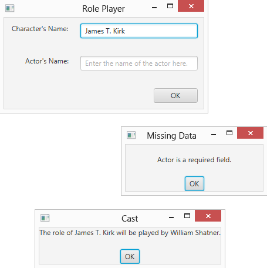
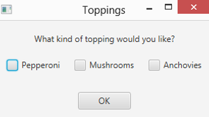
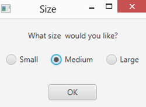
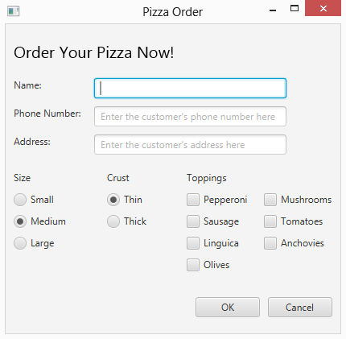
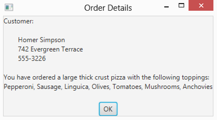

# 第 6 章 获取用户输入

> **在这一章当中**
>
> - 使用文本字段和区域
> - 验证数字数据并创建复选框
> - 设置单选按钮
> - 在完整的程序中使用其中一些组件

在本书的前五章中，我讨论了如何仅使用两个基本的 JavaFX 输入控件来创建 JavaFX 程序：标签和按钮。如果您只想编写在用户单击按钮时显示文本的程序，那么您现在可以放下这本书了。但是，如果您想编写真正有价值的程序，则需要使用其他 JavaFX 输入控件。

在本章中，您将了解如何使用一些最常见的 JavaFX 控件。首先，您了解了从用户那里获取信息的标签和控件。您将了解有关获取一行文本的文本字段控件和获取多行文本的文本区域控件的更多详细信息。然后我转到两个输入控件，它们可以从用户那里获取信息：单选按钮和复选框。

在此过程中，您会发现任何从用户收集输入数据的 JavaFX 程序的一个重要方面：数据验证。数据验证例程对于确保用户不会输入虚假数据至关重要。例如，您可以使用数据验证来确保用户在必填字段中输入数据，或者用户在数字字段中输入的数据确实是有效数字。

## 使用文本字段

文本字段是用户可以在其中键入单个文本的框。您可以使用 TextField 类创建文本字段。表 6-1 显示了这个类的一些更有趣和有用的构造函数和方法。

**表 6-1 方便的 TextField 构造函数和方法**

| 构造函数                      | 描述                                          |
| -------------------------------- | ---------------------------------------------------- |
| TextField()                      | 创建一个新的文本字段。                            |
| TextField(String text, int cols) | 创建具有初始文本值的新文本字段。 |

| 方法                            | 描述                                                  |
| --------------------------------- | ------------------------------------------------------------ |
| String getText()                  | 获取在字段中输入的文本值                    |
| void requestFocus()               | 要求将焦点移至此文本字段。请注意，该字段必须位于场景中才能使焦点请求起作用。|
| void setEditable(boolean value)   | 如果为 false，则使该字段为只读。                       |
| void setMaxWidth(double width)    | 设置字段的最大宽度。                        |
| void setMinWidth(double width)    | 设置字段的最小宽度。                       |
| void setPrefColumnCount(int cols) | 以列为单位设置文本字段的首选大小（即平均宽度文本字符的数量）。|
| void setPrefWidth(double width)   | 设置字段的首选宽度。                     |
| void setPromptText(String prompt) | 设置字段的提示值。如果字段有文本值或字段有焦点，则不会显示提示值。 |
| void setText(String text)         | 设置字段的文本值。                                |

TextField 类在 javafx.scene.control 包中定义，因此您应该在任何使用文本字段的程序中包含以下导入语句：

```java
imports javafx.scene.control.*;
```

创建文本字段的最常见方法是调用不带参数的构造函数，如下所示：

```java
TextField text1 = new TextField();
```

您可以将初始值设置为显示如下：

```java
TextField text1 = new TextField("Initial value");
```

或者，如果以后需要设置值，可以调用 setText 方法：

```java
text1.setText("Text value");
```

要检索用户在文本字段中输入的值，请调用 getText 方法，如下所示：

```java
String value = text1.getText();
```

与任何 JavaFX 控件一样，管理文本字段的宽度可能有点棘手。最终，JavaFX 将根据许多因素来确定文本字段的宽度，包括包含舞台和场景的窗口的大小以及放置在包含文本字段的一个或多个窗格上的任何大小限制。您可以通过调用 setMinWidth 和 setMaxWidth 方法设置文本字段大小的最小和最大限制，并且可以通过 setPrefWidth 方法指定首选宽度，如下例所示：

```java
TextField text1 = new TextField(); 
text1.setMinWidth(150); 
text1.setMaxWidth(250); 
text1.setPrefWidth(200);
```

设置首选宽度的另一种方法是使用 setPrefColumnCount 方法，该方法根据平均大小的字符设置宽度。例如，以下行的大小足以显示大约 50 个字符：

```java
text1.setPrefColumnCount(50);
```

请注意，setPrefColumnCount 方法不限制用户可以在字段中输入的字符数。相反，它限制了该字段一次可以显示的字符数。

每当您使用文本字段时，请提供一个提示，让用户知道他应该在该字段中输入哪些数据。一种常见的方法是在文本字段的左侧立即放置一个标签控件。例如：

```java
Label lblName = new Label("Name:"); 
lblName.setMinWidth(75); 
TextField txtName = new TextField(); 
txtName.setMinWidth(200); 
HBox pane = new HBox(10, lblName, txtName);
```

在这里，创建了一个标签和一个文本字段并将其添加到 HBox 窗格中，因此它们将并排显示。

JavaFX 还允许您在文本字段内显示提示。提示以较浅的文本颜色显示，并在字段获得焦点时消失。您使用 setPromptText 方法来创建这样的提示：

```java
TextField txtName = new TextField(); 
txtName.setPromptText("Enter the customer's name");
```

在这里，文本输入客户姓名将出现在文本字段中。

要检索用户在文本字段中输入的值，请使用 getText 方法，如下例所示：

```java
String lastName = textLastName.getText();
```

在这里，用户在 textLastName 文本字段中输入的值被分配给字符串变量 lastName。

图 6-1 显示了一个简单程序的操作，该程序使用文本字段允许用户输入剧中角色的姓名和将扮演该角色的演员的姓名。假设用户在两个字段中都输入了文本，然后程序会显示一个消息框，指示谁将扮演角色的角色。如果用户省略了其中一个或两个字段，则会显示一个消息框以指示错误。 （程序使用第 4 章清单 4-2 中介绍的 MessageBox 类来显示消息框。）

图 6-1 显示了该程序的主要阶段，以及当用户输入两个名称或用户省略名称时显示的消息框窗口。该程序的 JavaFX 代码如清单 6-1 所示。

> 图 6-1：运行中的角色播放器应用程序。



**清单 6-1：角色扮演者程序**

```java
import javafx.application.*; 
import javafx.stage.*; 
import javafx.scene.*; 
import javafx.scene.layout.*; 
import javafx.scene.control.*; 
import javafx.geometry.*;

public class RolePlayer extends Application                                         // →8
{
  public static void main(String[] args) 
  { 
    launch(args); 
  }

  TextField txtCharacter;                                                           // →15
  TextField txtActor;

  @Override public void start(Stage primaryStage) 
  {
    // Create the Character                                                         // →20
    Label lblCharacter = new Label("Character's Name:"); 
    lblCharacter.setMinWidth(100); 
    lblCharacter.setAlignment(Pos.BOTTOM_RIGHT);

    // Create the Character text field                                              // →25 
    txtCharacter = new TextField();
    txtCharacter.setMinWidth(200); 
    txtCharacter.setMaxWidth(200); 
    txtCharacter.setPromptText( 
      "Enter the name of the character here.");

    // Create the Actor label                                                       // →32 
    Label lblActor = new Label("Actor's Name:"); 
    lblActor.setMinWidth(100); 
    lblActor.setAlignment(Pos.BOTTOM_RIGHT);

    // Create the Actor text field                                                  // →37
    txtActor = new TextField(); 
    txtActor.setMinWidth(200); 
    txtActor.setMaxWidth(200); 
    txtActor.setPromptText("Enter the name of the actor here.");

    // Create the OK button                                                         // →43
    Button btnOK = new Button("OK"); 
    btnOK.setMinWidth(75); 
    btnOK.setOnAction(e -> btnOK_Click() );

    // Create the Character pane                                                    // →48
    HBox paneCharacter = new HBox(20, lblCharacter, txtCharacter); 
    paneCharacter.setPadding(new Insets(10));

    // Create the Actor pane                                                        // →52
    HBox paneActor = new HBox(20, lblActor, txtActor); 
    paneActor.setPadding(new Insets(10));

    // Create the Button pane                                                       // →56
    HBox paneButton = new HBox(20, btnOK); 
    paneButton.setPadding(new Insets(10)); 
    paneButton.setAlignment(Pos.BOTTOM_RIGHT);

    // Add the Character, Actor, and Button panes to a VBox                         // →61
    VBox pane = new VBox(10, paneCharacter, paneActor, paneButton);

    // Set the stage                                                                // →64
    Scene scene = new Scene(pane); 
    primaryStage.setScene(scene); 
    primaryStage.setTitle("Role Player"); 
    primaryStage.show();
  }

  public void btnOK_Click()                                                          // →71
  { 
    String errorMessage = "";                                                        // →73

    if (txtCharacter.getText().length() == 0)                                        // →75
    { 
      errorMessage += "\nCharacter is a required field.";
    }

    if (txtActor.getText().length() == 0)                                            // →80
    { 
      errorMessage += "\nActor is a required field."; 
    }

    if (errorMessage.length() == 0)                                                  // →85
    { 
      String message = "The role of " 
        + txtCharacter.getText() 
        + " will be played by " 
        + txtActor.getText() 
        + "."; 
      MessageBox.show(message,"Cast");
    } 
    else 
    { 
      MessageBox.show(errorMessage, "Missing Data");                                 // →96
    }
  }
}
```

这个程序不是很复杂，所以以下段落只是重点：

➝ 8：程序主类的名字是RolePlayer。

➝ 15：这些类变量允许任何RolePlayer类方法访问这两个文本字段。

➝ 20：这些行创建一个标签来标识字符文本框。该字段的最小宽度设置为 100 像素并右对齐，以便标识两个文本字段的标签正确对齐。

➝ 25：这些行创建最小和最大宽度为 200 像素的字符文本字段。提示文本设置为在此处输入字符的名称。只要文本字段没有焦点，该文本就会出现在文本字段中。在图 6-1 中，字符文本字段具有焦点，因此提示文本不可见。

➝ 32：这些行创建一个标签来标识 Actor 文本字段。与 Character 标签一样，Actor 标签的宽度设置为 100 像素，并且是右对齐的。

➝ 37：这些行创建 Actor 文本字段，将其宽度设置为 200 像素，并分配提示文本。您可以在图 6-1 中看到提示文本，因为 Actor 文本字段没有焦点。

➝ 43：这些行创建确定按钮。当用户单击按钮时调用 btnOK_Click 方法。

➝ 48：这些行创建了一个 HBox 窗格，并在其中添加了 Character 标签和文本框。

➝ 52：这些行创建了另一个 HBox 窗格，并在其中添加了 Actor 标签和文本框。

➝ 56：这些行创建了第三个 HBox 窗格来保存按钮。

➝ 61：现在所有控件都已创建并添加到 HBox 窗格中，将三个 HBox 窗格添加到一个 VBox 窗格中，以便将带有关联标签的文本框和按钮垂直堆叠

➝ 64：这些行创建一个场景来显示VBox窗格，然后将场景添加到主舞台并显示舞台。

➝ 71：当用户点击OK时调用btnOK_Click方法。

➝ 73：errorMessage 变量保存可能需要通知用户丢失数据的任何错误消息。

➝ 75：这个 if 语句确保用户已经在字符文本框中输入了数据。如果未输入数据，则会创建错误消息。

➝ 80：这个 if 语句确保用户已经在 Actor 文本框中输入了数据。如果未输入任何数据，则会将错误消息附加到 errorMessage 字段。

➝ 85：这个if语句通过测试errorMessage字段的长度来判断是否发生了数据验证错误。如果长度为零，则没有检测到错误，因此程序组装消息变量以显示哪个演员将扮演哪个角色。然后，调用 MessageBox 类的 show 方法来显示消息。 （您可以在第 4 章的清单 4-2 中找到 MessageBox 类的代码。）

➝ 96：如果用户忘记在 Character 或 Actor 文本字段中输入数据，此行将显示错误消息。

## 验证数值数据

如果您使用文本字段从用户那里获取数字数据，则需要特别小心。 getText 方法返回一个字符串值。您可以将此值传递给原始数字类型的包装类的解析方法之一。要将文本框中输入的值转换为 int，请使用 parseInt 方法：

```java
int count = Integer.parseInt(txtCount.getText());
```

这里getText方法的结果作为parseInt方法的参数。

表 6-2 列出了各种包装类的解析方法。注意：如果无法转换字符串，这些方法中的每一个都会抛出 NumberFormatException。因此，您需要在 trycatch 块中调用 parseInt 方法来捕获此异常。

**表 6-2 将字符串转换为数字的方法**

| 包装类 | 解析方法       |
| ------------- | ------------------- |
| Integer       | parseInt(String)    |
| Short         | parseShort(String)  |
| Long          | parseLong(String)   |
| Byte          | parseByte(String)   |
| Float         | parseFloat(String)  |
| Double        | parseDouble(String) |

如果您的程序使用超过一或两个数字输入文本字段，请考虑创建单独的方法来验证用户的输入。以下代码片段显示了一个方法，该方法接受一个文本字段和一个字符串，如果在字段中输入的数据无法转换为 int，则该字符串提供要显示的错误消息。该方法返回一个布尔值，指示该字段是否包含有效整数：

```java
private boolean isInt(TextField f, String msg) {
  try {
    Integer.parseInt(f.getText());
    return true; 
  } catch (NumberFormatException e) {
    MessageBox.show(msg, "Data Entry Error");
    return false; 
  }
}
```

您可以在需要检查文本字段是否具有有效整数时调用此方法。 （MessageBox 类与示例 6-1 中使用的类相同；您可以在第 4 章的示例 4-2 中找到它的代码。）

这是一个获取 txtCount 文本字段中输入的值并在输入的值是有效整数时将其显示在消息框中的方法：

```java
public void buttonOKClick() {
  if (isInt(textCount, "You must enter an integer.")) {
    MessageBox.show("You entered " + Integer.parseInt(textCount.getText()), "Your Number"); 
  } 
  textCount.requestFocus();
}
```

这里调用了 isInt 方法来确保用户输入的文本可以转换为 int。如果是这样，文本将转换为 int 并显示在消息框中。

## 使用复选框

复选框是用户可以单击以选中或清除的控件。复选框让用户可以为选项指定是或否设置。图 6-2 显示了一个带有三个复选框的窗口。

严格来说，一个复选框可以有三种状态：选中、未选中和未定义。未定义状态最常与 TreeView 控件一起使用。

> 图 6-2：三个复选框。



要创建复选框，请使用 CheckBox 类。它最喜欢的构造函数和方法如表 6-3 所示。

**表 6-3 值得注意的 CheckBox 构造函数和方法**

| 构造函数           | 描述                                               |
| --------------------- | --------------------------------------------------------- |
| CheckBox()            | 创建一个最初未选中的新复选框。     |
| CheckBox(String text) | 创建一个显示指定文本的新复选框 |

| 方法                                               | 描述                                                  |
| ---------------------------------------------------- | ------------------------------------------------------------ |
| String getText()                                     | 获取复选框显示的文本                 |
| boolean isSelected()                                 | 如果复选框被选中，则返回 true；如果复选框未被选中，则返回 false。 |
| void setOnAction (EventHandler\<ActionEvent\> value) | 设置一个 ActionEvent 侦听器来处理动作事件。        |
| void setSelected(boolean value)                      |如果参数为真，则选中复选框；如果参数为假，则取消选中它。|
| void setText(String text)                            | 设置复选框文本。                                     |

与任何 JavaFX 控件一样，如果您想在程序中的任何方法中引用复选框，请声明一个类变量以引用该控件：

```java
CheckBox chkPepperoni, chkMushrooms, chkAnchovies;
```

然后，您可以在 start 方法中使用类似这样的语句来创建复选框并将它们添加到布局窗格（在本例中为 pane1）：

```java
chkPepperoni = new CheckBox("Pepperoni"); 
pane1.add(chkPepperoni);

chkMushrooms = new CheckBox("Mushrooms"); 
pane1.add(chkMushrooms);

chkAnchovies = new CheckBox("Anchovies"); 
pane1.add(chkAnchovies);
```

请注意，我没有在构造函数中指定这些复选框的初始状态。结果，它们最初是未经检查的。如果要创建一个最初选中的复选框，请调用 setSelected 方法，如下所示：

```java
chkPepperoni.setSelected(true);
```

在事件监听器中，可以通过 isSelected 方法测试复选框的状态，也可以通过调用 setSelected 方法设置复选框的状态。这是一个显示消息框并在用户单击确定时清除所有三个复选框的方法：

```java
public void btnOK_Click() {
  String msg = ""; 
  if (chkPepperoni.isSelected())
    msg += "Pepperoni\n"; 
  if (chkMushrooms.isSelected())
    msg += "Mushrooms\n"; 
  if (chkAnchovies.isSelected())
    msg += "Anchovies\n"; 
  if (msg.equals(""))
    msg = "You didn't order any toppings."; 
  else
    msg = "You ordered these toppings:\n" + msg; 
  MessageBox.show(msg, "Your Order"); 
  chkPepperoni.setSelected(false); 
  chkMushrooms.setSelected(false); 
  chkAnchovies.setSelected(false);
}
```

在这里，用户选择的每个披萨配料的名称被添加到文本字符串中。例如，如果您选择意大利辣香肠和凤尾鱼，则会显示以下消息：

```
You ordered these toppings: 
Pepperoni 
Anchovies
```

如果需要，您可以将事件侦听器添加到复选框以响应用户单击这些复选框时生成的事件。假设您的餐厅菜单上有凤尾鱼，但您拒绝实际制作带有凤尾鱼的比萨饼。如果用户尝试检查 Anchovies 复选框，您可以在事件侦听器中调用以下方法来显示消息；显示消息后，该方法会清除复选框：

```java
public void chkAnchovies_Click(){ 
  MessageBox.show("We don't do anchovies here.", "Yuck!");
  chkAnchovies.setSelected(false); 
}
```

要将此事件侦听器添加到 Anchovies 复选框，请调用其 setOnAction 方法，如下所示：

```java
chkAnchovies.setOnAction(e -> chkAnchovies_Click());
```

仅当您需要在用户选择或取消选择框时立即向用户提供反馈时，才将侦听器添加到复选框。在大多数应用程序中，您要等到用户单击按钮才能检查框架中任何复选框的状态。

## 使用单选按钮

单选按钮类似于复选框，但有一个关键区别：它们成组移动，用户一次只能从每个组中选择一个单选按钮。当您单击单选按钮将其选中时，将自动取消选择之前选择的同一组中的单选按钮。图 6-3 显示了一个带有三个单选按钮的窗口。

> 图 6-3：带有三个单选按钮的窗口。



要使用单选按钮，您需要使用两个类。首先，您使用 RadioButton 类自己创建单选按钮，其构造函数和方法如表 6-4 所示。然后使用 ToggleGroup 类为按钮创建一个组，并将单选按钮添加到切换组。

ToggleGroup 对象只是一种关联一组单选按钮的方法，因此只能选择其中一个按钮。切换组对象本身不是控件，不会显示。要显示单选按钮，请将单个单选按钮而不是切换组添加到布局窗格。

**表 6-4 各种 RadioButton 构造函数和方法**

| 构造函数              | 描述                                         |
| ------------------------ | --------------------------------------------------- |
| RadioButton()            | 创建一个没有文本的新单选按钮。            |
| RadioButton(String text) | 使用指定的文本创建一个新的单选按钮。 |

| 方法                                               | 描述                                                  |
| ---------------------------------------------------- | ------------------------------------------------------------ |
| String getText()                                     | 获取单选按钮显示的文本。                 |
| boolean isSelected()                                 |如果选择了单选按钮，则返回 true；如果未选择单选按钮，则返回 false。|
| void setOnAction (EventHandler\<ActionEvent\> value) |设置一个 ActionEvent 侦听器来处理动作事件。|
| void setSelected(boolean value)                      |如果参数为真，则选择单选按钮；如果参数为假，则取消选择它。|
| void setText(String text)                            | 设置复选框文本。                                     |

创建单选按钮的常用方法是声明一个变量以将按钮作为类变量引用，以便可以在类中的任何位置访问它，如下例所示：

```java
RadioButton rdoSmall, rdoMedium, rdoLarge;
```

然后，在 start 方法中，调用 RadioButton 构造函数来创建单选按钮：

```java
rdoSmall = new RadioButton("Small");
```

此后，您可以以通常的方式将单选按钮添加到布局窗格中。

要创建一个切换组来对协同工作的单选按钮进行分组，请调用 ToggleGroup 类构造函数：

```java
ToggleGroup sizeGroup = new ToggleGroup();
```

然后调用每个单选按钮的 setToggleGroup 方法：

```java
rdoSmall.setToggleGroup(sizeGroup); 
rdoMedium.setToggleGroup(sizeGroup); 
rdoLarge.setToggleGroup(sizeGroup);
```

切换组与单选按钮的显示方式无关。要显示单选按钮，您仍必须将它们添加到布局窗格中。并且没有规定必须将切换组中的所有单选按钮添加到同一布局窗格中。但是，习惯上在场景中将所有单选按钮一起显示在单个切换组中，以便用户可以轻松地看到单选按钮属于一起。

如果您在 Swing 中使用过单选按钮，您会想要注意 JavaFX 切换组的工作方式与按钮组的工作方式之间的重要区别摇摆。在 JavaFX 中，切换组之外的单选按钮相互独立。在 Swing 中，按钮组之外的单选按钮都是默认组的一部分。因此，在 JavaFX 中，始终将单选按钮添加到切换组，即使场景只有一个切换组。

## 查看披萨订单应用程序

为了让您了解如何使用本章中介绍的控件以及我在第 5 章中介绍的布局窗格，本节介绍了一个相当复杂的应用程序，它允许用户订购比萨饼。用户在文本字段中输入他的姓名、地址和电话号码，使用单选按钮选择比萨饼的大小和外壳样式，并通过复选框选择配料。图 6-4 显示了 Pizza Order 应用程序显示的主窗口。

> 图 6-4：Pizza Order 应用程序的主窗口。



当用户输入他的比萨订单数据并单击“确定”时，该程序会显示一个消息框来汇总订单，如图 6-5 所示。

> 图 6-5：Pizza Order 应用程序确认用户的订单。



乍一看可能并不明显，但 Pizza Order 应用程序显示的场景总共使用 12 个布局窗格来控制其控件的排列。整个场景由一个边框窗格组织，其顶部区域显示标题（Order Your Pizza Now！）。中心区域显示文本字段、单选按钮和复选框，让用户可以配置她的披萨订单。底部区域包含确定和取消按钮。

供您参考，表 6-5 列出了用于组织此内容的 12 个布局窗格。

**表 6-5 披萨订单应用程序中使用的布局窗格**

| 名称           | 类      | 描述                                                  |
|--------------| ---------- | ------------------------------------------------------------ |
| paneMain     | BorderPane | 场景的主根窗格。                                  |
| paneTop      | HBox       | 包含显示在边框窗格顶部区域中的标题文本。 |
| paneName     | HBox       |包含客户姓名的标签和文本框，并排放置。 |
| panePhone    | HBox       | 包含电话号码的标签和文本框，并排放置。 |
| paneAddress  | HBox       | 包含地址的标签和文本框，并排放置。 |
| paneCustomer | VBox       | 包含垂直堆叠的姓名、电话和地址窗格。 |
| paneSize     | VBox       | 包含一个带有文本“大小”的标签和三个单选按钮，让用户选择披萨大小，垂直堆叠。 |
| paneCrust    | VBox       | 包含一个带有文本“Crust”的标签和两个单选按钮，让用户选择外壳样式，垂直堆叠。 |
| paneToppings | FlowPane   | 包含浇头复选框的流程窗格。 |
| paneTopping  | VBox       | 包含带有文本“Toppings”的标签和列出浇头的流窗格，垂直堆叠。 |
| paneOrder    | HBox       | 包含三个 VBox 窗格，列出并排排列的尺寸、外壳样式和浇头。此窗格显示在边框窗格的中心区域。 |
| paneBottom   | HBox       | 包含并排排列的“确定”和“取消”按钮。垫片用于将按钮强制到右边距。此窗格显示在边框窗格的底部区域。 |

**示例 6-2：披萨订单应用程序**

```java
import javafx.application.*; 
import javafx.stage.*; 
import javafx.scene.*; 
import javafx.scene.layout.*; 
import javafx.scene.control.*; 
import javafx.geometry.*; 
import javafx.scene.text.*;

public class PizzaOrder extends Application {

  public static void main(String[] args) {
    launch(args);
  }

  Stage stage;

  // Customer name, phone, and address fields

  TextField txtName;
  TextField txtPhone;
  TextField txtAddress;

  // Size radio buttons

  RadioButton rdoSmall;
  RadioButton rdoMedium;
  RadioButton rdoLarge;

  // Crust style radio buttons

  RadioButton rdoThin;
  RadioButton rdoThick;

  // Topping radio buttons

  CheckBox chkPepperoni;
  CheckBox chkSausage;
  CheckBox chkLinguica;
  CheckBox chkOlives;
  CheckBox chkMushrooms;
  CheckBox chkTomatoes;
  CheckBox chkAnchovies;

  @Override
  public void start(Stage primaryStage) {
    stage = primaryStage;

    // ----- Create the top pane -----

    Text textHeading = new Text("Order Your Pizza Now!");
    textHeading.setFont(new Font(20));
    HBox paneTop = new HBox(textHeading);
    paneTop.setPadding(new Insets(20, 10, 20, 10));

    // ---------- Create the customer pane ----------

    // Create the name label and text field

    Label lblName = new Label("Name:");
    lblName.setPrefWidth(100);
    txtName = new TextField();
    txtName.setPrefColumnCount(20);
    txtName.setPromptText("Enter the customer's name here");
    txtName.setMaxWidth(Double.MAX_VALUE);
    HBox paneName = new HBox(lblName, txtName);

    // Create the phone number label and text field

    Label lblPhone = new Label("Phone Number:");
    lblPhone.setPrefWidth(100);
    txtPhone = new TextField();
    txtPhone.setPrefColumnCount(20);
    txtPhone.setPromptText("Enter the customer's phone number here");
    HBox panePhone = new HBox(lblPhone, txtPhone);

    // Create the address label and text field

    Label lblAddress = new Label("Address:");
    lblAddress.setPrefWidth(100);
    txtAddress = new TextField();
    txtAddress.setPrefColumnCount(20);
    txtAddress.setPromptText("Enter the customer's address here");
    HBox paneAddress = new HBox(lblAddress, txtAddress);

    // Create the customer pane

    VBox paneCustomer = new VBox(10, paneName, panePhone, paneAddress);

    // ---------- Create the order pane ----------

    // Create the size pane

    Label lblSize = new Label("Size");
    rdoSmall = new RadioButton("Small");
    rdoMedium = new RadioButton("Medium");
    rdoLarge = new RadioButton("Large");
    rdoMedium.setSelected(true);
    ToggleGroup groupSize = new ToggleGroup();
    rdoSmall.setToggleGroup(groupSize);
    rdoMedium.setToggleGroup(groupSize);
    rdoLarge.setToggleGroup(groupSize);

    VBox paneSize = new VBox(lblSize, rdoSmall, rdoMedium, rdoLarge);
    paneSize.setSpacing(10);

    // Create the crust pane

    Label lblCrust = new Label("Crust");
    rdoThin = new RadioButton("Thin");
    rdoThick = new RadioButton("Thick");
    rdoThin.setSelected(true);
    ToggleGroup groupCrust = new ToggleGroup();
    rdoThin.setToggleGroup(groupCrust);
    rdoThick.setToggleGroup(groupCrust);

    VBox paneCrust = new VBox(lblCrust, rdoThin, rdoThick);
    paneCrust.setSpacing(10);

    // Create the toppings pane

    Label lblToppings = new Label("Toppings");
    chkPepperoni = new CheckBox("Pepperoni");
    chkSausage = new CheckBox("Sausage");
    chkLinguica = new CheckBox("Linguica");

    chkOlives = new CheckBox("Olives");
    chkMushrooms = new CheckBox("Mushrooms");
    chkTomatoes = new CheckBox("Tomatoes");
    chkAnchovies = new CheckBox("Anchovies");

    FlowPane paneToppings = new FlowPane(Orientation.VERTICAL, chkPepperoni, chkSausage, chkLinguica, chkOlives, chkMushrooms, chkTomatoes, chkAnchovies);
    paneToppings.setPadding(new Insets(10, 0, 10, 0));
    paneToppings.setHgap(20);
    paneToppings.setVgap(10);
    paneToppings.setPrefWrapLength(150);

    VBox paneTopping = new VBox(lblToppings, paneToppings);

    // Add the size, crust, and toppings pane to the order pane

    HBox paneOrder = new HBox(50, paneSize, paneCrust, paneTopping);

    // Create the center pane

    VBox paneCenter = new VBox(20, paneCustomer, paneOrder);
    paneCenter.setPadding(new Insets(0, 10, 0, 10));

    // ---------- Create the bottom pane ----------

    Button btnOK = new Button("OK");
    btnOK.setPrefWidth(80);
    btnOK.setOnAction(e -> btnOK_Click());

    Button btnCancel = new Button("Cancel");
    btnCancel.setPrefWidth(80);
    btnCancel.setOnAction(e -> btnCancel_Click());

    Region spacer = new Region();

    HBox paneBottom = new HBox(10, spacer, btnOK, btnCancel);
    paneBottom.setHgrow(spacer, Priority.ALWAYS);
    paneBottom.setPadding(new Insets(20, 10, 20, 10));

    // ---------- Finish the scene ----------

    BorderPane paneMain = new BorderPane();
    paneMain.setTop(paneTop);
    paneMain.setCenter(paneCenter);
    paneMain.setBottom(paneBottom);

    // Create the scene and the stage

    Scene scene = new Scene(paneMain);
    primaryStage.setScene(scene);
    primaryStage.setTitle("Pizza Order");
    primaryStage.show();

  }

  public void btnOK_Click() {

    // Create a message string with the customer information

    String msg = "Customer:\n\n";
    msg += "\t" + txtName.getText() + "\n";
    msg += "\t" + txtAddress.getText() + "\n";
    msg += "\t" + txtPhone.getText() + "\n\n";
    msg += "You have ordered a ";

    // Add the pizza size

    if (rdoSmall.isSelected()) msg += "small ";
    if (rdoMedium.isSelected()) msg += "medium ";
    if (rdoLarge.isSelected()) msg += "large ";

    // Add the crust style

    if (rdoThin.isSelected()) msg += "thin crust pizza with ";
    if (rdoThick.isSelected()) msg += "thick crust pizza with ";

    // Add the toppings

    String toppings = "";
    toppings = buildToppings(chkPepperoni, toppings);
    toppings = buildToppings(chkSausage, toppings);
    toppings = buildToppings(chkLinguica, toppings);
    toppings = buildToppings(chkOlives, toppings);
    toppings = buildToppings(chkTomatoes, toppings);
    toppings = buildToppings(chkMushrooms, toppings);
    toppings = buildToppings(chkAnchovies, toppings);

    if (toppings.equals(""))
      msg += "no toppings.";
    else
      msg += "the following toppings:\n"
      + toppings;
    // Display the message
    MessageBox.show(msg, "Order Details");
  }

  public String buildToppings(CheckBox chk, String msg) {
    // Helper method for displaying the list of toppings
    if (chk.isSelected()) {
      if (!msg.equals("")) {
        msg += ", ";
      }
      msg += chk.getText();
    }
    return msg;
  }

  public void btnCancel_Click() {
    stage.close();
  }
}
```

