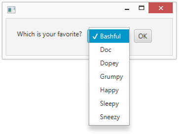

# 第 8 章 从列表中选择

> 在本章中
>
> - 使用选择框控件
> - 使用 ObservableList 接口
> - 监听用户选择的变化
> - 使用 ComboBox 和 ListView 控件
> - 使用 TreeView 控件

整个类别的 JavaFX 控件旨在让用户从列表中选择一个或多个项目。本章介绍了三个这样的控件：选择框、组合框和列表。在此过程中，您会发现如何使用 ObservableList 接口，该接口用于管理由选择框、组合框或列表视图控件显示的项目列表。

实际上，到目前为止，如果您已经阅读过，您已经简要介绍了 ObservableList 接口，因为它还用于管理显示在布局窗格中的控件列表。在第 5 章中，您了解了如何使用该接口的 addAll 方法。在本章中，您了解了该接口的附加功能。

您还将了解如何添加一个事件侦听器，该侦听器可以在用户更改当前选择时做出响应。

## 使用选择框

选择框是允许用户从下拉列表中选择项目的控件。最初，选择框仅显示当前选择的项目。当用户单击选项框时，选项列表会显示出来。用户可以通过单击列表中的任何项目来更改选择。图 8-1 显示了一个带有简单选择框的场景。

> 图 8-1：带有选择框的场景。

您使用 ChoiceBox 类来创建选择框。表 8-1 列出了该类最常用的构造函数和方法。

