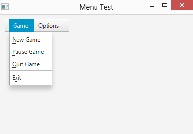
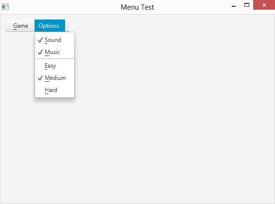
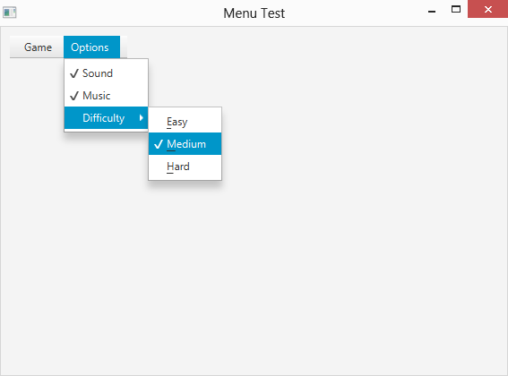
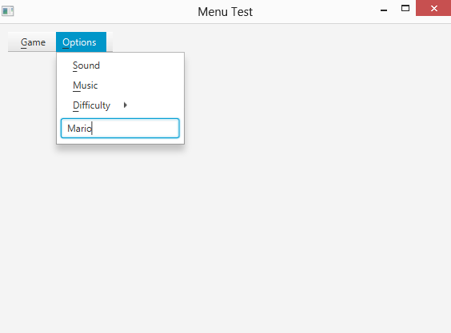

# 第 10 章  创建菜单

> **In This Chapter**
>
> + Creating basic and dynamic menus 
> + Working with separators and action listeners
> + Constructing menus with check boxes and radio buttons
> + Creating submenus and custom menu items

In this chapter, you find out how to adorn your programs with menus. You work with menus in applications, so you’re probably already familiar with what menus are and how they work. I don’t review those basics in this chapter. Instead, I jump right into the details of how to create a menu and add it to a scene.

## 介绍用于创建菜单的类

The following paragraphs describe the classes you use most often when you create menus:

> **✓ MenuBar:** This class is the top-level container for menus that appear in the menu bar at the top of a scene.
>
> **✓ Menu:** Each menu in the menu bar is represented by a Menu object. The menu bar, as shown in Figure 10-1, has two Menu objects: one for the Game menu and the other for the Options menu. A Menu object contains a collection of MenuItem objects that display when the user clicks the menu.
>
> **✓ MenuItem:** Menu items are represented by the MenuItem class or one of its subclasses. The Game menu shown in Figure 10-1 has four MenuItem objects: New Game, Pause Game, Quit Game, and Exit. It also includes one SeparatorMenuItem object; SeparatorMenuItem is a subclass of the MenuItem class.
>
> Interestingly, the Menu class is actually a subclass of MenuItem. That means that the items collection of a menu can contain other submenus. When the user clicks the submenu, the submenu’s collection of menu items displays.
>
> **✓ CheckMenuItem:** This special type of menu item has a check box associated with it. Although they’re not shown in Figure 10-1, the Options menu has two CheckMenuItem objects in it. This class extends MenuItem.
>
> **✓ RadioMenuItem:** This special type of menu item has a radio button associated with it. The RadioMenuItem class extends MenuItem.
>
> **✓ CustomMenuItem:** A custom menu item can have any JavaFX Node object associated with it. With a custom menu item, you can add controls, such as text fields or list boxes, to a menu.
>
> **✓ SeparatorMenuItem:** A separator menu item simply displays a separator line in a menu. You use this class to create visual groupings with a menu.

> Figure 10-1: A scene with a menu bar.



## 创建基本菜单栏

The basics of creating menus are pretty straightforward. First, you create a menu bar by calling the MenuBar constructor:

```java
MenuBar menuBar = new MenuBar();
```

Then you create one or more menus and add it or them to the menu bar. When the menu bar is finished, you add it to a layout pane just as you would add any other node:

```java
pane.getChildren().add(menuBar);
```

For your reference, Table 10-1 lists the most useful constructors and methods of the MenuBar class.

**Table 10-1 The MenuBar Class**

| Constructor | Description         |
| ----------- | ------------------- |
| MenuBar()   | Creates a menu bar. |

| Method                    | Description                                                  |
| ------------------------- | ------------------------------------------------------------ |
| ObservableList getMenus() | Returns the list of menus contained in this menu bar. You can use any of the methods of the ObservableList interface to add or remove menus from the menu bar. |

## 创建菜单

To create each menu, you use the Menu and MenuItem classes, whose constructors and methods I discuss in the next two tables in this chapter. Start by calling the Menu constructor and giving a name to the menu:

```java
Menu menuGame = new Menu("_Game");
```

Here, the underline in the text string marks the mnemonic shortcut key that the user can use to get at the menu without touching the mouse. In this case, the letter G is the mnemonic.

The mnemonic character allows the user to open the menu by pressing the mnemonic character while holding down the Alt key. When the user presses the Alt key, all the visible mnemonic characters will be underlined so the user can determine which characters are the mnemonics.

Table 10-2 lists the most important constructors and methods of the Menu class for your reference.

**Table 10-2 The Menu Class**

| Constructor       | Description                             |
| ----------------- | --------------------------------------- |
| Menu(String name) | Creates a menu with the specified name. |

| Method                    | Description                                                  |
| ------------------------- | ------------------------------------------------------------ |
| ObservableList getItems() | Returns an ObservableList collection that represents the menu items in this menu. You can then use any method of the ObservableList interface to add or remove menu items. |
| String getText()          | Gets the menu’s text.                                        |
| void setText(String text) | Sets the menu’s text.                                        |

## 创建菜单项

After you create a menu, the next step is creating menu items and adding them to the menu. To create a menu item, simply call the MenuItem constructor, passing the text to be displayed as a parameter:

```java
MenuItem menuItemNewGame = new MenuItem("_New Game");
```

Once again, the underscore identifies the mnemonic shortcut for the menu item. Thus, the user can select this menu item by pressing Alt+N.

To add an event handler to a menu, use the setOnAction method. For example:

```java
menuItemNewGame.setOnAction(e -> StartNewGame());
```

Here, the method StartNewGame will be called when the user chooses the New Game menu item.

Here’s a short sequence that creates the four menu items shown in Figure 10-1, assigning an action event handler to each item:

```java
MenuItem menuItemNewGame = new MenuItem("_New Game"); 
menuItemNewGame.setOnAction(e -> StartNewGame());

MenuItem menuItemPauseGame = new MenuItem("_Pause Game"); 
menuItemNewGame.setOnAction(e -> PauseGame()); 

MenuItem menuItemQuitGame = new MenuItem("_Quit Game"); 
menuItemNewGame.setOnAction(e -> QuitGame());

MenuItem menuItemExit = new MenuItem("E_xit");
menuItemExit.setOnAction(e -> ExitProgram());
```

After you create your menu items, you can add them to the menu like this:

```java
menuGame.getChildren().add(menuItemNewGame); menuGame.getChildren().add(menuItemPauseGame);
menuGame.getChildren().add(menuItemQuitGame); 
menuGame.getChildren().add(menuItemExit);
```

Alternatively, you could use the addAll method to add the menu items all at once:

```java
menuGame.getChildren()
  .addAll(menuItemNewGame,menuItemPauseGame, menuItemQuitGame, menuItemExit);
```

Table 10-3 lists some constructors and methods of the MenuItem class in case you want to look them up quickly later.

**Table 10-3 The MenuItem Class**

| Constructor           | Description                                  |
| --------------------- | -------------------------------------------- |
| MenuItem(String name) | Creates a menu item with the specified name. |

| Method                                          | Description                                                  |
| ----------------------------------------------- | ------------------------------------------------------------ |
| String getText()                                | Gets the menu item’s text.                                   |
| void setText(String text)                       | Sets the menu item’s text.                                   |
| boolean isDisable()                             | Returns true if the menu item is disabled.                   |
| void setDisable()                               | Disables the menu item.                                      |
| void setDisable(boolean value)                  | If value is true, disables the menu item. Otherwise, enables the menu item. |
| setOnAction(EventHandler \<ActionEvent\> value) | Sets an action event handler that is called when the user selects this menu item. |

## 使用分割线

A menu separator is a menu item whose only purpose is to create visual separation within a menu so that items appear grouped logically. The menu that was shown in Figure 10-1 includes a separator that divides the three menu items that start, pause, or end games from the item that exits the program.

To create a separator, you use the SeparatorMenuItem class. Usually, you create the separator in the same statement you use to add the separator to the menu, like this:

```java
menuGame.getItems().add(new SeparatorMenuItem());
```

Here’s an example that adds a separator between the Quit Game menu item and the Exit menu item:

```java
menuGame.getChildren().add(menuItemNewGame); menuGame.getChildren().add(menuItemPauseGame);
menuGame.getChildren().add(menuItemQuitGame); 
menuGame.getChildren().add(new SeparatorMenuItem()); menuGame.getChildren().add(menuItemExit);
```

## 使用操作监听器

Menu items generate action events when selected by the user. As with any other action event, you handle the action events for menus by creating an action event handler that is called when the action event is generated. The easiest way to do that is by creating a method to call when the action event occurs, and then using a Lambda expression with the menu item’s setOnAction method to call the method you created.

Here’s a simple method that you might associate with an Exit menu item. This method simply exits the program by calling the close method of the primary stage:

```java
private void menuItemExit_OnClick() {
  stage.close();
}
```

Note: For this method to work, stage must be a class field that’s been assigned to the primary stage in the program’s start method.

To use this listener, pass it via a Lambda expression to the Exit menu item’s setOnAction method, as follows:

```java
menuItemExit.setOnAction(e -> exitMenuAction());
```

If you prefer, you can eliminate the separate method altogether and call stage.close() directly in the setOnAction method, like this:

```java
exitItem.addActionListener(e -> stage.close());
```

However, I prefer to create separate methods to handle each menu item. This practice makes it easier to add code (for example, to ensure that the user has saved her work before exiting).

A common way to handle action events for a menu is to use a single method to handle events for all the menu items in the menu. To do that, you must pass the ActionEvent object to the event handler method via the Lambda expression when you call the setOnAction method, as in this example:

```java
menuItemExit.setOnAction(e -> menuAction(e));
```

Then the menuAction method can use nested if statements to determine which menu item was chosen by the user, as in this example:

```java
public void menuAction(ActionEvent e) {
  if (e.getSource() == newItem) 
    newGame(); 
  else if (e.getSource() == pauseItem)
    pauseGame(); 
  else if (e.getSource() == quitItem)
    quitGame(); 
  // and so on
}
```

Here’s a sample action listener that you may want to use while you’re figuring out how to work with menus. This action listener simply displays the text of each menu item on the console whenever the user chooses a menu command. That way, you can be certain you’re setting up your menus and action listeners properly:

```java
public void menuAction(ActionEvent e){ 
  MenuItem item = (MenuItem)e.getSource();
  System.out.println(item.getText());
}
```

## 创建可更改的菜单

In many applications, menu items change as you work with the program. Some items may be disabled in certain situations, and the text of a menu item may change depending on the context in which the command could be used.

For example, you may want the Pause Game menu item in the Game menu to change to Resume Game when the user pauses the game. Then, if the user resumes the game, this menu item reverts to Pause Game. You could do that in several ways. The easiest is to just look at the text in the menu item. If the text is _Pause Game, change it to _Resume Game; if the text is _Resume Game, change it to _Pause Game. Here’s a snippet of code that does the job:

```java
if (menuItemPauseGame.getText().equals("_Pause Game")) {
  menuItemPauseGame.setText("_Resume Game"); 
} else {
  menuItemPauseGame.setText("_Pause Game");
}
```

In a real program, of course, this code also pauses and resumes the game.

Enabling or disabling menu items depending on what’s happening in the program is also common. Suppose that you don’t want to allow users to quit the game while the game is paused. In that case, you disable the Quit Game menu item when the user chooses Pause Game and enable it again if the user chooses Resume Game, like this:

```java
if (menuItemPauseGame.getText().equals("_Pause Game")) {
  menuItemPauseGame.setText("_Resume Game");
  menuItemQuitGame.setDisable(true); }
else {
  menuItemPauseGame.setText("_Pause Game"); 
  menuItemQuitGame.setDisable(false);
}
```

## 使用多选和单选菜单项

A check menu item is a menu item that resembles a check box that the user can click to check or uncheck. Check menu’s ideal for menu items that allow users to select program options.

A radio menu item is similar to a check menu item except that it can be grouped with other radio menu items, much like a radio button. As with radio buttons, only one item in a group of radio menu items can be selected at a time. So when the user clicks a radio menu item, any other radio items in the same group are automatically unchecked.

Figure 10-2 shows an Options menu that contains two check menu items and three radio items. A separator is used to separate the check items from the radio items.

> Figure 10-2: A menu with check menu items and radio menu items.



To create a check menu item, use the CheckMenuItem class, whose constructors and methods are listed in Table 10-4. This class inherits the MenuItem class, so most of its methods are the same.

**Table 10-4 The CheckMenuItem Class**

| Constructor                | Description                                        |
| -------------------------- | -------------------------------------------------- |
| CheckMenuItem(String name) | Creates a check menu item with the specified name. |

| Method                                          | Description                                                  |
| ----------------------------------------------- | ------------------------------------------------------------ |
| boolean isSelected()                            | Returns true if the item is checked.                         |
| void setSelected(boolean value)                 | Specify true to check the item or false to uncheck the item. |
| String getText()                                | Gets the menu item’s text.                                   |
| void setText(String text)                       | Sets the menu item’s text.                                   |
| boolean isDisable()                             | Returns true if the menu item is disabled.                   |
| void setDisable()                               | Disables the menu item.                                      |
| void setDisable(boolean value)                  | If value is true, disables the menu item. Otherwise, enables the menu item. |
| setOnAction(EventHandler \<ActionEvent\> value) | Sets an action event handler that’s called when the user selects this menu item. |

Initially, the check menu item is not checked. If you want the default setting for the item to be checked, call the setSelected method, like this:

```java
menuItemMusic.setSelected(true);
```

To test the state of the check menu item, you use the isSelected method, as in this example:

```java
if (menuItemMusic.isSelected() == true) 
  System.out.println("Your mamma can't dance.");
else
  System.out.println("Your daddy can't rock and roll.");
```

Here two different messages display on the console, depending on the setting of the check box for the musicItem menu item.

To create a radio menu item, use the RadioMenuItem class shown in Table 10-5.

**Table 10-5 The RadioMenuItem Class**

| Constructor                | Description                                        |
| -------------------------- | -------------------------------------------------- |
| RadioMenuItem(String name) | Creates a radio menu item with the specified name. |

| Method                                          | Description                                                  |
| ----------------------------------------------- | ------------------------------------------------------------ |
| void setToggleGroup(ToggleGroup group)          | Assigns this radio menu item to a toggle group.              |
| ToggleGroup getToggleGroup()                    | Retrieves the toggle group that this radio menu item is a member of. |
| boolean isSelected()                            | Returns true if the item is checked.                         |
| void setSelected(boolean value)                 | Specify true to check the item or false to uncheck the item. |
| String getText()                                | Gets the menu item’s text.                                   |
| void setText(String text)                       | Sets the menu item’s text.                                   |
| boolean isDisable()                             | Returns true if the menu item is disabled.                   |
| void setDisable()                               | Disables the menu item.                                      |
| void setDisable(boolean value)                  | If value is true, disables the menu item. Otherwise, enables the menu item. |
| setOnAction(EventHandler \<ActionEvent\> value) | Sets an action event handler that’s called when the user selects this menu item. |

As you can see, this class is almost the same as the CheckMenuItem class. The only significant difference is the addition of the setToggleGroup method, which lets you add a radio menu item to a toggle group. Here’s a snippet of code that creates three radio menu items, then creates a toggle group and adds the three radio menu items to the group:

```java
RadioMenuItem menuItemEasy = new RadioMenuItem("_Easy"); 
RadioMenuItem menuItemMedium = new RadioMenuItem("_Medium");
RadioMenuItem menuItemHard = new RadioMenuItem("_Hard");

ToggleGroup groupDifficulty = new ToggleGroup();

menuItemEasy.setToggleGroup(groupDifficulty);
menuItemMedium.setToggleGroup(groupDifficulty); menuItemHard.setToggleGroup(groupDifficulty);
```

## 创建子菜单

A submenu is a menu within a menu. Submenus are possible because the Menu class is itself a subclass of the MenuItem class, which means that any item in a menu can itself be another menu. When the user clicks a submenu, the submenu opens to reveal its menu items. Submenus can be created within submenus, as many levels deep as you wish. But few menus are nested more than two or three levels deep.

The following example creates a version of the Options menu that isolates the three difficulty choices into a separate submenu named Difficulty:

```java
// Create the check menu items 
CheckMenuItem menuItemSound = new CheckMenuItem("_Sound"); 
CheckMenuItem menuItemMusic = new CheckMenuItem("_Music");

// Create the radio menu items 
RadioMenuItem menuItemEasy = new RadioMenuItem("_Easy"); 
RadioMenuItem menuItemMedium = new RadioMenuItem("_Medium"); 
RadioMenuItem menuItemHard = new RadioMenuItem("_Hard"); 
ToggleGroup difficultyGroup = new ToggleGroup();
menuItemEasy.setToggleGroup(difficultyGroup); menuItemMedium.setToggleGroup(difficultyGroup); menuItemHard.setToggleGroup(difficultyGroup);

// Create the Difficulty submenu 
Menu menuDifficulty = new Menu("_Difficulty"); menuDifficulty.getItems().add(menuItemEasy); menuDifficulty.getItems().add(menuItemMedium); menuDifficulty.getItems().add(menuItemHard);

// Create the Options menu 
Menu menuOptions = new Menu("_Options"); 
menuOptions.getItems().add(menuItemSound); 
menuOptions.getItems().add(menuItemMusic); 
menuOptions.getItems().add(menuDifficulty);
```

Figure 10-3 shows this menu in action.

> Figure 10-3: A menu with a submenu.



## 创建自定义菜单项

A custom menu item is a menu item that can contain any JavaFX node. This allows you to easily convert any JavaFX node into a menu item. For example, you can turn a text field, choice box, or combo box into a menu item by adding it to a custom menu item and then adding the custom menu item to a menu. Figure 10-4 shows an example of a custom menu item that contains a text field.

> Figure 10-4: A custom menu item that contains a text field.



To create a custom menu item, use the CustomMenuItem class. Table 10-6 shows the details of this class.

**Table 10-6 The CustomMenuItem Class**

| Constructor                                 | Description                                                  |
| ------------------------------------------- | ------------------------------------------------------------ |
| CustomMenuItem()                            | Creates an empty custom menu item.                           |
| CustomMenuItem(Node content)                | Creates a custom menu item with the specified node as its content. |
| CustomMenuItem(Node content, boolean value) | Creates a custom menu item with the specified node as its content and the specified hideOnClick setting. |

| Method                                          | Description                                                  |
| ----------------------------------------------- | ------------------------------------------------------------ |
| Node getContent()                               | Gets the menu item’s content.                                |
| void setContent(Node content)                   | Sets the menu item’s content.                                |
| void setHideOnClick(boolean value)              | Sets the HideOnClick property. This property should be set to false for most custom menu items. |
| boolean isHideOnClick()                         | Indicates the HideOnClick setting.                           |
| boolean isDisable()                             | Returns true if the menu item is disabled.                   |
| void setDisable()                               | Disables the menu item.                                      |
| void setDisable(boolean value)                  | If value is true, disables the menu item. Otherwise, enables the menu item. |
| setOnAction(EventHandler \<ActionEvent\> value) | Sets an action event handler that’s called when the user selects this menu item. |

As you can see, you can specify the node that you want to add as the custom menu item’s content either in the constructor or via the setContent method.

One common problem with custom menu items is that they have a tendency to disappear when the user clicks them. That’s because the default behavior for menu items is to disappear as soon as they’re clicked. For most custom menu items, that’s not desirable. For example, if a custom menu item contains a text field but the text field disappears whenever the user clicks it, the user can’t enter anything into the text field.

To avoid that, you can call the setHideOnClick method with a value of false as its parameter. This suppresses the hide-on-click behavior, allowing the user to click the custom menu item to select it. Then, the user can enter data into the field. Note: You can also set the hide-on-click behavior via the class constructor.

The following example shows how to create a text field custom menu item and add it to a menu:

```java
TextField txtName = new TextField(); 
txtName.setPromptText("Player Name"); 
CustomMenuItem menuItemName = new CustomMenuItem(txtName); 
menuItemName.setHideOnClick(false);
menuOptions.getItems().add(menuItemName);
```

