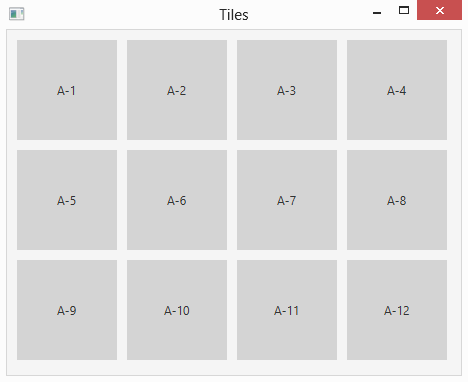

# 第 11 章  更多与精确场景设计有关的布局面板

> **In This Chapter**
>
> - Using four more layout panes to create spectacular layouts 
> - Introducing rectangle shapes
> - Adding scroll bars to a layout 
> - Creating two complete programs

In Chapter 5, you can read about how to work with four basic layout pane classes that let you control the arrangement of controls in a scene: HBox, which arranges nodes horizontally; VBox, which arranges nodes vertically; FlowPane, which arranges nodes both horizontally and vertically; and BorderPane, which divides the scene into five regions: Top, Right, Bottom, Left, and Center.

In this chapter, you discover four additional layout panes that give you additional ways to arrange the elements in a scene. Specifically, you discover how to use the following five layout pane classes:

> ✓ StackPane: The StackPane class is a bit different than the other layout panes in that it doesn’t visually separate nodes from one another. Instead, it displays nodes directly on top of each other. For example, if you add a rectangle shape and a text shape to a stack pane, the text will appear directly over the rectangle.
>
> ✓ AnchorPane: This layout lets you anchor nodes to the top, right, bottom, left, or center of the pane. As the pane resizes, the nodes are repositioned but remain tied to their anchor points. Note: A node can be anchored to more than one position. For example, you might anchor a node to the top and the right. Then, when you resize the pane, the node will remain near the top-right corner of the pane.
>
> ✓ GridPane: Arranges nodes in a grid of rows and columns. The grid does not have to be uniformly sized like a chess board. Instead, the width of each column and the height of each row can vary according to its content. In addition, content can span columns or rows. GridPane is an ideal layout type for forms that gather information from the user via user interface controls such as text boxes, list boxes, and so on.
>
> ✓ TilePane: If you want a layout that resembles a chess board, in which each cell in a grid is the same size, TilePane is the layout pane you’re looking for. TilePane is ideal for organizing thumbnails of image files or other objects of the same size.
>
> ✓ ScrollPane: Technically, the ScrollPane class is not a layout pane at all; it inherits the Control class, not the Pane class. However, it’s primary use is to create layouts that are too large to display all at once and so require a scroll bar to allow the user to pan left and right or up and down (or both) to see all its contents.

Keep in mind that layout panes are typically used in combinations to create the complete layout for your scene. For example, you might use a GridPane to organize user input controls and then place the GridPane in the center section of a BorderPane to place it in the middle of the scene. Or, you might use VBox panes to display labels beneath image thumbnails and then add the VBox panes to a tile pane to display the labeled images in a tiled arrangement.

## Using the StackPane Layout

A stack pane layout is unusual in that it does not arrange its nodes by spreading them out so that you can see them all. Instead, it stacks its nodes one on top of the other so that they overlap. The first node you add to a stack pane at the bottom of the stack; the last node is on the top.

You will most often use a stack pane layout with shapes rather than controls. Because I haven’t yet covered shapes, I limit the examples in this section to simple rectangles created with the Rectangle class. You can read more about this class in Chapter 13. For now, just realize that you can create a rectangle like this:

```java
Rectangle r1 = new Rectangle(100,100);
```

To add a fill color, call the setFill method, like this:

```java
r1.setFill(Color.RED);
```

The Color class defines a number of constants for commonly used colors. In this section, I use just three: LIGHTGRAY, DARKGRAY, and DIMGRAY.

The Rectangle class is in the javafx.scene.shape package, and the Color class is in javafx.scene.paint. Thus, you need to include the following import statements to use these classes:

```java
import javafx.scene.shapes.*; 
import javafx.scene.paint.*;
```

To create a stack pane, you use the StackPane class, whose constructors and methods are shown in Table 11-1.

**Table 11-1 StackPane Constructors and Methods**

| Constructor                 | Description                                                  |
| --------------------------- | ------------------------------------------------------------ |
| StackPane()                 | Creates an empty stack pane.                                 |
| StackPane(Node... children) | Creates a stack pane with the specified child nodes. This constructor lets you create a stack pane and add child nodes to it at the same time. |

| Method                                          | Description                                                  |
| ----------------------------------------------- | ------------------------------------------------------------ |
| ObservableList\<Node\> getChildren()            | Returns the collection of all child nodes that have been added to the stack pane. The collection is returned as an ObservableList type, which includes the methods add and addAll, which lets you add one or more nodes to the list. |
| static void setAlignment (Pos alignment)        | Sets the alignment for child nodes within the stack pane. See Table 5-5 in Chapter 5 for an explanation of the Pos enumeration. |
| static void setMargin(Node child, Insets value) | Sets the margins for a given child node. See Table 5-2 in Chapter 5. |
| void setPadding(Insets value)                   | Sets the padding around the inside edges of the stack pane. See Table 5-2 in Chapter 5 for an explanation of the Insets class. |

The simplest way to create a stack pane is to first create the nodes that you will place in the pane and then call the StackPane constructor, passing the child nodes as parameters. For example:

```java
Rectangle r1 = new Rectangle(100,100); 
r1.setFill(Color.DARKGRAY); 
Rectangle r2 = new Rectangle(50,50); 
r2.setFill(Color.LIGHTGRAY); 
StackPane stack = new StackPane(r1, r2);
```

Here, I first create a pair of rectangles, one 100x100, the other 50x50. The larger rectangle is filled dark gray, the smaller one light gray. Then, I create a stack pane that holds the two rectangles. Figure 11-1 shows how this pane appears when displayed. As you can see, the smaller rectangle is displayed within the larger one.

> Figure 11-1: Two rectangles displayed in a StackPane.


If you prefer, you can call the getChildren method to add nodes to the stack pane, like this:

```java
stack.getChildren().add(r1); 
stack.getChildren().add(r2);
```

Or like this:

```java
stack.getChildren().addAll(r1,r2);
```

Note: The order in which you add nodes to a stack pane has a major impact on how the child nodes are displayed. For example, suppose you reversed the order in which the two rectangles are added:

```java
stack.getChildren().addAll(r2,r1
```

Then, the larger rectangle will be displayed over the top of the smaller one. The result is that the user will see only the larger rectangle. (Unless, of course, the larger rectangle is transparent. I discuss how to create transparent shapes in Chapter 13.)

By default, the objects in a stack pane are centered on top of one another. You can change that by using the setAlignment method. The argument for this method is of type Pos, the same as for other layout panes that have a setAlignment method. If you need a refresher on the Pos enumeration, flip to Table 5-5 in Chapter 5. Here’s an example that displays three rectangles of various sizes aligned at the top left of the stack pane:

```java
Rectangle r1 = new Rectangle(400,150); 
r1.setFill(Color.DARKGRAY);

Rectangle r2 = new Rectangle(200, 400); 
r2.setFill(Color.LIGHTGRAY);

Rectangle r3 = new Rectangle(150,150); 
r3.setFill(Color.DIMGRAY);

StackPane stack = new StackPane(r1, r2, r3); 
stack.setAlignment(Pos.TOP_CENTER);
```

Figure 11-2 shows how this pane appears when displayed in a scene.

> Figure 11-2: Three rectangles displayed with top-center alignment.


As with other layout panes, you can use the setPadding method to add padding around the perimeter of the pane. For example, the following line creates a 50-pixel buffer around the edge of the pane:

```java
stack.setPadding(new Insets(50));
```

The setPadding method accepts an argument of type Insets. For more information about the Insets class, flip to Table 5-2 in Chapter 5.

You can also add margins to individual nodes within a stack pane. To do so, call the setMargin method, passing both the node and an Insets object that describes the margin:

```java
stack.setMargin(r1, new Insets(25));
```

## Using the TilePane layout

The tile pane layout is similar to the flow pane layout: It arranges nodes in neat rows and columns, either horizontally or vertically. The crucial difference is that in a tile pane layout, all the cells are the same size. The tile pane layout calculates the size of the largest node in its child node collection and then uses that size as the size for each cell. This creates a nice grid-like appearance, as shown in Figure 11-3.

By default, a tile pane shows five nodes in each row, using as many rows as necessary to display all its nodes. Thus, the tile pane in Figure 11-3 displays its 12 rectangles in two rows of five and a third row of just two.

If you adjust the size of the tile pane, the number of nodes per row adjusts automatically. For example, Figure 11-4 shows the same tile pane resized so that the 12 rectangles are displayed in three rows of four.

> Figure 11-3: A dozen rectangles displayed in a tile pane.


> Figure 11-4: A tile pane automatically rearranges its tiles when the pane is resized.



To create a tile pane, you use the TilePane class, as I describe in Table 11-2.

**Table 11-2 TilePane Constructors and Methods**

| Constructor                                                  | Description                                                  |
| ------------------------------------------------------------ | ------------------------------------------------------------ |
| TilePane()                                                   | Creates an empty tile pane.                                  |
| TilePane(Node. . . children)                                 | Creates a tile pane with the specified child nodes.          |
| TilePane(double hgap, double vgap)                           | Creates an empty tile pane with the specified gaps between rows and columns. |
| TilePane(Orientation orientation)                            | Creates an empty tile pane with the specified orientation. You can specify Orientation.HORIZONTAL or Orientation.VERTICAL. |
| TilePane(double hgap, double vgap, Node. . .children)        |                                                              |
| TilePane(Orientation orientation, double hgap, double vgap)  |                                                              |
| TilePane(Orientation orientation, Node. . . children)        |                                                              |
| TilePane(Orientation orientation, double hgap, double vgap, Node. . . children) |                                                              |

| Method                                         | Description                                                  |
| ---------------------------------------------- | ------------------------------------------------------------ |
| ObservableList\<Node\> getChildren()           | Returns the collection of all child nodes that have been added to the tile pane. The collection is returned as an ObservableList type, which includes the methods add and addAll, which lets you add one or more nodes to the list. |
| void setHgap(double value)                     | Sets the size of the gap that appears between columns.       |
| void setVgap(double value)                     | Sets the size of the gap that appears between rows.          |
| void setOrientation(Orientation orientation)   | Sets the orientation. Allowable values are Orientation.HORIZONTAL and Orientation.VERTICAL. |
| void setPrefColumns(int value)                 | Sets the number of columns preferred for this tile pane.     |
| void setPrefRows(int value)                    | Sets the number of rows preferred for this tile pane.        |
| void setPrefTileWidth(double value)            | Sets the preferred width for each cell.                      |
| void setPrefTileHeight(double value)           | Sets the preferred height for each cell.                     |
| static void setMargin(Node node, Insets value) | Sets the margin for a particular node. See Table 5-2 in Chapter 5 for an explanation of the Insets class. |
| void setMinHeight(double value)                | Sets the minimum height of the tile pane.                    |
| void setMaxHeight(double value)                | Sets the maximum height of the tile pane.                    |
| void setPrefHeight(double value)               | Sets the preferred height of the tile pane.                  |
| void setMinWidth(double value)                 | Sets the minimum width of the tile pane.                     |
| void setMaxWidth(double value)                 | Sets the maximum width of the tile pane.                     |
| void setPrefWidth(double value)                | Sets the preferred width of the tile pane.                   |
| void setPadding(Insets value)                  | Sets the padding around the inside edges of the tile pane. See Table 5-2 in Chapter 5 for an explanation of the Insets class. |

```java
TilePane tile1 = new TilePane(); 
tile1.setHgap(10); 
tile1.setVgap(10); 
tile1.setPadding(new Insets(10,10,10,10));
for (int i=1; i<13; i++){
  Rectangle r = new Rectangle(100, 100); 
  r.setFill(Color.LIGHTGRAY); 
  Label l = new Label("A-" + i); 
  StackPane s = new StackPane(r, l); 
  tile1.getChildren().add(s);
}
```

As you can see, a for loop is used to create 12 labeled rectangles, which are added to the tile pane. In the for loop, I first create a 100x100-pixel rectangle and set its color to light gray. Then, I create a label and assign it a text value that consists of the string “A-” followed by an integer value. Finally, I create a stack pane and add the rectangle and the label to it. The result is that the label appears on top of the rectangle. I then add the stack pane to the tile pane.

## Using the ScrollPane Layout

When a layout is too large to fit in a window, you want to provide horizontal or vertical scroll bars (or both) so the user can scroll to see the entire layout. The easiest way to do that is with a scroll pane. A scroll pane envelops a single node with an area that automatically displays horizontal or vertical scroll bars whenever necessary. Thus, the scroll bars are not displayed if the entire layout fits within the scroll pane. If the layout is taller than the scroll pane, a vertical scroll bar appears. And if the layout is wider than the scroll pane, a horizontal scroll bar appears.

Technically, a scroll pane is not really a layout pane. The ScrollPane class is a descendant of the Control class, not the Pane class. Even so, scroll panes are typically used in conjunction with layout panes to accommodate layouts that are too large to fit onscreen.

Figure 11-5 shows a tile pane similar to the ones shown in the preceding section contained within a scroll pane. As you can see, the tile pane in this example displays two tiles per row, and a vertical scroll bar is visible, allowing the user to scroll to see all the tiles. To create margins around the scroll pane, I added the scroll pane to a stack pane and then set margins on the stack pane.

> Figure 11-5: A tile pane contained within a scroll pane.


To create a scroll pane, use the ScrollPane class depicted in Table 11-3.

**Table 11-3 ScrollPane Constructors and Methods**

| Constructor           | Description                                          |
| --------------------- | ---------------------------------------------------- |
| ScrollPane()          | Creates an empty scroll pane.                        |
| ScrollPane(Node node) | Creates a scroll pane with the specified child node. |

| Method                                                | Description                                                  |
| ----------------------------------------------------- | ------------------------------------------------------------ |
| void getContent(Node node)                            | Sets the node contained within this scroll pane.             |
|                                                       | Note: The allowable values for the following two methods are shown at the end of this table. |
| void setHbarPolicy(ScrollPane. ScrollBarPolicy value) | Sets the policy for the horizontal scroll bar.               |
| void setVbarPolicy(ScrollPane. ScrollBarPolicy value) | Sets the policy for the vertical scroll bar.                 |
| void setPannable(boolean value)                       | If true, the user can pan the contents of the scroll pane using the mouse. The default is false. |
| void setMinHeight(double value)                       | Sets the minimum height of the scroll pane.                  |
| void setMaxHeight(double value)                       | Sets the maximum height of the scroll pane.                  |
| void setPrefHeight(double value)                      | Sets the preferred height of the scroll pane.                |
| void setMinWidth(double value)                        | Sets the minimum width of the scroll pane.                   |
| void setMaxWidth(double value)                        | Sets the maximum width of the scroll pane.                   |
| void setPrefWidth(double value)                       | Sets the preferred width of the scroll pane.                 |
| void setPadding(Insets value)                         | Sets the padding around the inside edges of the tile pane. See Table 5-2 in Chapter 5 for an explanation of the Insets class. |

| ScrollBarPolicy Enumeration           | Description                              |
| ------------------------------------- | ---------------------------------------- |
| ScrollPane. ScrollBarPolicy.ALWAYS    | Always show a scroll bar.                |
| ScrollPane. ScrollBarPolicy.NEVER     | Never show a scroll bar.                 |
| ScrollPane. ScrollBarPolicy.AS_NEEDED | Show a scroll bar only when it’s needed. |

The easiest way to create a scroll pane is to call the ScrollPane constructor and pass the node you want scrolled as a parameter, like this:

```java
ScrollPane spane = new ScrollPane(tile1);
```

You will most likely also want to set the size constraints for the scroll pane. The following code fixes the width at 250 and allows the layout to determine the height, with a preferred height of 400:

```java
spane.setMaxWidth(250); 
spane.setMinWidth(250); 
spane.setPrefWidth(250); 
spane.setPrefHeight(400);
```

If you want, you can set a policy for the vertical and horizontal scroll bars. By default, the scroll bars appear only if necessary. If you want a scroll bar to always appear, even when it isn’t necessary, set the policy to ALWAYS as in this example:

```java
spane.setVBarPolicy(ScrollBarPolicy.ALWAYS);
```

The complete program used to create the scroll pane shown in Figure 11-5 is shown in Listing 11-1.

**Listing 11-1: The ScrolledTile Program**

```java
import javafx.application.*; 
import javafx.stage.*; 
import javafx.scene.*; 
import javafx.scene.layout.*; 
import javafx.scene.control.*; 
import javafx.scene.shape.*; 
import javafx.scene.paint.*; 
import javafx.geometry.*;

public class ScrolledTile extends Application 
{
  public static void main(String[] args) 
  { 
    launch(args); 
  }

  @Override public void start(Stage primaryStage) 
  {

    TilePane tile1 = new TilePane();                                              // →20
    tile1.setHgap(10); 
    tile1.setVgap(10); 
    tile1.setPrefColumns(2); 
    tile1.setPadding(new Insets(10,10,10,10));
    for (int i=1; i<13; i++)                                                      // →25
    {
      Rectangle r = new Rectangle(100, 100); 
      r.setFill(Color.LIGHTGRAY); 
      Label l = new Label("A-" + i);
      StackPane s = new StackPane(r, l); 
      tile1.getChildren().add(s);
    }

    ScrollPane spane = new ScrollPane(tile1);                                     // →34
    spane.setMinWidth(250); 
    spane.setPrefWidth(250); 
    spane.setMaxWidth(250); 
    spane.setPrefHeight(400); 
    spane.setVbarPolicy(ScrollPane.ScrollBarPolicy.ALWAYS);                       // →39

    StackPane stack = new StackPane(spane);                                       // →41
    stack.setMargin(spane, new Insets(40,40,40,40));

    Scene scene = new Scene(stack);                                               // →44
    primaryStage.setScene(scene); 
    primaryStage.setTitle("Scrolled Tiles"); 
    primaryStage.show();
  }
}
```

The following paragraphs describe the highlights of this program:

➝ 20：This line and the four lines that follow it create the tile pane, set the horizontal and vertical gaps to 10 pixels, set the preferred width to two columns, and set the padding.

➝ 25：A for loop is used to create 12 labeled rectangles and add them to the tile pane.

➝ 34：These lines create the scroll pane and set its size. The width is fixed at 250 pixels. The preferred height is 400 pixels, but the scroll pane’s height can grow or shrink as needed to fill the scene.

➝ 39：The vertical scroll bar will always be displayed, even if it isn’t necessary.

➝ 41：A stack pane is used here for the sole purpose of providing 40 pixels of margin around the scroll pane.

➝ 44：The stack pane is added to the scene, and the scene is finalized and displayed.

## Using the GridPane Layout

The grid pane layout manager lets you arrange GUI elements in a grid of rows and columns. Unlike a tile pane, the rows and columns of a grid pane do not have to be the same size. Instead, the grid pane layout automatically adjusts the width of each column and the height of each row based on the components you add to the panel.

Here are some important features of the grid pane layout manager:

> ✓ You can specify which cell you want each component to go in, and you can control each component’s position in the panel.
>
> ✓ You can create components that span multiple rows or columns, such as a button two columns wide or a list box four rows high.
>
> ✓ You can tell GridPane to stretch a component to fill the entire space allotted to it if the component isn’t already big enough to fill the entire area. You can specify that this stretching be done horizontally, vertically, or both.
>
> ✓ If a component doesn’t fill its allotted area, you can tell the grid pane layout manager how you want the component to be positioned within the area — for example, left- or right-aligned.

The following sections describe the ins and outs of working with grid pane layouts.

### Sketching out a plan

Before you create a grid pane layout, draw a sketch showing how you want the components to appear in the panel. Then slice the panel into rows and columns, and number the rows and columns starting with zero in the top-left corner. Figure 11-6 shows such a sketch for an application that lets a user order a pizza.

> Figure 11-6: Sketching out a panel.


After you have the panel sketched out, list the components, their x and y coordinates on the grid, their alignment, and whether each component spans more than one row or column. Here’s an example:

| 组件             | x    | y    | 对齐 | 跨度 |
| ---------------- | ---- | ---- | ---- | ---- |
| "Name" 标签      | 0    | 0    | 右   |      |
| "Phone" 标签     | 0    | 1    | 右   |      |
| "Address" 标签   | 0    | 2    | 右   |      |
| Name 文本框      | 1    | 0    | 左   | 2    |
| Phone 文本框     | 1    | 1    | 左   | 2    |
| Address 文本框   | 1    | 2    | 左   | 2    |
| Size 单选按钮    | 0    | 3    | 左   |      |
| Style 单选按钮   | 1    | 3    | 左   |      |
| Toppings 多选项  | 2    | 3    | 左   |      |
| OK 和 Close 按钮 | 2    | 4    | 右   |      |

After you lay out the grid, you can write the code to put each component in its proper place.

### Creating a grid pane

Table 11-4 shows the most frequently used constructors and methods of the GridPane class, which you use to create a grid pane.