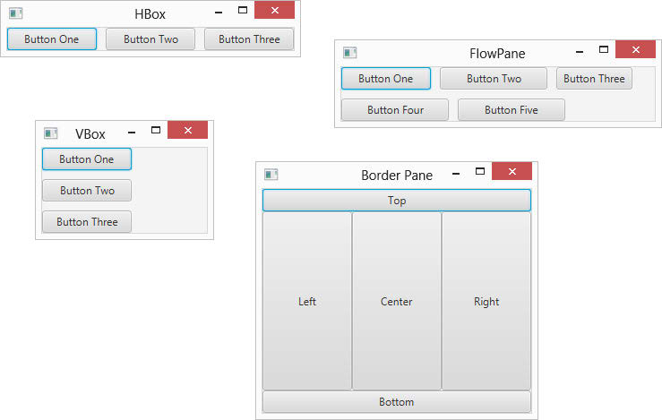
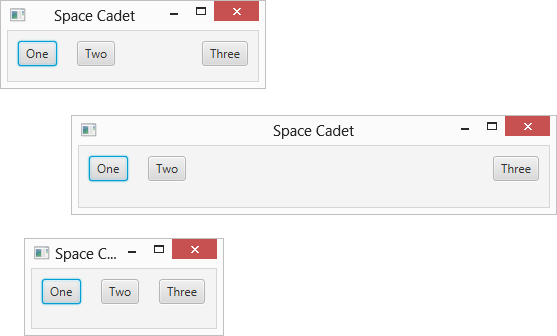
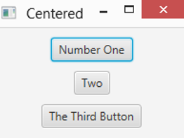
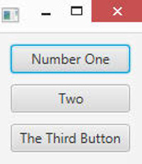
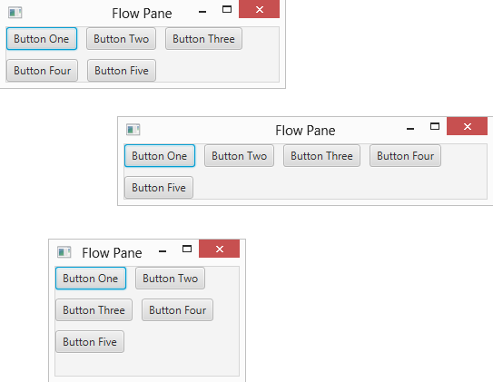
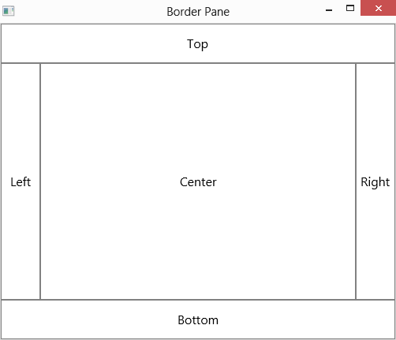

# 第 5 章 使用布局面板布置场景

> **In This Chapter**
>
> - Using four popular layout pane classes: HBox, VBox, FlowPane, and BorderPane
> - Adjusting the size of layout panes and the nodes they contain
> - Fiddling with various options for spacing out the nodes in a layout pane

Controlling the layout of components in a scene is often one of the most difficult aspects of working with JavaFX. In fact, at times it can be downright exasperating. Often the components almost seem to have minds of their own. They get stubborn and refuse to budge. They line up on top of one another when you want them to be side by side. You make a slight change to a label or text field, and the whole scene seems to rearrange itself. At times, you want to put your fist through the monitor.

I recommend against putting your fist through your monitor. You’ll make a mess, cut your hand, and have to spend money on a new monitor — and when you get your computer working again, the components still won’t line up the way you want them to be.

The problem isn’t with the components; it’s with the layout panes, which determine where each component appears in its frame or panel. Layout panes are special classes whose sole purpose in life is to control the arrangement of the nodes that appear in a scene. JavaFX provides several distinct types of layout panes; each type uses a different approach to controlling the arrangement of nodes. The trick to successfully lay out a scene is to use the layout panes in the correct combination to achieve the arrangement you want.

## Working with Layout Panes

Understanding layout panes is the key to creating JavaFX frames that are attractive and usable.

### Introducing four JavaFX layout panes

JavaFX provides many different layout panes for you to work with. I explain the following four in this chapter:

> ✓ HBox: This layout pane arranges nodes horizontally, one next to the other. You use it to create controls arranged neatly in rows.
>
> ✓ VBox: This layout pane arranges nodes vertically, one above the other.
>
> You use it to create controls arranged neatly in columns.
>
> ✓ FlowPane: This layout pane arranges nodes next to each other until it runs out of room; then, it wraps to continue layout nodes. You can configure a FlowPane to arrange nodes horizontally in rows or vertically in columns.
>
> ✓ BorderPane: This layout pane divides the pane into five regions: Top, Left, Center, Right, and Bottom. When you add a node, you can specify which region you want to place the node in.

To give you a general idea of the results that can be achieved with each of these four layout panes, Figure 5-1 shows four sample windows that each use one of the layout panes.

Chapter 11 discusses additional types of layout panes.

> Figure 5-1: Four commonly used types of layout panes.



### Creating layout panes

The basic process of working with layout panes is simple. Here is the general procedure for creating a layout node:

1. Create the controls or other nodes you want to add to the pane.

   For example, if the layout pane will contain two buttons, you should create the two buttons using code similar to this:

   ```java
   Button btnOK = new Button(); 
   btnOK.setText("OK"); 
   btnOK.setOnAction(e -> btnOK_Click()); 
   Button btnCancel = new Button(); btnCancel.setText("Cancel"); 
   btnCancel.setOnAction(e -> btnCancel_Click());
   ```

2. Create a layout pane by calling its constructor.

   For example:

   ```java
   HBox pane = new HBox();
   ```

3. Fine-tune any of the settings required by the layout pane.

   Each type of layout pane has a unique assortment of parameters that govern the details of how nodes are laid out within the pane. For example, the HBox pane lets you set the number of pixels that will be used to separate each node in the pane. You can set this value as follows:

   ```java
   HBox.setSpacing(10);
   ```

4. Add each of the nodes that will appear in the layout pane.

   Each type of layout pane provides a method for adding nodes to the pane. For the HBox pane, you must first call the getChildren method to get a list of all the nodes that have been added to the pane. Then, you call the addAll method to add one or more nodes to the pane. For example:

   ```java
   pane.getChildren().addAll(btnOK, btnCancel);
   ```

5. Create the scene, specifying the layout pane as the scene’s root node.

   For example:

   ```java
   Scene scene = new Scene(pane, 300, 400);
   ```

   In this example, pane is added as the root node for the scene.

### Combining layout panes

You can combine several layout panes to create layouts that are more complicated than a single layout pane can provide. For example, suppose you want to create a layout that has a horizontal row of buttons at the bottom and a vertical column of buttons at the right. To do that, you could create an HBox for the buttons at the bottom and a VBox for the buttons at the right. Then, you could create a BorderPane and add the HBox to the bottom region and the VBox to the right region.

Combinations like this are possible because all the layout panes inherit the base class javafx.scene.layout.Pane, which in turn inherits the class javafx.scene.node. In other words, all panes are also nodes. Each node that you add to a layout pane can be another layout pane. You can nest layout panes within layout panes as deeply as you need to achieve the exact layout you need for your application.

## Using the HBox Layout

The HBox class provides one of the simplest of all JavaFX’s layout managers: It arranges one or more nodes into a horizontal row. Table 5-1 presents the most commonly used constructors and methods of the HBox class.

**Table 5-1 HBox Constructors and Methods**

| Constructor                              | Description                                                  |
| ---------------------------------------- | ------------------------------------------------------------ |
| HBox()                                   | Creates an empty HBox.                                       |
| HBox(double spacing)                     | Creates an empty HBox with the specified spacing.            |
| HBox(Node. . . children)                 | Creates an HBox with the specified child nodes. This constructor lets you create an HBox and add child nodes to it at the same time. |
| HBox(double spacing, Node. . . children) | Creates an HBox with the specified spacing and child nodes.  |

| Method                                              | Description                                                  |
| --------------------------------------------------- | ------------------------------------------------------------ |
| ObservableList\<Node\> getChildren()                | Returns the collection of all child nodes that have been added to the HBox. The collection is returned as an ObservableList type, which includes the method addAll, letting you add one or more nodes to the list. |
| static void setAlignment(Pos alignment)             | Sets the alignment for child nodes within the HBox.<br/>See Table 5-5 for an explanation of the Pos enumeration. For more information, see the section “Aligning Nodes in a Layout Pane” later in this chapter. |
| static void setHgrow(Node child, Priority priority) | Sets the growth behavior of the given child node.<br/>See Table 5-3 for an explanation of the Priority enumeration. For more information, see the section “Adding Space by Growing Nodes” later in this chapter. |
| static void setMargin(Node child, Insets value)     | Sets the margins for a given child node.<br/>See Table 5-2 for the constructors of the Insets class.<br/>For more information, see the section “Adding Space with Margins” later in this chapter. |
| void setPadding(Insets value)                       | Sets the padding around the inside edges of the Hbox.<br/>See Table 5-2 for the constructors of the Insets class.<br/>For more information, see the section “Spacing Things Out” later in this chapter. |
| void setSpacing(double value)                       | Sets the spacing between nodes displayed within the HBox.<br/>For more information, see the section “Spacing Things Out” later in this chapter. |

The HBox class is defined in the javafx.scene.layout package, so you should include the following import statement in any program that uses an HBox:

```java
import javafx.scene.layout.*;
```

The easiest way to create an HBox is to first create the nodes that you want to place in the HBox and then call the HBox constructor and pass the nodes as arguments. For example:

```java
Button btn1 = new Button("Button One"); 
Button btn2 = new Button("Button Two"); 
Button btn3 = new Button("Button Three"); 
HBox hbox = new HBox(btn1, btn2, btn3);
```

If you prefer to create the HBox control in an initially empty state and later add the controls, you can do so like this:

```java
HBox hbox = new HBox(); 
Hbox.getChildren().addAll(btn1, btn2, btn3);
```

Here, the getChildren method is called, which returns a collection of all the children added to the HBox pane. This collection is defined by the class ObservableList, which includes a method named addAll that you can use to add one or more nodes to the list.

## Spacing Things Out

By default, child nodes in a layout pane are arranged immediately next to one another, with no empty space in between. If you want to provide space between the nodes in the pane, you can do so in four ways:

> ✓ Adding spacing between elements within the pane 
>
> ✓ Adding padding around the inside edges of the pane
>
> ✓ Adding margins to the individual nodes in the pane 
>
> ✓ Creating spacer nodes that can grow to fill available space

In this section, I show you how to add spacing and padding to an pane. Then, the next three sections show you how to use the other two techniques.

Note that although I illustrate the techniques in these sections using the HBox layout pane, the techniques apply to other types of panes as well.

To set the spacing for an HBox pane, you can use the spacing parameter on the HBox constructor or by calling the setSpacing method. For example, this statement creates an HBox pane with a default spacing of 10 pixels:

```java
HBox hbox = new HBox(10);
```

This example creates an HBox pane with 10-pixel spacing and adds three buttons:

```java
HBox hbox = new HBox(10, btn1, btn2, btn3);
```

And this example creates an HBox pane using the default constructor, and then calls the setSpacing method to set the spacing to 10 pixels:

```java
HBox hbox = new HBox(); 
Hbox.setSpacing(10);
```

Although spacing adds space between nodes in an HBox pane, it doesn’t provide any space between the nodes and the edges of the pane itself. For example, if you set the spacing to 10 pixels and add three buttons to the pane, the three buttons will be separated from one another by a gap of 10 pixels. However, there won’t be any space at all between the left edge of the first button and the left edge of the pane itself. Nor will there be any space between the top of the buttons and the top of the pane. In other words, the three buttons will be crowded tightly into the pane.

To add space around the perimeter of the layout pane, use the setPadding method. This method takes as a parameter an object of type Insets, which represents the size of the padding (in pixels) for the top, right, bottom, and left edge of an object. You can create an Insets object using either of the two constructors listed in Table 5-2. The first provides an even padding for all four edges of an object; the second lets you set a different padding value for each edge.

To set the padding to a uniform 10 pixels, call the setPadding method like this:

```java
hbox.setPadding(new Insets(10));
```

To set a different padding value for each edge, call it like this:

```java
hbox.setPadding(new Insets(20, 10, 20, 10));
```

In this example, the top and bottom padding is set to 20 and the right and left padding is set to 10.

**Table 5-2 Insets Constructors**

| Constructor                                                  | Description                                                  |
| ------------------------------------------------------------ | ------------------------------------------------------------ |
| Insets(double value)                                         | Creates an Insets object that uses the same value for the top, right, bottom, and left margins. |
| Insets(double top, double right, double bottom, double left) | Creates an Insets object that uses the specified top, right, bottom, and left margins. |

The Insets enumeration is defined in the javafx.geometry package, so you should include the following import statement in any program that uses Insets:

```java
import javafx.geometry.*;
```

## Adding Space with Margins

Another way to add space around the nodes in a layout pane is to create margins around the individual nodes. This technique allows you to set a different margin size for each node in the layout pane, giving you complete control over the spacing of each node.

To create a margin, call the setMargin method for each node you want to add a margin to. You might think that because each node can have its own margin, the setMargin method would belong to the Node class. Instead, the setMargin method is defined by the HBox class. The setMargin method accepts two parameters:

> ✓ The node you want to add the margin to 
>
> ✓ An Insets object that defines the margins you want to add

Here’s an example that sets a margin of 10 pixels for all sides of a button named btn1:

```java
HBox hbox = new HBox(); 
hbox.setMargin(btn1, new Insets(10));
```

The setMargin method is a static method of the HBox class, so when you call it, you can reference the HBox class itself rather than an actual instance of an HBox. Thus, the following code will work equally as well:

```java
Hbox.setMargin(btn1, new Insets(10));
```

(Yes it’s a subtle difference: In the first example, hbox refers to an instance of the HBox class; in the second example, HBox refers to the class itself.)

Here’s an example that sets a different margin for each side of the pane:

```java
Hbox.setMargin(btn1, new Insets(10, 15, 20, 10));
```

In this example, the top margin is 10 pixels, the right margin is 15 pixels, the bottom margin is 20 pixels, and the left margin is 10 pixels.

Note that margins, spacing, and padding can work together. Thus, if you create a 5-pixel margin on all sides of two buttons, add those two buttons to a pane whose spacing is set to 10 pixels and whose padding is set to 10 pixels, the buttons will be separated from one another by a space of 20 pixels and from the inside edges of the pane by 15 pixels.

## Adding Space by Growing Nodes

A third way to add space between nodes in an HBox is to create a node whose sole purpose is to add space between two HBox nodes. Then, you can configure the spacer node that will automatically grow to fill any extra space within the pane. By configuring only the spacer node and no other nodes in this way, only the spacer node will grow. This has the effect of pushing the nodes on either side of the spacer node apart from one another.

For example, suppose you want to create an HBox layout pane that contains three buttons. Instead of spacing all three buttons evenly within the pane, you want the first two buttons to appear on the left side of the pane and the third button to appear on the right side of the pane. The amount of space between the second and third buttons will depend entirely on the size of the pane. Thus, if the user drags the window to expand the stage, the amount of space between the second and third buttons should increase accordingly.

The easiest way to create a spacer node is by using the Region class. The Region class is the base class for both the Control class, from which controls such as Button and Label derive. It is also the based class for the Pane class, from which all the layout panes described in this chapter and in Chapter 11 derive.

For my purposes here, I just use the simple default constructor of the Region class to create a node that serves as a simple spacer in a layout pane. I don’t provide a specific size for the region. Instead, I configure it so that it will grow horizontally to fill any unused space within its container.

To do that, you use the static setHgrow method of the HBox class, specifying one of the three constant values defined by an enumeration named Priority enumeration. Table 5-3 lists these constants and explains what each one does.

**Table 5-3 The Priority enumeration**

| Constant            | Description                                                  |
| ------------------- | ------------------------------------------------------------ |
| Priority.NEVER      | Indicates that the width of the node should never be adjusted to fill the available space in the pane. This is the default setting. Thus, by default, nodes are not resized based on the size of the layout pane that contains them. |
| Priority.ALWAYS     | Indicates that the width of the node should always be adjusted if necessary to fill available space in the pane. If you set two or more nodes to ALWAYS, the adjustment will be split equally among each of the nodes. |
| Priority. SOMETIMES | Indicates that the node’s width may be adjusted if necessary to fill out the pane. However, the adjustment will be made only if there are no other nodes that specify ALWAYS. |

The Priority enumeration is defined in the javafx.scene.layout package; the same package that defines the layout managers that require it. So you don’t need to include an additional import statement to use the Priority enumeration.

The following example creates three buttons and a spacer, sets the margins for all three buttons to 10 pixels, and then adds the three buttons and the spacer to an HBox such that the first two buttons appear on the left of the HBox and the third button appears on the right:

```java
// Create the buttons 
Button btn1 = new Button("One"); 
Button btn2 = new Button("Two"); 
Button btn3 = new Button("Three");

// Create the spacer 
Region spacer = new Region();

// Set the margins 
hBox.setMargin(btn1, new Insets(10)); 
hBox.setMargin(btn2, new Insets(10)); 
hBox.setMargin(btn3, new Insets(10));

// Set the Hgrow for the spacer 
hBox.setHgrow(spacer, Priority.ALWAYS);

// Create the HBox layout pane 
HBox hbox = new HBox(10, btn1, btn2, spacer, btn3);
```

Figure 5-2 shows how this pane appears when added to a stage. So that you can see how the spacer works, the figure shows three incarnations of the pane, each with the window dragged to a different size. Notice how the spacing between the second and third buttons is adjusted automatically so that the first two buttons are on the left side of the pane and the third button is on the right.

> Figure 5-2: Using a spacer node to space out buttons in an HBox pane.



Like the setMargin method, the setHGrow method is a static class of the HBox class. Thus, you can call it from an instance of the HBox class (as in the preceding example), or you can call it from the HBox class itself. In other words, the second two lines in the following code segment are redundant:

```java
HBox pane = new HBox(); 
pane.setHGrow(spacer, Priority.ALWAYS); 
HBOX.setHGrow(spacer, Priority.ALWAYS);
```

## Using the VBox Layout

The VBox class is similar to the HBox class, but instead of arranging nodes horizontally in a row, it arranges them vertically in a column. Table 5-4 shows the most commonly used constructors and methods of the VBox class.

**Table 5-4 VBox Constructors and Methods**

| Constructor                              | Description                                                  |
| ---------------------------------------- | ------------------------------------------------------------ |
| VBox()                                   | Creates an empty VBox.                                       |
| VBox(double spacing)                     | Creates an empty VBox with the specified spacing.            |
| VBox(Node. . . children)                 | Creates an VBox with the specified child nodes. This constructor lets you create a VBox and add child nodes to it at the same time. |
| VBox(double spacing, Node. . . children) | Creates a VBox with the specified spacing and child nodes.   |

| Method                                              | Description                                                  |
| --------------------------------------------------- | ------------------------------------------------------------ |
| ObservableList\<Node\> getChildren()                | Returns the collection of all child nodes that have been added to the VBox. The collection is returned as an ObservableList type, which includes the method addAll, letting you add one or more nodes to the list. |
| static void setAlignment(Pos alignment)             | Sets the alignment for child nodes within the VBox.<br/>See Table 5-5 for an explanation of the Pos enumeration. For more information, see the section “Aligning Nodes in a Layout Pane” later in this chapter. |
| static void setMargin(Node child, Insets value)     | Sets the margins for a given child node.<br/>See Table 5-2 for the constructors of the Insets class. For more information, see the section “Adding Space with Margins” earlier in this chapter. |
| void setPadding(Insets value)                       | Sets the padding around the inside edges of the VBox.<br/>See Table 5-2 for the constructors of the Insets class. For more information, see the section “Spacing Things Out” earlier in this chapter. |
| static void setVgrow(Node child, Priority priority) | Sets the growth behavior of the given child node.<br/>See Table 5-3 for an explanation of the Priority enumeration. For more information, see the section “Adding Space by Growing Nodes” earlier in this chapter. |

The VBox class is defined in the javafx.scene.layout package, so you should include the following import statement in any program that uses a VBox:

```java
import javafx.scene.layout.*;
```

Here’s an example that creates three buttons and uses a VBox to arrange them into a column:

```java
Button btn1 = new Button("Button One"); 
Button btn2 = new Button("Button Two"); 
Button btn3 = new Button("Button Three"); 
VBox vbox = new VBox(btn1, btn2, btn3);
```

You can accomplish the same thing by using the default constructor and calling the getChildren method, as in this example:

```java
VBox vbox = new VBox(); 
Vbox.getChildren().addAll(btn1, btn2, btn3);
```

As with the HBox class, you can use spacing, padding, margins, and spacer nodes to control the spacing of nodes within a VBox. Here’s an example that sets 10 pixels of vertical space between nodes and 10 pixels of padding on each edge of the pane:

```java
Button btn1 = new Button("One"); 
Button btn2 = new Button("Two"); 
Button btn3 = new Button("Three"); 
VBox vbox = new VBox(10, btn1, btn2, btn3); 
vbox.setPadding(new Insets(10));
```

Here’s an example that creates a column of three buttons, with one button at the top of the column and two at the bottom, with 10 pixels of spacing and padding:

```java
// Create the buttons 
Button btn1 = new Button("One"); 
Button btn2 = new Button("Two"); 
Button btn3 = new Button("Three");

// Create the spacer 
Region spacer = new Region();

// Set the Vgrow for the spacer 
VBox.setVgrow(spacer, Priority.ALWAYS);

// Create the VBox layout pane 
VBox vbox = new VBox(10, btn1, spacer, btn2, btn3); 
vbox.setPadding(new Insets(10));
```

## Aligning Nodes in a Layout Pane

Both the HBox and the VBox layout panes have a setAlignment method that lets you control how the nodes that are contained within the pane are aligned with one another. The setAlignment method accepts a single argument, which is one of the constants defined by the Pos enumeration, described in Table 5-5.

**Table 5-5 The Pos enumeration**

| Constant            | Vertical Alignment | Horizontal Alignment |
| ------------------- | ------------------ | -------------------- |
| Pos.TOP_LEFT        | Top                | Left                 |
| Pos.TOP_CENTER      | Top                | Center               |
| Pos.TOP_RIGHT       | Top                | Right                |
| Pos.CENTER_LEFT     | Center             | Left                 |
| Pos.CENTER          | Center             | Center               |
| Pos.CENTER_RIGHT    | Center             | Right                |
| Pos.BOTTOM_LEFT     | Bottom             | Left                 |
| Pos.BOTTOM_CENTER   | Bottom             | Center               |
| Pos.BOTTOM_RIGHT    | Bottom             | Right                |
| Pos.BASELINE_LEFT   | Baseline           | Left                 |
| Pos.BASELINE_CENTER | Baseline           | Center               |
| Pos.BASELINE_RIGHT  | Baseline           | Right                |

The Pos enumeration is defined in the javafx.geometry package, so you should include the following import statement in any program that uses Insets:

```java
import javafx.geometry.*;
```

The following example shows how you might create a vertical column of three buttons, centered within the pane:

```java
Button btn1 = new Button("Number One"); 
Button btn2 = new Button("Two"); 
Button btn3 = new Button("The Third Button"); 
VBox vbox = new VBox(10, btn1, btn2, btn3); 
vbox.setPadding(new Insets(10)); 
vbox.setAlignment(Pos.CENTERED);
```

When this pane is added to a scene and then shown in a stage, the results resemble the window shown in Figure 5-3.

> Figure 5-3: Three buttons centered in a VBox layout pane.



## Making Nodes the Same Width

When you place a set of buttons or other controls in a layout pane, you may want the buttons to all have the same width to create a neat, even appearance. This is especially true when you place them in a vertical column in a VBox pane because the vertical column will draw attention to any differences in the widths of the buttons.

You can easily dictate that the buttons all have the same width by setting the maximum width of each of the buttons to Double.MAX_VALUE. Here’s a revised version of the preceding example in which the three buttons are set to the same width:

```java
Button btn1 = new Button("Number One"); 
Button btn2 = new Button("Two"); 
Button btn3 = new Button("The Third Button"); 
btn1.setMaxWidth(Double.MAX_VALUE); 
btn2.setMaxWidth(Double.MAX_VALUE); 
btn3.setMaxWidth(Double.MAX_VALUE); 
VBox vbox = new VBox(10, btn1, btn2, btn3); 
vbox.setPadding(new Insets(10)); 
vbox.setAlignment(Pos.CENTERED);
```

Figure 5-4 shows how these buttons appear when the pane is added to a scene and the scene displayed in a stage. Notice that all three buttons have adopted the width of the widest button (btn3).

**Figure 5-4: Three buttons with the same width.**



## Using the Flow Layout

The flow layout comes in two flavors: horizontal and vertical. A horizontal flow layout arranges its child nodes in a row until the width of the pane reaches a certain size that you can specify. When that size is reached, the layout begins a new row of child nodes beneath the first row. This flow continues, starting a new row each time the size limit is reached, until all the child nodes have been placed.

A vertical flow layout works the same way except that child nodes are laid out in columns until the size limit is reached. When the size limit is reached, a new column immediately to the right of the first column is started.

You use the FlowPane class to create a flow layout. Table 5-6 shows the constructors and most commonly used methods for the FlowPane class.

**Table 5-6 FlowPane Constructors and Methods**

| Constructor                                                  | Description                                                  |
| ------------------------------------------------------------ | ------------------------------------------------------------ |
| FlowPane()                                                   | Creates an empty horizontal flow layout with both the horizontal and vertical gaps set to zero. |
| FlowPane(double hgap, double vgap)                           | Creates an empty horizontal flow layout with the specified horizontal and vertical gaps. |
| FlowPane(double hgap, double vgap, Node... children)         | Creates a horizontal flow layout with the specified horizontal and vertical gaps and populated with the specified child nodes. |
| FlowPane(Node... children)                                   | Creates a horizontal flow layout with both the horizontal and vertical gaps set to zero and populated with the specified child nodes. |
|                                                              | Note: In each of the following constructors, Orientation can be Orientation.HORIZONTAL or Orientation.VERTICAL. |
| FlowPane(Orientation orientation)                            | Creates an empty flow layout with the specified orientation and both the horizontal and vertical gaps set to zero. |
| FlowPane(Orientation orientation, double hgap, double vgap)  | Creates an empty flow layout with the specified orientation and the specified horizontal and vertical gaps. |
| FlowPane(Orientation orientation, double hgap, double vgap, Node... children) | Creates a flow layout with the specified orientation and horizontal and vertical gaps, populated with the specified children. |
| FlowPane(Orientation orientation, Node... children)          | Creates a flow layout with the specified orientation and both the horizontal and vertical gaps set to zero, populated with the specified children. |

| Method                                          | Description                                                  |
| ----------------------------------------------- | ------------------------------------------------------------ |
| ObservableList\<Node\> getChildren()            | Returns the collection of all child nodes. The collection is returned as an ObservableList type, which includes the method addAll, letting you add one or more nodes to the list. |
| void setAlignment(Pos alignment)                | Sets the alignment for nodes within the rows and columns.<br/>See Table 5-5 for an explanation of the Pos enumeration. For more information, see the section “Aligning Nodes in a Layout Pane” earlier in this chapter. |
| void setColumn Alignment(Pos alignment)         | Sets the alignment for nodes within the columns.<br/>See Table 5-5 for an explanation of the Pos enumeration. For more information, see the section “Aligning Nodes in a Layout Pane” earlier in this chapter. |
| void setHgap(double value)                      | Sets the horizontal gap. For a horizontal flow layout, this is the amount of space between nodes. For a vertical flow layout, this is the amount of space between columns. |
| static void setMargin(Node child, Insets value) | Sets the margins for a given child node.<br/>See Table 5-2 for the constructors of the Insets class. For more information, see the section “Adding Space with Margins” earlier in this chapter. |
| void setOrientation(Orientation orientation)    | Sets the orientation of the flow layout, which can be Orientation. HORIZONTAL or Orientation. VERTICAL. |
| void setPadding(Insets value)                   | Sets the padding around the inside edges of the flow layout.<br/>See Table 5-2 for the constructors of the Insets class. For more information, see the section “Spacing Things Out” earlier in this chapter. |
| void setPrefWrapLength (double value)           | Sets the preferred wrap length for the pane. For a horizontal flow layout, this represents the preferred width of the pane; for a vertical flow layout, it represents the preferred height. |
| void setRowAlignment(Pos alignment)             | Sets the alignment for nodes within the rows.<br/>See Table 5-5 for an explanation of the Pos enumeration. For more information, see the section “Aligning Nodes in a Layout Pane” earlier in this chapter. |
| void setSpacing(double value)                   | Sets the spacing between nodes displayed within the flow layout. For more information, see the section “Spacing Things Out” earlier in this chapter. |
| void setVgap(double value)                      | Sets the vertical gap. For a vertical flow layout, this is the amount of space between nodes. For a horizontal flow layout, this is the amount of space between rows. |

The FlowPane class is defined in the javafx.scene.layout package, so you should include the following import statement in any program that uses a flow layout:

```java
import javafx.scene.layout.*;
```

The constructors for this class let you specify the horizontal and vertical gaps, which provide the spacing between the horizontal and vertical elements of the layout, the orientation (horizontal or vertical), and the child nodes with which to populate the layout.

To set the limit at which the flow layout wraps, you use the setPrefWrap Length method. The wrap length is applied to the dimension in which the pane flows its contents. Thus, for a horizontal flow layout, the wrap length specifies the preferred width of the pane; for a vertical flow layout, the wrap length specifies the pane’s preferred height.

Note that regardless of the preferred wrap length, if you don’t call this method, the wrap length defaults to 400 pixels.

The following example creates a horizontal layout with 10 pixels of horizontal and vertical gaps, populated by five buttons, and a preferred wrap length of 300 pixels:

```java
Button btn1 = new Button("Button One"); 
Button btn2 = new Button("Button Two"); 
Button btn3 = new Button("Button Three"); 
Button btn4 = new Button("Button Four"); 
Button btn5 = new Button("Button Five"); 
FlowPane pane = new FlowPane(Orientation.HORIZONTAL, 10, 10, btn1, btn2, btn3, btn4, btn5); 
pane.setPrefWrapLength(300);
```

Figure 5-5 shows how these buttons appear when the layout is added to a scene and the scene displayed in a stage. This figure also shows how the buttons in the flow layout are rearranged when the user resizes the window. Notice that initially, the first three buttons appear on the first row and the next two appear on the second row. When the window is dragged a bit wider, the buttons reflow so that four fit on the first row and just one spills to the second row. Then, when the window is dragged smaller, just two buttons appear on the first two rows and a third row is created for the fifth button.

> Figure 5-5: A flow layout pane with five buttons.



## Using the Border Layout

The border layout is a pane that is carved into five regions: Top, Left, Center, Right, and Bottom, as shown in Figure 5-6. When you add a component to the layout, you can specify which of these regions the component goes in.

> Figure 5-6: How the border layout carves things up.



Border layout is the ideal layout manager for applications that have a traditional window arrangement in which menus and toolbars are displayed at the top of the window, a status bar or OK and Cancel buttons are displayed at the bottom, a navigation pane is displayed on the left, various task panes are displayed on the right, and content is displayed in the middle.

You use the BorderPane class to create a border layout. Table 5-7 lists the constructors and the most commonly used methods for the BorderPane class.

**Table 5-7 BorderPane Constructors and Methods**

| Constructor                                                  | Description                                                  |
| ------------------------------------------------------------ | ------------------------------------------------------------ |
| BorderPane ()                                                | Creates an empty border layout.                              |
| BorderPane (Node center)                                     | Creates a border layout with the specified center node.      |
| BorderPane (Node center, Node top, Node right, Node bottom, Node left) | Creates a border layout with the specified center, top, right, bottom, and left nodes. |

| Method                                          | Description                                                  |
| ----------------------------------------------- | ------------------------------------------------------------ |
| void setCenter(Node node)                       | Sets the center node.                                        |
| void setTop(Node node)                          | Sets the top node.                                           |
| void setRight(Node node)                        | Sets the right node.                                         |
| void setBottom(Node node)                       | Sets the bottom node.                                        |
| void setLeft(Node node)                         | Sets the left node.                                          |
| void setAlignment(Pos alignment)                | Sets the alignment for nodes within border pane.<br/>See Table 5-5 for an explanation of the Pos enumeration. For more information, see the section “Aligning Nodes in a Layout Pane” earlier in this chapter. |
| static void setMargin(Node child, Insets value) | Sets the margins for a given child node.<br/>See Table 5-2 for the constructors of the Insets class. For more information, see the section “Adding Space with Margins” earlier in this chapter. |

The BorderPane class is defined in the javafx.scene.layout package, so you should include the following import statement in any program that uses a border layout:

```java
import javafx.scene.layout.*;
```

The default constructor for this class creates an empty border layout, to which you can add nodes later, as in this example:

```java
Button btn1 = new Button("Button One"); 
Button btn2 = new Button("Button Two"); 
Button btn3 = new Button("Button Three"); 
VBox vbox = new VBox(btn1, btn2, btn3);

BorderPane pane = new BorderPane(); 
pane.setCenter(vbox);
```

Here, three buttons are created and added to a VBox. Then, a border layout is created, and the VBox is added to its center region.

Alternatively, you can add a node to the center region via the BorderPane constructor, like this:

```java
BorderPane pane = new BorderPane(vbox);
```

The third constructor listed in Table 5-7 lets you add nodes to all five regions at once. The following example assumes that you have already created five panes, named centerPane, topPane, rightPane, bottomPane, and leftPane:

```java
BorderPane pane = new BorderPane(centerPane, topPane, rightPane, bottomPane, leftPane);
```

Here are a few additional important points to know about the BorderPane class:

> ✓ If you don’t add a node to one of the regions, that region is not rendered.
>
> ✓ The border layout regions are sized according to their contents.
>
> Thus, if you add a VBox pane to the right region, the width of the VBox pane will determine the width of the right region.
>
> ✓ If the user resizes the window to make it wider, the top, center, and bottom regions will expand in width — the width of the left and right regions remains unchanged.
>
> Similarly, if the user drags the window to make it taller, the left, center, and right regions expand in height; the height of the top and bottom regions remains the same.
>
> ✓ The nodes you add to the regions of a border pane will themselves almost always be other layout panes.
>
> In Chapter 6, you see a comprehensive example that shows how to create a complex layout that uses various combinations of VBox, HBox, and FlowPane layout panes as the nodes for each region of a BorderPane.

