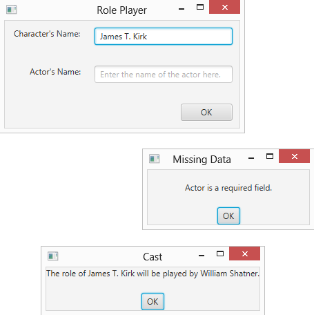
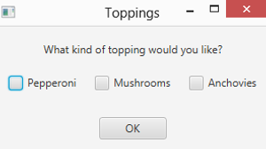
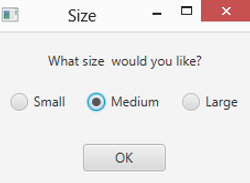
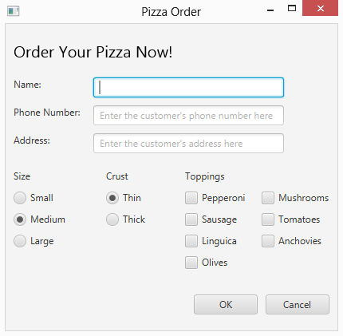
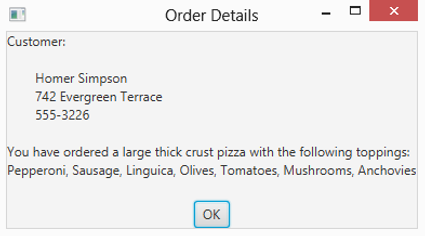

# 第 6 章 获取用户输入

> **In This Chapter**
>
> - Working with text fields and areas
> - Validating numeric data and creating check boxes
> - Setting radio buttons
> - Using some of these components in a complete program

In the first five chapters of this book, I discuss how to create JavaFX programs using only two basic JavaFX input controls: labels and buttons. If all you ever want to write are programs that display text when the user clicks a button, you can put the book down now. But if you want to write programs that actually do something worthwhile, you need to use other JavaFX input controls.

In this chapter, you find out how to use some of the most common JavaFX controls. First, you read about the label and controls that get information from the user. You find out more details about the text field control, which gets a line of text, and the text area control, which gets multiple lines. Then I move on to two input controls that get either/or information from the user: radio buttons and check boxes.

Along the way, you discover an important aspect of any JavaFX program that collects input data from the user: data validation. Data validation routines are essential to ensure that the user doesn’t enter bogus data. For example, you can use data validation to ensure that the user enters data into required fields or that the data the user enters into a numeric field is indeed a valid number.

## Using Text Fields

A text field is a box into which the user can type a single text. You create text fields by using the TextField class. Table 6-1 shows some of the more interesting and useful constructors and methods of this class.

**Table 6-1 Handy TextField Constructors and Methods**

| Constructor                      | Description                                          |
| -------------------------------- | ---------------------------------------------------- |
| TextField()                      | Creates a new text field.                            |
| TextField(String text, int cols) | Creates a new text field with an initial text value. |

| Method                            | Description                                                  |
| --------------------------------- | ------------------------------------------------------------ |
| String getText()                  | Gets the text value entered in the field.                    |
| void requestFocus()               | Asks for the focus to be moved to this text field. Note that the field must be in a scene for the focus request to work. |
| void setEditable(boolean value)   | If false, makes the field read-only.                         |
| void setMaxWidth(double width)    | Sets the maximum width for the field.                        |
| void setMinWidth(double width)    | Sets the minimum width for the field.                        |
| void setPrefColumnCount(int cols) | Sets the preferred size of the text field in columns (that is, the number of average-width text characters). |
| void setPrefWidth(double width)   | Sets the preferred width for the field.                      |
| void setPromptText(String prompt) | Sets the field’s prompt value. The prompt value will not be displayed if the field has a text value or if the field has focus. |
| void setText(String text)         | Sets the field’s text value.                                 |

The TextField class is defined in the javafx.scene.control package, so you should include the following imports statement in any program that uses a text field:

```java
imports javafx.scene.control.*;
```

The most common way to create a text field is to call the constructor without arguments, like this:

```java
TextField text1 = new TextField();
```

You can set the initial value to be displayed like this:

```java
TextField text1 = new TextField("Initial value");
```

Or, if you need to set the value later, you can call the setText method:

```java
text1.setText("Text value");
```

To retrieve the value that the user has entered into a text field, call the getText method like this:

```java
String value = text1.getText();
```

As with any JavaFX control, managing the width of a text field can be a bit tricky. Ultimately, JavaFX will determine the width of the text field based on a number of factors, including the size of the window that contains the stage and scene and any size constraints placed on the pane or panes that contain the text field. You can set minimum and maximum limits for the text field size by calling the setMinWidth and setMaxWidth methods, and you can indicate the preferred width via the setPrefWidth method, as in this example:

```java
TextField text1 = new TextField(); 
text1.setMinWidth(150); 
text1.setMaxWidth(250); 
text1.setPrefWidth(200);
```

Another way to set the preferred width is with the setPrefColumnCount method, which sets the width in terms of average-sized characters. For example, the following line sizes the field large enough to display approximately 50 characters:

```java
text1.setPrefColumnCount(50);
```

Note that the setPrefColumnCount method does not limit the number of characters the user can enter into the field. Instead, it limits the number of characters the field can display at one time.

Whenever you use a text field, provide a prompt that lets the user know what data he should enter into the field. One common way to do that is to place a label control immediately to the left of the text field. For example:

```java
Label lblName = new Label("Name:"); 
lblName.setMinWidth(75); 
TextField txtName = new TextField(); 
txtName.setMinWidth(200); 
HBox pane = new HBox(10, lblName, txtName);
```

Here, a label and a text field are created and added to an HBox pane so they will be displayed side-by-side.

JavaFX also allows you to display a prompt inside of a text field. The prompt is displayed in a lighter text color and disappears when the field receives focus. You use the setPromptText method to create such a prompt:

```java
TextField txtName = new TextField(); 
txtName.setPromptText("Enter the customer's name");
```

Here, the text Enter the customer’s name will appear inside the text field.

To retrieve the value entered by the user into a text field, you use the getText method, as in this example:

```java
String lastName = textLastName.getText();
```

Here the value entered by the user in the textLastName text field is assigned to the String variable lastName.

Figure 6-1 shows the operation of a simple program that uses a text field to allow the user to enter the name of a character in a play and the name of the actor who will play the role. Assuming the user enters text in both fields, the program then displays a message box indicating who will play the role of the character. If the user omits either or both fields, a message box displays to indicate the error. (The program uses the MessageBox class that was presented in Listing 4-2 in Chapter 4 to display the message box.)

Figure 6-1 shows what the main stage for this program looks like, as well as the message box windows displayed when the user enters both names or when the user omits a name. The JavaFX code for this program is shown in Listing 6-1.

> Figure 6-1: The Role Player application in action.



**Listing 6-1: The Role Player Program**

```java
import javafx.application.*; 
import javafx.stage.*; 
import javafx.scene.*; 
import javafx.scene.layout.*; 
import javafx.scene.control.*; 
import javafx.geometry.*;

public class RolePlayer extends Application                                         // →8
{
  public static void main(String[] args) 
  { 
    launch(args); 
  }

  TextField txtCharacter;                                                           // →15
  TextField txtActor;

  @Override public void start(Stage primaryStage) 
  {
    // Create the Character                                                         // →20
    Label lblCharacter = new Label("Character's Name:"); 
    lblCharacter.setMinWidth(100); 
    lblCharacter.setAlignment(Pos.BOTTOM_RIGHT);

    // Create the Character text field                                              // →25 
    txtCharacter = new TextField();
    txtCharacter.setMinWidth(200); 
    txtCharacter.setMaxWidth(200); 
    txtCharacter.setPromptText( 
      "Enter the name of the character here.");

    // Create the Actor label                                                       // →32 
    Label lblActor = new Label("Actor's Name:"); 
    lblActor.setMinWidth(100); 
    lblActor.setAlignment(Pos.BOTTOM_RIGHT);

    // Create the Actor text field                                                  // →37
    txtActor = new TextField(); 
    txtActor.setMinWidth(200); 
    txtActor.setMaxWidth(200); 
    txtActor.setPromptText("Enter the name of the actor here.");

    // Create the OK button                                                         // →43
    Button btnOK = new Button("OK"); 
    btnOK.setMinWidth(75); 
    btnOK.setOnAction(e -> btnOK_Click() );

    // Create the Character pane                                                    // →48
    HBox paneCharacter = new HBox(20, lblCharacter, txtCharacter); 
    paneCharacter.setPadding(new Insets(10));

    // Create the Actor pane                                                        // →52
    HBox paneActor = new HBox(20, lblActor, txtActor); 
    paneActor.setPadding(new Insets(10));

    // Create the Button pane                                                       // →56
    HBox paneButton = new HBox(20, btnOK); 
    paneButton.setPadding(new Insets(10)); 
    paneButton.setAlignment(Pos.BOTTOM_RIGHT);

    // Add the Character, Actor, and Button panes to a VBox                         // →61
    VBox pane = new VBox(10, paneCharacter, paneActor, paneButton);

    // Set the stage                                                                // →64
    Scene scene = new Scene(pane); 
    primaryStage.setScene(scene); 
    primaryStage.setTitle("Role Player"); 
    primaryStage.show();
  }

  public void btnOK_Click()                                                          // →71
  { 
    String errorMessage = "";                                                        // →73

    if (txtCharacter.getText().length() == 0)                                        // →75
    { 
      errorMessage += "\nCharacter is a required field.";
    }

    if (txtActor.getText().length() == 0)                                            // →80
    { 
      errorMessage += "\nActor is a required field."; 
    }

    if (errorMessage.length() == 0)                                                  // →85
    { 
      String message = "The role of " 
        + txtCharacter.getText() 
        + " will be played by " 
        + txtActor.getText() 
        + "."; 
      MessageBox.show(message,"Cast");
    } 
    else 
    { 
      MessageBox.show(errorMessage, "Missing Data");                                 // →96
    }
  }
}
```

This program isn’t very complicated, so the following paragraphs just hit the highlights:

➝ 8：The name of the program’s main class is RolePlayer.

➝ 15：These class variables allow any of the RolePlayer class methods to access the two text fields.

➝ 20：These lines create a label to identify the Character text box. The field is set to a minimum width of 100 pixels and is right-justified so that the labels that identify the two text fields will be aligned properly.

➝ 25：These lines create the Character text field with a minimum and maximum width of 200 pixels. The prompt text is set to Enter the name of the character here. This text will appear within the text field whenever the text field does not have focus. In Figure 6-1, the Character text field has focus so the prompt text isn’t visible.

➝ 32：These lines create a label to identify the Actor text field. Like the Character label, the Actor label’s width is set to 100 pixels and it’s right-aligned.

➝ 37：These lines create the Actor text field, set its width to 200 pixels, and assign prompt text. You can see the prompt text in Figure 6-1 because the Actor text field doesn’t have focus.

➝ 43：These lines create the OK button. The btnOK_Click method is called when the user clicks the button.

➝ 48：These lines create an HBox pane and add the Character label and text box to it.

➝ 52：These lines create another HBox pane and add the Actor label and text box to it.

➝ 56：These lines create a third HBox pane to hold the button.

➝ 61：Now that all the controls are created and added to HBox panes, the three HBox panes are added to a VBox pane so that the text boxes with their associated labels and the button are stacked vertically.

➝ 64：These lines create a scene to show the VBox pane and then add the scene to the primary stage and show the stage.

➝ 71：The btnOK_Click method is called whenever the user clicks OK.

➝ 73：The errorMessage variable holds any error message that might be necessary to inform the user of missing data.

➝ 75：This if statement ensures that the user has entered data into the Character text box. If no data is entered, an error message is created.

➝ 80：This if statement ensures that the user has entered data into the Actor text box. If no data is entered, an error message is appended to the errorMessage field.

➝ 85：This if statement determines whether any data validation errors have occurred by testing the length of the errorMessage field. If the length is zero, no error has been detected, so the program assembles the message variable to display which actor will be playing which character. Then, the show method of the MessageBox class is called to display the message. (You can find the code for the MessageBox class in Listing 4-2 in Chapter 4.)

➝ 96：This line displays the error message if the user forgets to enter data in the Character or Actor text fields.

## Validating Numeric Data

You need to take special care if you’re using a text field to get numeric data from the user. The getText method returns a string value. You can pass this value to one of the parse methods of the wrapper classes for the primitive numeric types. To convert the value entered in a text box to an int, use the parseInt method:

```java
int count = Integer.parseInt(txtCount.getText());
```

Here the result of the getText method is used as the parameter of the parseInt method.

Table 6-2 lists the parse methods for the various wrapper classes. Note: Each of these methods throws NumberFormatException if the string can’t be converted. As a result, you need to call the parseInt method in a try/catch block to catch this exception.

**Table 6-2 Methods That Convert Strings to Numbers**

| Wrapper Class | parse Method        |
| ------------- | ------------------- |
| Integer       | parseInt(String)    |
| Short         | parseShort(String)  |
| Long          | parseLong(String)   |
| Byte          | parseByte(String)   |
| Float         | parseFloat(String)  |
| Double        | parseDouble(String) |

If your program uses more than one or two numeric-entry text fields, consider creating separate methods to validate the user’s input. The following code snippet shows a method that accepts a text field and a string that provides an error message to be displayed if the data entered in the field can’t be converted to an int. The method returns a Boolean value that indicates whether the field contains a valid integer:

```java
private boolean isInt(TextField f, String msg) {
  try {
    Integer.parseInt(f.getText());
    return true; 
  } catch (NumberFormatException e) {
    MessageBox.show(msg, "Data Entry Error");
    return false; 
  }
}
```

You can call this method whenever you need to check whether a text field has a valid integer. (The MessageBox class is the same one used in Listing 6-1; you find the code for it in Chapter 4, in Listing 4-2.)

Here’s a method that gets the value entered in a txtCount text field and displays it in message box if the value entered is a valid integer:

```java
public void buttonOKClick() {
  if (isInt(textCount, "You must enter an integer.")) {
    MessageBox.show("You entered " + Integer.parseInt(textCount.getText()), "Your Number"); 
  } 
  textCount.requestFocus();
}
```

Here the isInt method is called to make sure that the text entered by the user can be converted to an int. If so, the text is converted to an int and displayed in a message box.

## Using Check Boxes

A check box is a control that the user can click to check or clear. Check boxes let the user specify a Yes or No setting for an option. Figure 6-2 shows a window with three check boxes.

Strictly speaking, a check box can have three states: checked, unchecked, and undefined. The undefined state is most often used in conjunction with a TreeView control.

> Figure 6-2: Three check boxes.



To create a check box, you use the CheckBox class. Its favorite constructors and methods are shown in Table 6-3.

**Table 6-3 Notable CheckBox Constructors and Methods**

| Constructor           | Description                                               |
| --------------------- | --------------------------------------------------------- |
| CheckBox()            | Creates a new check box that is initially unchecked.      |
| CheckBox(String text) | Creates a new check box that displays the specified text. |

| Method                                               | Description                                                  |
| ---------------------------------------------------- | ------------------------------------------------------------ |
| String getText()                                     | Gets the text displayed by the check box.                    |
| boolean isSelected()                                 | Returns true if the check box is checked or false if the check box is not checked. |
| void setOnAction (EventHandler\<ActionEvent\> value) | Sets an ActionEvent listener to handle action events.        |
| void setSelected(boolean value)                      | Checks the check box if the parameter is true; unchecks it if the parameter is false. |
| void setText(String text)                            | Sets the check box text.                                     |

As with any JavaFX control, if you want to refer to a check box in any method within the program, declare a class variable to reference the control:

```java
CheckBox chkPepperoni, chkMushrooms, chkAnchovies;
```

Then you can use statements like these in the start method to create the check boxes and add them to a layout pane (in this case, pane1):

```java
chkPepperoni = new CheckBox("Pepperoni"); 
pane1.add(chkPepperoni);

chkMushrooms = new CheckBox("Mushrooms"); 
pane1.add(chkMushrooms);

chkAnchovies = new CheckBox("Anchovies"); 
pane1.add(chkAnchovies);
```

Notice that I didn’t specify the initial state of these check boxes in the constructor. As a result, they’re initially unchecked. If you want to create a check box that’s initially checked, call setSelected method, like this:

```java
chkPepperoni.setSelected(true);
```

In an event listener, you can test the state of a check box by using the isSelected method, and you can set the state of a check box by calling its setSelected method. Here’s a method that displays a message box and clears all three check boxes when the user clicks OK:

```java
public void btnOK_Click() {
  String msg = ""; 
  if (chkPepperoni.isSelected())
    msg += "Pepperoni\n"; 
  if (chkMushrooms.isSelected())
    msg += "Mushrooms\n"; 
  if (chkAnchovies.isSelected())
    msg += "Anchovies\n"; 
  if (msg.equals(""))
    msg = "You didn't order any toppings."; 
  else
    msg = "You ordered these toppings:\n" + msg; 
  MessageBox.show(msg, "Your Order"); 
  chkPepperoni.setSelected(false); 
  chkMushrooms.setSelected(false); 
  chkAnchovies.setSelected(false);
}
```

Here, the name of each pizza topping selected by the user is added to a text string. If you select pepperoni and anchovies, for example, the following message displays:

```
You ordered these toppings: 
Pepperoni 
Anchovies
```

If you want, you can add event listeners to check boxes to respond to events generated when the user clicks those check boxes. Suppose that your restaurant has anchovies on the menu, but you refuse to actually make pizzas with anchovies on them. Here’s a method you can call in an event listener to display a message if the user tries to check the Anchovies check box; after displaying the message, the method then clears the check box:

```java
public void chkAnchovies_Click(){ 
  MessageBox.show("We don't do anchovies here.", "Yuck!");
  chkAnchovies.setSelected(false); 
}
```

To add this event listener to the Anchovies check box, call its setOnAction method, like this:

```java
chkAnchovies.setOnAction(e -> chkAnchovies_Click());
```

Add a listener to a check box only if you need to provide immediate feedback to the user when she selects or deselects the box. In most applications, you wait until the user clicks a button to examine the state of any check boxes in the frame.

## Using Radio Buttons

Radio buttons are similar to check boxes, but with a crucial difference: They travel in groups, and a user can select only one radio button at a time from each group. When you click a radio button to select it, the radio button within the same group that was previously selected is deselected automatically. Figure 6-3 shows a window with three radio buttons.

> Figure 6-3: A window with three radio buttons.



To work with radio buttons, you use two classes. First, you create the radio buttons themselves with the RadioButton class, whose constructors and methods are shown in Table 6-4. Then you create a group for the buttons with the ToggleGroup class and add the radio buttons to the toggle group.

A ToggleGroup object is simply a way of associating a set of radio buttons so that only one of the buttons can be selected. The toggle group object itself is not a control and is not displayed. To display radio buttons, you add the individual radio buttons, not the toggle group, to a layout pane.

**Table 6-4 Various RadioButton Constructors and Methods**

| Constructor              | Description                                         |
| ------------------------ | --------------------------------------------------- |
| RadioButton()            | Creates a new radio button with no text.            |
| RadioButton(String text) | Creates a new radio button with the specified text. |

| Method                                               | Description                                                  |
| ---------------------------------------------------- | ------------------------------------------------------------ |
| String getText()                                     | Gets the text displayed by the radio button.                 |
| boolean isSelected()                                 | Returns true if the radio button is selected or false if the radio button is not selected. |
| void setOnAction (EventHandler\<ActionEvent\> value) | Sets an ActionEvent listener to handle action events.        |
| void setSelected(boolean value)                      | Selects the radio button if the parameter is true; de-selects it if the parameter is false. |
| void setText(String text)                            | Sets the check box text.                                     |

The usual way to create a radio button is to declare a variable to refer to the button as a class variable so that it can be accessed anywhere in the class, as in this example:

```java
RadioButton rdoSmall, rdoMedium, rdoLarge;
```

Then, in the start method, you call the RadioButton constructor to create the radio button:

```java
rdoSmall = new RadioButton("Small");
```

Thereafter, you can add the radio button to a layout pane in the usual way.

To create a toggle group to group radio buttons that work together, call the ToggleGroup class constructor:

```java
ToggleGroup sizeGroup = new ToggleGroup();
```

Then call the setToggleGroup method of each radio button:

```java
rdoSmall.setToggleGroup(sizeGroup); 
rdoMedium.setToggleGroup(sizeGroup); 
rdoLarge.setToggleGroup(sizeGroup);
```

Toggle groups have nothing to do with how radio buttons display. To display radio buttons, you must still add them to a layout pane. And there’s no rule that says that all the radio buttons within a toggle group must be added to the same layout pane. However, it is customary to display all the radio buttons in a single toggle group together on the scene so that the user can easily see that the radio buttons belong together.

If you’ve worked with radio buttons in Swing, you’ll want to note an important distinction between the way JavaFX toggle groups work versus how button groups work in Swing. In JavaFX, radio buttons that are outside a toggle group are independent of one another. In Swing, radio buttons that are outside a button group are all part of a default group. Thus, in JavaFX, always add radio buttons to a toggle group, even if the scene has only a single toggle group.

## Looking at a Pizza Order Application

To give you an idea of how to use the controls that I present in this chapter together with the layout panes that I present in Chapter 5, this section presents a fairly complicated application that lets the user order a pizza. The user enters his name, address, and phone number into text fields, selects the pizza’s size and crust style using radio buttons, and chooses toppings via check boxes. Figure 6-4 shows the main window displayed by the Pizza Order application.

> Figure 6-4: The Pizza Order application’s main window.



When the user enters the data for his pizza order and clicks OK, this program displays a message box summarizing the order, as shown in Figure 6-5.

> Figure 6-5: The Pizza Order application confirms the user’s order.



It may not be obvious at first glance, but the scene displayed by the Pizza Order application uses a total of 12 layout panes to govern the arrangement of its controls. The overall scene is organized with a border pane whose top region displays the title (Order Your Pizza Now!). The center region displays the text fields, radio buttons, and check boxes that let the user configure her pizza order. And the bottom region contains the OK and Cancel buttons.

For your reference, Table 6-5 lists the 12 layout panes that are used to organize this content.

**Table 6-5 Layout Panes Used in the Pizza Order Application**

| Name         | Class      | Description                                                  |
| ------------ | ---------- | ------------------------------------------------------------ |
| paneMain     | BorderPane | The scene’s main root pane.                                  |
| paneTop      | HBox       | Contains the title text that’s displayed in the top region of the border pane. |
| paneName     | HBox       | Contains the label and text box for the customer’s name, placed side-by-side. |
| panePhone    | HBox       | Contains the label and text box for the phone number, placed side-by-side. |
| paneAddress  | HBox       | Contains the label and the text box for the address, placed side-by-side. |
| paneCustomer | VBox       | Contains the name, phone, and address panes, stacked vertically. |
| paneSize     | VBox       | Contains a label with the text “Size” and the three radio buttons that let the user choose the pizza size, stacked vertically. |
| paneCrust    | VBox       | Contains a label with the text “Crust” and the two radio buttons that let the user choose the crust style, stacked vertically. |
| paneToppings | FlowPane   | A flow pane that contains the check boxes for the toppings.  |
| paneTopping  | VBox       | Contains a label with the text “Toppings” and the flow pane that lists the toppings, stacked vertically. |
| paneOrder    | HBox       | Contains the three VBox panes that list the sizes, crust styles, and toppings arranged side-by-side. This pane is displayed in the center region of the border pane. |
| paneBottom   | HBox       | Contains the OK and Cancel buttons arranged side-by-side. A spacer is used to force the buttons to the right margin. This pane is displayed in the bottom region of the border pane. |

**Listing 6-2: The Pizza Order Application**

```java
import javafx.application.*; 
import javafx.stage.*; 
import javafx.scene.*; 
import javafx.scene.layout.*; 
import javafx.scene.control.*; 
import javafx.geometry.*; 
import javafx.scene.text.*;

public class PizzaOrder extends Application {

  public static void main(String[] args) {
    launch(args);
  }

  Stage stage;

  // Customer name, phone, and address fields

  TextField txtName;
  TextField txtPhone;
  TextField txtAddress;

  // Size radio buttons

  RadioButton rdoSmall;
  RadioButton rdoMedium;
  RadioButton rdoLarge;

  // Crust style radio buttons

  RadioButton rdoThin;
  RadioButton rdoThick;

  // Topping radio buttons

  CheckBox chkPepperoni;
  CheckBox chkSausage;
  CheckBox chkLinguica;
  CheckBox chkOlives;
  CheckBox chkMushrooms;
  CheckBox chkTomatoes;
  CheckBox chkAnchovies;

  @Override
  public void start(Stage primaryStage) {
    stage = primaryStage;

    // ----- Create the top pane -----

    Text textHeading = new Text("Order Your Pizza Now!");
    textHeading.setFont(new Font(20));
    HBox paneTop = new HBox(textHeading);
    paneTop.setPadding(new Insets(20, 10, 20, 10));

    // ---------- Create the customer pane ----------

    // Create the name label and text field

    Label lblName = new Label("Name:");
    lblName.setPrefWidth(100);
    txtName = new TextField();
    txtName.setPrefColumnCount(20);
    txtName.setPromptText("Enter the customer's name here");
    txtName.setMaxWidth(Double.MAX_VALUE);
    HBox paneName = new HBox(lblName, txtName);

    // Create the phone number label and text field

    Label lblPhone = new Label("Phone Number:");
    lblPhone.setPrefWidth(100);
    txtPhone = new TextField();
    txtPhone.setPrefColumnCount(20);
    txtPhone.setPromptText("Enter the customer's phone number here");
    HBox panePhone = new HBox(lblPhone, txtPhone);

    // Create the address label and text field

    Label lblAddress = new Label("Address:");
    lblAddress.setPrefWidth(100);
    txtAddress = new TextField();
    txtAddress.setPrefColumnCount(20);
    txtAddress.setPromptText("Enter the customer's address here");
    HBox paneAddress = new HBox(lblAddress, txtAddress);

    // Create the customer pane

    VBox paneCustomer = new VBox(10, paneName, panePhone, paneAddress);

    // ---------- Create the order pane ----------

    // Create the size pane

    Label lblSize = new Label("Size");
    rdoSmall = new RadioButton("Small");
    rdoMedium = new RadioButton("Medium");
    rdoLarge = new RadioButton("Large");
    rdoMedium.setSelected(true);
    ToggleGroup groupSize = new ToggleGroup();
    rdoSmall.setToggleGroup(groupSize);
    rdoMedium.setToggleGroup(groupSize);
    rdoLarge.setToggleGroup(groupSize);

    VBox paneSize = new VBox(lblSize, rdoSmall, rdoMedium, rdoLarge);
    paneSize.setSpacing(10);

    // Create the crust pane

    Label lblCrust = new Label("Crust");
    rdoThin = new RadioButton("Thin");
    rdoThick = new RadioButton("Thick");
    rdoThin.setSelected(true);
    ToggleGroup groupCrust = new ToggleGroup();
    rdoThin.setToggleGroup(groupCrust);
    rdoThick.setToggleGroup(groupCrust);

    VBox paneCrust = new VBox(lblCrust, rdoThin, rdoThick);
    paneCrust.setSpacing(10);

    // Create the toppings pane

    Label lblToppings = new Label("Toppings");
    chkPepperoni = new CheckBox("Pepperoni");
    chkSausage = new CheckBox("Sausage");
    chkLinguica = new CheckBox("Linguica");

    chkOlives = new CheckBox("Olives");
    chkMushrooms = new CheckBox("Mushrooms");
    chkTomatoes = new CheckBox("Tomatoes");
    chkAnchovies = new CheckBox("Anchovies");

    FlowPane paneToppings = new FlowPane(Orientation.VERTICAL, chkPepperoni, chkSausage, chkLinguica, chkOlives, chkMushrooms, chkTomatoes, chkAnchovies);
    paneToppings.setPadding(new Insets(10, 0, 10, 0));
    paneToppings.setHgap(20);
    paneToppings.setVgap(10);
    paneToppings.setPrefWrapLength(150);

    VBox paneTopping = new VBox(lblToppings, paneToppings);

    // Add the size, crust, and toppings pane to the order pane

    HBox paneOrder = new HBox(50, paneSize, paneCrust, paneTopping);

    // Create the center pane

    VBox paneCenter = new VBox(20, paneCustomer, paneOrder);
    paneCenter.setPadding(new Insets(0, 10, 0, 10));

    // ---------- Create the bottom pane ----------

    Button btnOK = new Button("OK");
    btnOK.setPrefWidth(80);
    btnOK.setOnAction(e -> btnOK_Click());

    Button btnCancel = new Button("Cancel");
    btnCancel.setPrefWidth(80);
    btnCancel.setOnAction(e -> btnCancel_Click());

    Region spacer = new Region();

    HBox paneBottom = new HBox(10, spacer, btnOK, btnCancel);
    paneBottom.setHgrow(spacer, Priority.ALWAYS);
    paneBottom.setPadding(new Insets(20, 10, 20, 10));

    // ---------- Finish the scene ----------

    BorderPane paneMain = new BorderPane();
    paneMain.setTop(paneTop);
    paneMain.setCenter(paneCenter);
    paneMain.setBottom(paneBottom);

    // Create the scene and the stage

    Scene scene = new Scene(paneMain);
    primaryStage.setScene(scene);
    primaryStage.setTitle("Pizza Order");
    primaryStage.show();

  }

  public void btnOK_Click() {

    // Create a message string with the customer information

    String msg = "Customer:\n\n";
    msg += "\t" + txtName.getText() + "\n";
    msg += "\t" + txtAddress.getText() + "\n";
    msg += "\t" + txtPhone.getText() + "\n\n";
    msg += "You have ordered a ";

    // Add the pizza size

    if (rdoSmall.isSelected()) msg += "small ";
    if (rdoMedium.isSelected()) msg += "medium ";
    if (rdoLarge.isSelected()) msg += "large ";

    // Add the crust style

    if (rdoThin.isSelected()) msg += "thin crust pizza with ";
    if (rdoThick.isSelected()) msg += "thick crust pizza with ";

    // Add the toppings

    String toppings = "";
    toppings = buildToppings(chkPepperoni, toppings);
    toppings = buildToppings(chkSausage, toppings);
    toppings = buildToppings(chkLinguica, toppings);
    toppings = buildToppings(chkOlives, toppings);
    toppings = buildToppings(chkTomatoes, toppings);
    toppings = buildToppings(chkMushrooms, toppings);
    toppings = buildToppings(chkAnchovies, toppings);

    if (toppings.equals(""))
      msg += "no toppings.";
    else
      msg += "the following toppings:\n"
      + toppings;
    // Display the message
    MessageBox.show(msg, "Order Details");
  }

  public String buildToppings(CheckBox chk, String msg) {
    // Helper method for displaying the list of toppings
    if (chk.isSelected()) {
      if (!msg.equals("")) {
        msg += ", ";
      }
      msg += chk.getText();
    }
    return msg;
  }

  public void btnCancel_Click() {
    stage.close();
  }
}
```

