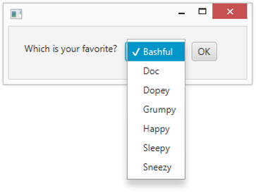

# 第 8 章 从列表中选择

> **In This Chapter**
>
> - Using the ChoiceBox control 
> - Working with the ObservableList interface
> - Listening for changes to the user’s selection 
> - Using the ComboBox and ListView controls
> - Using the TreeView control

An entire category of JavaFX controls are designed to let the user choose one or more items from a list. This chapter presents three such controls: choice boxes, combo boxes, and lists. Along the way, you discover how to use the ObservableList interface, which is used to manage the list of items displayed by a choice box, combo box, or a list view control.

Actually, if you’ve read along so far, you’ve already been briefly introduced to the ObservableList interface, as it’s also used to manage the list of controls that are displayed in a layout pane. In Chapter 5, you read about how to use the addAll method of this interface. In this chapter, you read about the additional capabilities of this interface.

You also discover how to add an event listener that can respond when the user changes the current selection.

## Using Choice Boxes

A choice box is a control that lets the user choose an item from a drop-down list. Initially, the choice box shows just the item that’s currently selected. When the user clicks the choice box, the list of choices reveals. The user can change the selection by clicking any of the items in the list. Figure 8-1 shows a scene with a simple choice box.

> Figure 8-1: A scene with a choice box.

You use the ChoiceBox class to create choice boxes. Table 8-1 lists the most frequently used constructors and methods of this class.

